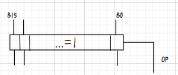
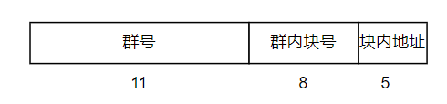
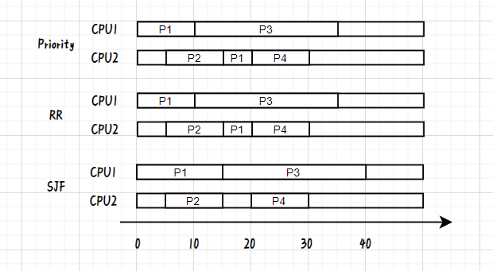

# 选择
DCCBD CBBBA
CADBA CBABB  

# 综合应用
## 21
不会
## 22
用并查集,对原图边遍历,执行Unoin()，获得原本的连通性，然后对原图每一顶点遍历，从边集中删去有关边，再遍历边集，执行Union() ，与原图用遍历v集合Find()比对，若相同则输出  
$\Omicron(ne\log n)$
## 23
```c++
void PostTraver(Node *T,int level=1){
    if(T!=null){
        PostTraver(T->Lchild,level++);
        PostTraver(T->Rchild,level++);
        std::cout<<T.data<<level;
    }
}
```
## 24
二叉查找过程中，若S[i+1]<S[i]，意味着key<S[i];反之，意味着key>S[i];
```c++
int IsKey(int S[],int n){//暴力解
    for(int i=0;i<n-1;i++){
        if(S[i+1]<S[i]){
            for(int j=i+2;j<n;j++)
                if(S[j]>S[i])
                    return 0;
        }
        else{
            for(int j=i+2;j<n;j++)
                if(S[j]<S[i])
                    return 0;
        }
    }
    return 1;
}
```
```c++
int IsKey(int S[],int n){//O(n)解
        int min=MINV,max=MAXV;//c
    for(int i=0;i<n;i++){
        if(S[i]<min&&S[i]>max)
            return 0;
        if(S[i+1]&&S[i+1]<S[i]){
            max=S[i];
        }
        else {
            min=S[i];
        }
    }
    return 1;
}
```
## 25
(1)FFFCH、0069H  
(2)  
  
(3)
$$
OF=(A_{15}\oplus Z_{15})((B_{15}\oplus OP)\oplus Z_{15}) \\
CF=C_{-1}C_{15}
$$
## 26
(1)  
  
(2)组号：83H 标记：029H  
(3)
$$
H=1-\frac{2^{7}+1}{2^{12}/2}=1-\frac{129}{2048}
$$
(4)任书P125
## 27
(1)7+4=11条   
(2)39H,3643H  
(3)  R3←(R3)+Imme
| 时钟 | 功能 | 有效控制信号 |
|---|---|---|
| C5 | MAR←(PC) | PCout、MARin |
| C6 | MDR←M[(MAR)],PC+1 | Read、WMFC、PCinc |
| C7 | Y←(R3) | R3out、Yin |
| C8 | Z←(Y)+(MDR) | Zin、MDRout、ALUop=0 |
|C9|R3←(Z)，END←1|R3in、Zout，END|

(4)任书P223
## 28
(1)1.2×40M+40M×(1-0.98)=48.8M次  
(2)250次；5k次  
(3)(不确定)((1+0.2)/4)×4=1.02MB/s
## 29
(1)  
  
(2)  
Priority:5/4;(20+10+25+10)/4=65/4   
RR:5/4;(20+10+25+10)/4=65/4  
SJF:0;(15+10+25+10)/4=15
## 30
(1)50,20,10,500,900 ;931  
(2)50,0,600 ;1497
## 31
```C++
semaphore box=n,mutex=1,A=0,B=0,start_A=1,strart_B=0;
甲{

    while(1):
        wait(start_A);
        wait(box);
        wait(mutex);
        produce();
        signal(mutex);
        signal(A);
        signal(start_B);
}
乙{
    while(1):
        wait(start_B);
        wait(box);
        wait(mutex);
        produce();
        signal(mutex);
        signal(B);
        signal(start_A);
}
丙{
    while(1):
        wait(A);
        wait(B);
        wait(mutex);
        produce();
        signal(mutex);
        signal(box);
        signal(box);
}
```
## 32 
(1)8,8,5;64.008ms,64.008ms,40.008ms  
(2)存在;略


