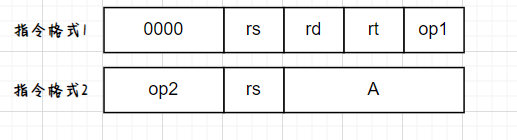
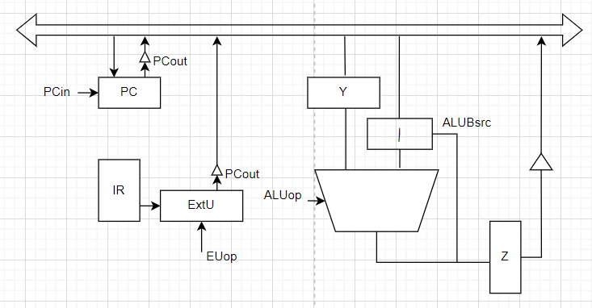

# 选择题
## 1
会导致进程从等待到就绪的事件是

A 时间片未完  `B运行进程阻塞`  
C 等待事件完成 D
## 2

## fork
```c++
rec1=fork()
rec2=fork()
if(rec1==0){rec2=0;rec3=fork();printf(A)}
if（rec2==0）printf(B)
printf(C)
printf(D)
```
程序执行打印B的数量
 
4个 `5个` 6个 7个
## 6 动态分区分配算法
给了待分配空间的页面大小,150MB,100MB,200MB,200MB,100MB,三个连续空间,按序链成,300,200,250，问哪个方法可以完成分配？

A 首次适应 B 最佳适应 `C`最差适应 D都不行
## 7
TLB命中率90%，cache命中率80% 访存2ms,缺页处理10ms，TLB访问时间忽略，平均访存时间

A2.86ms `B3.12ms` C3.24ms D3.32ms
## 8 
32位逻辑地址空间，两级页表 外页表11 内页表11 页内地址10 ，每个页表项8B，有进程32MB，问页表占内存大小

A --  B16KB C1024KB `D1040KB`
## ？
Max  已分配  问处于什么状态

`A安全` B不安全 C死锁 D不确定
## ？
某资源有7个，打印机最多需要2个资源完成任务，最多分配多少个打印机不产生死锁

A3 B4 C5 D6

## RAID
RAID0+1和RAID1+0方式组合8块盘，问最多允许多少个盘故障
2,2 2,4 4,2 4,4

## 17 
时间复杂度估算错误的是

A  B $3^{n}$~$\Omicron(2^{n})$  
B --  
`C` $n\log_2n+n^{2}\sim$$\Omicron(n^{3})$  
D log 2 +12323~$\Omicron(\log_2n)$
## kmp
ababaababa.. 字串ababc运用kmp问比较了多少次

A19 B20 `C`21 D22


## AVL树
插入序列：--从空开始建树，问树高
A3 `B4` C5 D7

## 二叉线索树
若某节点v的右孩子为线索，中序遍历该线索二叉树在v之后的节点为

`A` V的右孩子
B 右孩子的左孩子
C 右孩子再往左走到底
D --

## 最多可能
序列有5个元素，构成的二叉搜索树最大可能数目

41棵
##  快排
快速排序第一趟能确定一个位置，问三层最多能确定几个位置  

A 1 B 3 `C `4 D 5
## 胜者树 
七个数据序列问构造出的胜者树是  


## 指令执行时钟周期
某程序指令

A B C10000Tc D 10240Tc


## 浮点数表示
阶码：8位+尾数：？位 均为补码，问真值

A。$2^{-24}$ B-
C $2^{-22}$ D-

## 关系运算
用减法和逻辑实现的关系运算，能表示X<Y

A OF$\oplus$SF BSF C- D-

## 存储器引脚
DRAM芯片 2M×4bit问引脚数量至少为

A 13 B 16 `C 17` D-

## 35
某计算机指令字长均为16位 

op2  0100,0110,---分别为加法，减法，取数，


功能描述：
指令1：rt← (rs) op1 (rd)
指令2：rd←M[(rs)+A]

错误的是
A 指令数据寻址方式至少有两种
B格式2最多能有15条指令
C
D能实现的偏移量为-256-254


## 36
根据35题条件，数组A的首地址，每个元素为2B存放在R1中，能实现R3←A[2]-8的是

`A`  
B 及E04H    11 10 0000 0002  
C   
D   08及6E04H        11 10 0000 0004

既可以用减法实现也可以用加法实现
## CPU时序
包含中断处理的CPU 


B 指令CPI最多为5
C 需要设置6拍


## 40 中断


# 综合应用题
## 41
FCFS、非抢占SJF、RR(时间片2)、优先级调度的平均等待时间和平均周转时间 

## 42
纯请求调页系统，给某进程的页框数为3，

(1)FIFO，LRU，OPT的缺页次数，最后的页框号  
(2)实现LRU的一种方法并说明优缺点  
(3)FIFO和LRU的缺页次数是否会随着分配页框数的增大而减小，说明理由
## 43
甲。乙 丙三个农民，甲负责挖洞，乙负责播种，丙负责埋，当未撒种子的洞MAX个时，甲停止挖洞，甲，丙共用一把铲子。
## 44
有向图,迪杰斯特拉构造0号节点到其他节点的最短路径过程，
(1)写明每一步的d[6]数组和s[6]数组；  
(2)是否能用到有负权值的图中：  
(3)迪杰斯特拉的时间复杂度  
## 45
求一棵树的度，给的树是孩子兄弟表示法的树。节点结构为{lchild,data, rsibling}三个元素。给出算法思路，用C/C++实现算法，求时间复杂度。
## 46
32位CPU，联合控制，cache采用4路组相联，LRU，写回法，cache块32B，内存和I/O独立编址，有$\overline{{\rm MEMW}}$，$\overline{{\rm MEMR}}$，地址线A31-A2，主存为8个32M-4B的存储体交叉编址，存储体存取周期64ns,半同步32位总线100MHz，支持猝发传输，分为地址传送，等待响应，数据传输三个阶段,一个总线时钟周期可以传输一个地址或数据。

(1)Tag位数，需要多少个比较器  
(2)${\overline{{\rm CS}}}$表达式  
(3)cache缺失要多少时间，最多需要访存几次  
(4)DMA接口和中断IO接口相比，信号线的连接和信号传递方向有什么区别

## 47
数据通路

ALUBsrc:功能，为1时ALU非Y的那个输入口数据原样输出到ALU中，ALUop=0+1-，数据通路
图类似19 20 21 那个图
(1)实现1的功能(可以使用逻辑门电路 MUX等)  
(2)为什么GPRS输入/输出不需要锁存器?若ALU没有Z锁存，则若运算操作在ti，需要什么时候输出运算结果？  
(3)写出PC<-(PC) + disp的uopcmd  
(4)CU和数据通路之间，除了有uopcmd，指令译码，还有什么联系？

