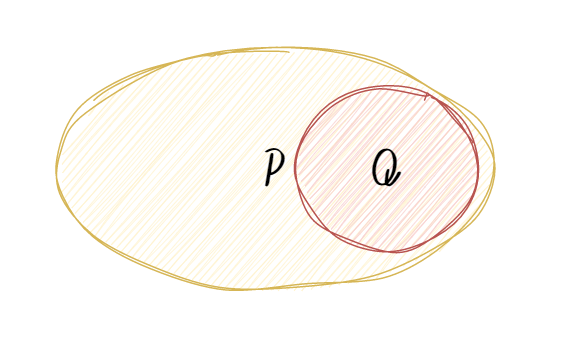
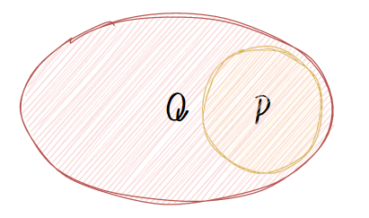
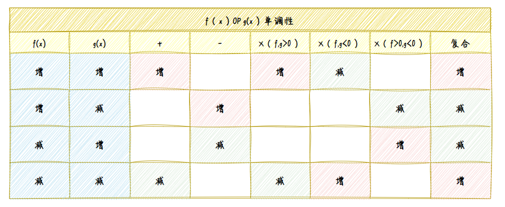

# (数的)不等式  
## 作差法
1.若|f(x)|，|g(x)| 平方作差  
2.作商
## 性质
$\mathbb{R}$中  
1.加减数-不变符号  
2.乘除正数-不变符号  
3.乘除负数-改变符号方向 
4a>b，c>d a+c>b+d
eg
$$
x^{2}>c^{2}\Leftrightarrow|X|>|c|\\
$$
## 一元二次不等式
一元二次方程
1.开口2.顶点
## 基本不等式|均值不等式
引入
$$
(a-b)^{2}=a^{2}+b^{2}-2ab\geq 0\\
a^{2}+b^{2}\geq 2ab\\
$$
若$a>0,b>0$,令$x=a^{2},y=b^{2}$
$$
\because a>0,b>0\\
\therefore a=\sqrt{x},b=\sqrt{y}\\
x+y\geq 2\sqrt{xy}
$$
基本不等式  
当x>0,y>0时，有
$$
\frac{x+y}{2}\geq \sqrt{xy}
$$
当x=y时，取=号  

平方平均数(方差)
$$
\sqrt{\frac{x^{2}+y^{2}}{2}}\geq \frac{x+y}{2}
$$
调和平均数

### 应用
#### 1代换

# 充要条件
定理：若p`条件`，则q`结论`  
p是q的充分条件

p是q的必要条件  

## 证明的充分性和必要性
由于定理为证明题，
故理论上p真，q也为真
故p→q，p是q的充分条件  
从条件p推出结论q就是充分性证明。
而必要性则说的是结论q满足条件p必满足
# 集合
## 性质
- 确定性
- 互异性
- 无序性
## 写法
列举法
{1，2，3}  
描述法
{(x,y)|x≤2,y≤2}
# 函数
## 概念
### 定义域
隐含给出
#### 分母
$$
\frac{1}{f(x)},f(x)\not ={0}
$$
#### 根号
$$
\sqrt{f(x)},f(x)\geq 0
$$
#### 对数
$$
\log_{a}b,a>0且\not ={1},b>0
$$
### 值域
概率论-概率分布函数值域[0-1]
### 对应关系
## 性质
### 单调性`一元函数`
高中，单调性，作差法，
作差大于0，那么这里要用不等式？
#### `f(x)与g(x)运算的单调性` 
用于抽象函数  

### **对称性**-含奇偶性
#### 一元对称性
`两个自变量相加为常数`一定具有对称性  
y轴对称
$$
基本f(a-x)=f(a+x)\\
初级f(x)=f(2a-x)\\
高级f(x+a)=f(-x+b)\\
特殊f(x)=f(-x)
$$
(x，0)点对称
$$
基本f(a-x)=-f(a+x)\\
初级f(x)=-f(2a-x)\\
高级f(x+a)=-f(-x+b)\\
特殊f(x)=-f(-x)
$$
#### 二元函数(x,y)对称性
两自变量对调后函数值相同|相反|成比例？  
y=x  
y=-x  
y轴 x=-x  
x轴 y=-y  
TODO   
### 周期性
`自变量相减为常数`
$$
f(x-a)=f(x+b)
$$
## 计算
### 求函数解析式
$$
F(\frac{x+1}{x})求F(x)
$$
大学：求复合函数解析式
### 指数与指数幂的运算法则

# 图像与二次方程
## 一元二次方程与韦达定理
## 直线与方程
### 点斜式
### `一般式`
$$
Ax+By+C=0
$$
作图：

## 圆锥曲线`二次曲线`与方程
圆锥曲线都是二次曲线
### 圆的方程
#### 标准式
#### 一般式
### 椭圆的方程
#### 几何定义
到两定点距离之和相等
#### 标准方程
$$
\frac{x^2}{a^2}+\frac{y^{2}}{b^2}=1
$$
#### 一般方程
$$
Ax^2+By^2+Cx+Dy+E=0
$$
A，B同号
### 双曲线的方程
#### 几何定义
到两个定点距离之差的绝对值为定值 
#### 标准方程
$$
\frac{x^2}{a^2}-\frac{y^{2}}{b^2}=1
$$
#### 一般方程
$$
Ax^2+By^2+Cx+Dy+E=0
$$
A，B异号
## 抛物线
### 几何定义
到一个定直线与到一个定点距离相等的点
#### 标准方程
$$
y^2=2px
$$
#### 一般方程
$$
Ax^2+By^2+Cx+Dy+E=0
$$
A，B一个为0