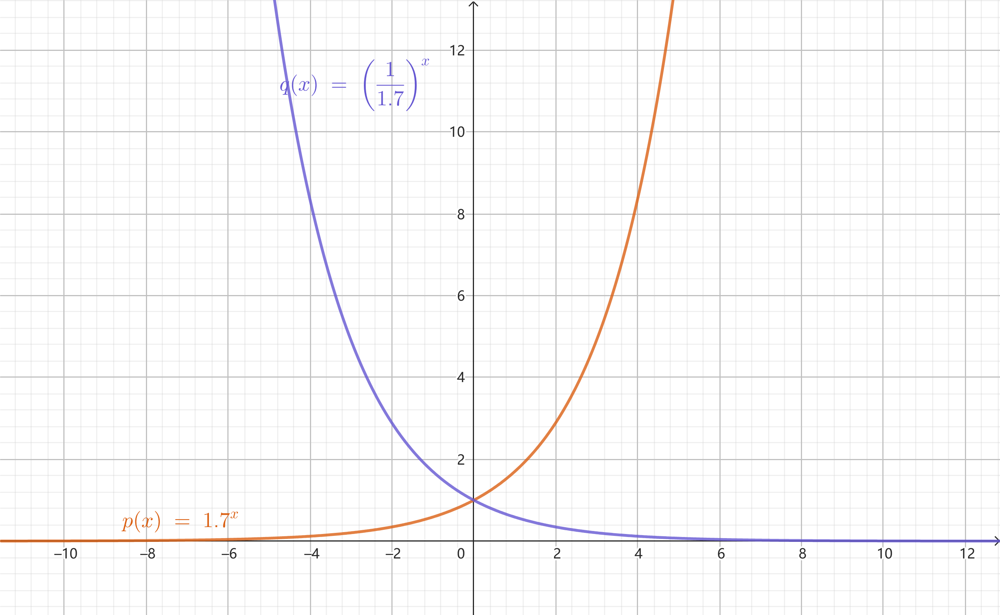
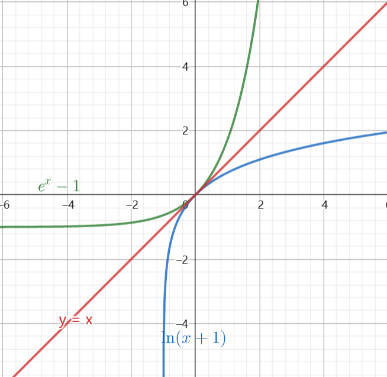
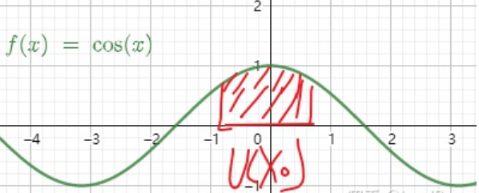

# 函数与极限
### 映射
## 函数定义
## 基本初等函数
### 常函数
定义域上为**偶函数** ->定积分的时候复合？
### 幂函数
$$
y=x^a \\
a<0,y=\frac{1}{x^{-a}},e.g. y=\frac{1}{x}\\
1>a>0,习惯写为y=\sqrt{x}，可能没有负数部分 与y=x^{\frac{1}{a}}为逆映射，关于y=x对称
\\
a>1,整数次奇偶性不同
$$

### 指数函数
a>1
1>a>0
$$
a^x\\
e^x\\
\lim_{x\rightarrow\infty}e^x=不\exist\\
\int_{-\infty}^0e^x=1
$$

### 对数函数
$$
\lim_{x\rightarrow{0}^+} x^\alpha\ln^\beta x=0,\alpha,\beta >0\\
\lim_{x\rightarrow+\infty} \frac{\ln^\beta x}{x^\alpha}=0,\alpha,\beta >0\\
$$

### 三角函数 
周期性 
$$
\sec x、\csc x
$$

### 反三角函数
$$
\arcsin x+\arccos x=\frac{\pi}{2}\\
证明：1.求导0\\
2.回代
$$
## 初等函数
## 对勾函数
$$
y=x+\frac{k}{x},k>0
$$
## 幂指函数为例
$$
x^x图像\\
1.端点求极限、代值\\
\lim_{x\rightarrow0^+}x^x=\lim_{x\rightarrow0^+}e^{x\ln x}=1\\
2.求导求极值渐进性\\
(x^x)'=(e^{x\ln x})'=x^x\cdot(x\ln x)'=x^x\cdot(\ln x+1)\\
导数=0,x=\frac{1}{e}
$$

## 函数图像变换
#### 平移
##### 左右
##### 上下
####  **对称**-绝对值问题
$$
|\sin x|=\sin |x|
$$
##### x轴
##### y轴
#### 伸缩
##### 横向
##### 纵向
## 基本性质(高中的)
### 单调性
### 周期性
### 函数奇偶性
#### def
迪利克雷函数，偶函数
#### 判别法

#### 复合函数奇偶性
**`内偶则偶，内奇同外`**  
最内层函数是偶函数，直接判定复合函数为偶函数;内层函数是奇函数，看外层，内非直接走定义，`注意定义域的对称性`

    偶函数会在值域区间运转两遍，相当于对外层函数同一区间来回扫描了两次  
    奇函数值域对称性，相当于把外层函数图像以不均匀的比例$k\cdot\Delta x$进行了放缩  

**证** 二层复合，在对称区间$I$上有  

$$
h(x)=f(g(x))
$$
若g(x)为偶函数，有  
$$
g(-x)=g(x)
$$
则
$$
h(-x)=f(g(-x))=f(g(x))=h(t)
$$
若g(x)为奇函数，有  
$$
g(-x)=-g(x)
$$
则  
$$
h(-x)=f(g(-x))=f(-g(x))
$$
当f(x)为奇函数  
$$
f(-g(x))=-f(g(x))=-h(x)
$$
当f(x)为偶函数  
$$
f(-g(x))=f(g(x))=h(x)
$$

## 极限
### 定义

TODO  补充  
### 性质
第一条是与极限值有关，二三预则在说极限存在下函数本身的特性，或者函数值与极限值的关系
#### 唯一性
$$\lim_{x\rightarrow\infty} e^x$$
#### 局部有界性
指**函数**极限存在时，f(x)在自变量的某邻域内有界  
#### 局部保号性
指**函数极限**存在**且不为0**时，f(x)与lim f(x)在一定程度上同号

强调去心邻域，即不含$x_0$的邻域，因为趋于某点的极限与该点是否定义没有关系。  
$$
\exist\lim_{x\rightarrow x_0} f(x)=A>0\\
则\exist\delta>0,使得0<|x-x_0|<\delta 时，f(x)>0
$$

**证** 
$$
\because \exist\lim_{x\rightarrow x_0} f(x)=A>0\\
\therefore \forall\varepsilon>0,\exist\delta>0,当0<|x-x0|<\delta时，有\\
|f(x)-A|<\varepsilon \\
不妨取\varepsilon=\frac{A}{2},则\\
|f(x)-A|<\frac{A}{2}\\
即-\frac{A}{2}<f(x)-A<\frac{A}{2}\\
故f(x)>\frac{A}{2}>0
$$  
极限值为什么不=0？$f(x)=x\sin \frac{1}{x}$ 从证明的角度$\varepsilon>0$

**推论** 如果$x_0$的**去心邻域**内f(x)$\geq$ 0且$\lim f(x)\exist$,那么$\lim f(x)\geq 0$  

指**函数极限**存在，且函数值f(x)在x轴的一侧，极限值不可能跑到另一侧

**证** 采用反证法
$$
若不然，则\lim f(x)<0\\
根据局部保号性，有\\
\exist\delta_1>0,使得0<|x-x_0|<\delta_1 时，f(x)<0\\
若x_0的去心领域为0<|x-x_0|<\delta_2，\delta_2>0\\
取\delta=min\{\delta_1,\delta_2\}\\
在0<|x-x_0|<\delta内\\
f(x)\geq 0,且f(x)<0,矛盾
$$
为什么**极限值不能去**等号？$f(x)=x^2$  
那么这样也是没有问题的  
如果$x_0$的**去心邻域**内f(x)> 0且$\lim f(x)\exist$,那么$\lim f(x)\geq 0$  

## 函数连续性
### 定义（点连续）

由于函数本质是映射关系，**函数连续性**反映的是如时间变量很微小时，气温变化很微小  
为什么说第四维是时间，我们都是三维物体，我们的每个状态都可以用四维函数来表示，同一时间，同一个你的状态是唯一的  
**直观：函数图像是一个弧**  

def （变量）增量$\Delta u$：一个变量u从初值变到终值，终值与初值的差  
def 函数的增量：在自变量从初值移动到终值，因变量相应的从一个移动到另一个，两个因变量值（函数值）的差  
**简单：增量的极限为0**

**def1：自变量增量趋于0时，函数的增量也趋于0**  
**函数值=`函数在自变量趋向该点的`极限值**  
$\varepsilon-\delta$语言描述一个变量趋于这句话：
$$
\exist\delta>0,当|x-x_0|<\delta时\\
$$
**定义** 设$y=f(x)$在点$x_0$的某一邻域内有定义，如果
$$
\lim_{\Delta x\rightarrow 0} [f(x_0+\Delta x)-f(x_0)]=0\\
$$
那么就称$f(x)$在点$x_0$连续  
换一种叙述：设$x=x_0+\Delta x$
$$
\lim_{x\rightarrow x_0}f(x)=f(x_0)
$$

### 连续函数f
#### 定义
**区间上**每一点都连续  称为**在该区间上的**连续函数  
若为开区间，则右端点指左连续，左端点指右连续  
**在定义区间上的**连续函数**简称**`连续函数`  
#### 间断点
TODO 间断点  
#### 可去 
#### 跳跃
#### 振荡
#### 无穷
#### ~~其他~~
### 连续函数 的变换 的连续性分析
#### **初等函数在定义域内都是连续的**※
如果题目给的函数是个具体函数，那么它长得不管多复杂，很可能都是初等函数，那么就隐含了**连续函数**这一重要条件  
但是在定义区间连续
### 闭区间连续函数性质
为什么一定要闭区间呢？？？？？？
#### 有界性与最值定理
**※`闭区间`连续函数必有界，且必能取到最大最小值**
$$
f(x)在闭区间I上连续\\
\exist n,m,使得N\leq f(x)\leq M\\
且\exist\xi_1,\xi_2\in I,使得f(\xi_1)=N,f(\xi_2)=M
$$

太重要了你必须想起来，不难理解，但是你缺乏知识框架导致你想不到如何使用  
在证明的时候放缩很好用吖，包括后面的一切的一切**中值定理**都是由这条性质引出的

##### 零点定理??如何证超纲
$$
f(x)在区间I上有两个值f(a),f(b)，f(a)\cdot f(b)<0\\
若f(x)在[a,b]连续，则\exist\xi\in(a,b),f(\xi)=0
$$
好有意思，算法好你数学不好怎么行
##### 介值定理
$$
若f(x)在[a,b]连续,\\
f(x)在区间I上有两个值A=f(a),B=f(b)\\
则\exist\xi\in(a,b),使得f(\xi)=C，
$$
作差法+两个连续函数的和差积商都连续+零点定理
##### 介值定理推论——值域定理
在[a,b]连续的函数，记最大值为m，最小值为n，则其值域为[a,b]
##### 平均值定理
$$
f(x)为区间[a,b]的连续函数，\\
则 \exist\xi\in(a,b),使得\\
f(\xi)=\frac{f(x_1)+f(x_2)+\cdots+f(x_n)}{n},其中x_i\in (a,b)\\
证明:\\
\because f(x)为区间[a,b]的连续函数\\
\exist M,N,使得 N\leq f(x)\leq M\\
不妨设f(x_a)=N,f(x_B)=M\\
\therefore  对任意常数C\exist\xi\in(x_a,x_b),使得f(\xi)=C，C\in(N，M)\\
\because N=\frac{nf(x_a)}{n}<\frac{f(x_1)+f(x_2)+\cdots+f(x_n)}{n}<\frac{nf(x_b)}{n}=M\\
\therefore 不妨取C=\frac{f(x_1)+f(x_2)+\cdots+f(x_n)}{n}
$$

## 函数极值与最值
求解在中值定理部分，费马引理求解
### 极值的定义
#### def1
$$
\exist U(x_0),\forall x\in U(x_0) f(x)\leq f(x_0)orf(x)\geq f(x_0)
$$
#### ~~def2~~
$$
\exist \mathring{U}(x_0),\forall x\in \mathring{U}(x_0) f(x)< f(x_0)orf(x)> f(x_0)
$$
#### 区别
$$
f(x)=f(x_0)在def2中仅在x=x_0处取到，常函数f(x)=c根据\\
def1处处有极大值，考研用定义1\\
闭区间连续函数有最值定理 f(x)=c\\
$$

### 最值的定义

