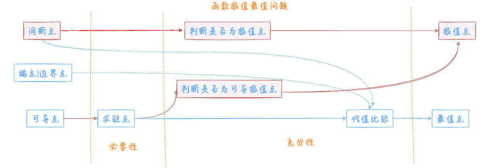

# 多元函数微分法及其应用
## 概念
$\mathbb{R}$ 一维空间|线性空间   
$\mathbb{R^2}$ 二维空间|平面  
$\mathbb{R^n}$n维空间  
学习思路从$\mathbb{R}$→$\mathbb{R}^2$→$\mathbb{R}^n$
### 平面点集|点集
距离公式
$$
d=\sqrt{(x-x_0)^{2}+(y-y_0)^{2}\cdots}
$$
#### $\mathbb{R}^2$邻域|邻域
是一个特殊的点集`无限集`
#### 点和点集关系
点的邻域与点集的`集合关系`
内点
外点
边界点-边界
聚点

#### 点集分类
开集
闭集

连通集
离散点集显然不是连通集，连续点集的`一块`   
开区域|区域 ：连通的开集   
闭区域：连通的开集+边界

有界集
无界集
### 多元函数概念
#### **定义** 
设D是$\mathbb{R}^n$的一个非空子集，映射f：D→$\mathbb{R}$为定义在D上的二元函数，记为 
$$
z=f(x,y),(x,y)\in D
$$
其中D为定义域，x，y为自变量，z为因变量`因变量只有一个`
### 多元函数的极限
以二元为例  
#### **定义** 
设二元函数$f(P)=f(x,y)$的定义域为$D$，$P_(x_0,y_0)$是$D$的**聚点**。如果存在常数$A$，对于任意给定的正数$A$，对$\forall\varepsilon>0，\exist\delta>0,当P(x,y)\in D\cap \mathring{U}$时，都有
$$
|f(P)-A|=|f(x,y)-A|<\varepsilon 
$$
成立，那么就称$A$为函数$f(x,y)$当$(x,y)\rightarrow (x_0,y_0)$时的极限，记作
$$
\lim_{x \rightarrow x_0 \atop y \rightarrow y_0 } f(x,y) = A
$$
注意这依旧是一个`函数`的极限   
在**有定义**的趋向方式下唯一 
#### 计算
TODO 复习极限运算  
适用极限运算法则  
1.连续函数代值  
2.等价无穷小替换  
3.根号有理化  
4.洛必达法则  
5.多项式比阶  
### 多元函数连续性
#### **定义**
设二元函数$f(P)=f(x,y)$的定义域为D,$P_0(x_0,y_0)$为D的聚点，且$P_0\in D$,若  
$$
\lim_{x \rightarrow x_0 \atop y \rightarrow y_0 } f(x,y) = f(x_0,y_0)
$$
则称函数$f(P)=f(x,y)$在$P_0(x_0,y_0)$连续  
由极限运算法则可知  
**一切多元初等函数在其定义区间都是连续的**  
#### 性质
##### 有界与最值定理
##### 介值定理
##### 一致连续性定理
TODO def 一致连续 没提到  
### 偏导数
思想：将其他自变量看成系数|常量，对一个自变量构成的函数求导  
#### 点偏导数
**定义** 设函数$z=f(x,y)$在点$(x_0,y_0)$的某个邻域内有定义，当$y$固定在$y_0$而$x$在$x_0$处有增量$\Delta x$时，相应的函数有增量
$$
f(x_0+\Delta x,y_0)-f(x_0,y_0)
$$
如果
$$
\lim_{\Delta x\rightarrow 0}\frac{f(x_0+\Delta x)-f(x_0,y_0)}{\Delta x}
$$
存在，那么称此极限为$z=f(x,y)$在点$(x_0,y_0)$处对$x$的偏导数，记作
$$
f_x(x_0,y_0)=\frac{\partial f}{\partial x}\Bigg|_{x=x_0\atop y=y_0}
$$
#### 偏导函数|偏导数
同理，记作
>教材不加',而张宇书加',即$f_x(x,y),f'_x(x,y)$
$$
f_x(x,y)=\frac{\partial f}{\partial x}=\frac{\partial z}{\partial x}
$$

>$f_x(x,y);f_y(x,y)$都是`关于x,y`的函数
#### 高阶偏导数
当$f_x(x,y);f_y(x,y)$的偏导数也存在，那么称它们是$z=f(x,y)$的二阶偏导数，如下
$$
\frac{\partial}{\partial x}\left(\frac{\partial z}{\partial x}\right)=\frac{\partial^{2}z}{\partial x^{2}}=f_{xx}(x,y)\\
\frac{\partial}{\partial y}\left(\frac{\partial z}{\partial x}\right)=\frac{\partial^{2}z}{\partial x\partial y}=f_{xy}(x,y)\\
\frac{\partial}{\partial x}\left(\frac{\partial z}{\partial y}\right)=\frac{\partial^{2}z}{\partial y\partial x}=f_{yx}(x,y)\\
\frac{\partial}{\partial y}\left(\frac{\partial z}{\partial y}\right)=\frac{\partial^{2}z}{\partial y^{2}}=f_{yy}(x,y)
$$
**定理** 如果函数的两个二阶混合偏导数在区域D内连续，则在区域内这两个二阶混合偏导数必相等，即
$$
\frac{\partial^{2}z}{\partial y\partial x}=\frac{\partial^{2}z}{\partial x\partial y}
$$
证明略
### 全微分
全增量可表示为一个线性主部+一个关于自变量增量的高阶无穷小  
微分是一个关于自变量增量的**线性主部**，也就是一个`表达式`
#### 偏增量与全增量
偏增量：
$$
f(x+\Delta x,y)-f(x,y)\approx f_x(x,y)\Delta x\\
f(x,y+\Delta y)-f(x,y)\approx f_y(x,y)\Delta y\\
$$
全增量：
$$
\Delta z=f(x+\Delta x,y+\Delta y)-f(x,y)
$$

#### 可微
**定义** 设函数$z=f(x,y)$在点$(x,y)$的某个邻域内有定义，如果函数在点$(x,y)$的全增量
$$
\Delta z=f(x+\Delta x,y+\Delta y)-f(x,y)
$$
可表示为
$$
\Delta z=A\Delta x+B\Delta y+\omicron(\rho)
$$
其中，$\rho=\sqrt{(\Delta x)^{2}+(\Delta y)^{2}}$,那么称函数$z=f(x,y)$在点$(x,y)$可微分
#### 全微分
**定义** 若函数$z=f(x,y)$在点$(x,y)可微分，则称 $A\Delta x+B\Delta y$为函数$z=f(x,y)$在点$(x,y)$的全微分,记为
$$
{\rm d}z=A\Delta x+B\Delta y
$$
#### 可微的必要条件
可微→偏导存在
#### 充分条件
偏导连续→可微 

$$
\begin{aligned}
\Delta z&=f(x+\Delta x,y+\Delta y)-f(x,y)\\
&=[f(x+\Delta x,y+\Delta y)-f(x,y+\Delta y)]+f(x,y+\Delta y)-f(x,y)\\
\end{aligned}
$$
运用拉格朗日中值定理，得
$$
f(x+\Delta x,y+\Delta y)-f(x,y+\Delta y)=f_x(x+\theta_1\Delta ,y=\Delta y)\Delta x(1<\theta_1<1)
$$
又因为连续，则
$$
f_x(x+\theta_1\Delta ,y=\Delta y)\Delta x(1<\theta_1<1)=[f_x(x,y)+\omicron(\Delta x,\Delta y)]\Delta x
$$
同理，剩余略，故
$$
\displaystyle\lim_{\Delta x\rightarrow 0 \atop \Delta y\rightarrow 0}\Delta x-{\rm d}x=0
$$
#### 题型
判别`某点`是否可微：  
1.作差求极限 $\displaystyle\lim_{\Delta x\rightarrow 0 \atop \Delta y\rightarrow 0}\Delta x-{\rm d}x$  
2、利用充分性**证** 是  
3、利用必要性**证** 否  
## 计算
### 多元复合函数求导法则
TODO 绘图  **例** 8.4.5
#### -多-1
#### -多-多
#### -多-多|1
#### 自添-1-多
#### tips
建立表格，不妨慢一点，在求偏导时先将其他常量写成a，b  
外层函数参数按位记为1，2，3，eg
$$
f'_1=f_u(u,v),f'_2=f_v(u,v),f''_{12}=f_{uv}(u,v)
$$
### 全微分形式不变性
设函数$z=f(u,v)$具有连续偏导数，则有全微分
$$
{\rm d}z=\frac{\partial z}{\partial u}{\rm d}u+\frac{\partial z}{\partial v}{\rm d}v=\frac{\partial z}{\partial x}{\rm d}x+\frac{\partial z}{\partial y}{\rm d}y
$$
即无论u，v是自变量还是中间变量，全微分形式是一样的
### 隐函数求导 
#### 隐函数存在定理
>后验逻辑，先将方程一边当成一个函数求偏导，
设一个因变量，若方程对应变量求偏导不等于0，则能确定一个隐函数与之对应

**隐函数存在定理1** 设函数$F(x,y)$在点$P(x_0,y_0)$的某一邻域内有**连续偏导数**，且$F(x_0,y_0)=0$，$F_y(x_0,y_0)\ne 0$,则  
方程$F(x,y)=0$在点$P(x_0,y_0)$的某一邻域内能唯一确定一个连续且具有连续导数的函数$y=f(x)$  
**隐函数存在定理2**
略  
#### 隐函数求导公式
$$
\frac{{\rm d}y}{{\rm d}x}=-\frac{F_x}{F_y}\\
\frac{\partial z}{\partial x}=-\frac{F_x}{F_z},\frac{\partial z}{\partial y}=-\frac{F_y}{F_z}
$$
## 应用 
### 多元函数极值及其求法

#### **定义** 
设函数$f(x,y)$的定义域为D，$P_0(x_0,y_0)$为D的内点。若存在$P_0$的某个邻域$U(P_0)\subset D$,使得对应该邻域异于$P_0$的任何点$(x,y)$，都有
$$
f(x,y)<f(x_0,y_0)
$$
则称函数$f(x,y)$在$P_0(x_0,y_0)$有极大值$f(x_0,y_0)$  
极小值同理
#### 偏导数存在情况下的极值存在定理  
**定理1** **偏导存在**情况下 极值存在**必要性定理**   
存在→一阶偏导0   
**证** 不妨设$z=f(x,y)$在点$(x_0,y_0)$具有极大值，则
$$
f(x,y)<f(x_0,y_0)
$$
在$\mathring{U}(x_0,y_0)$都成立  
不妨取$y=y_0,x\ne x_0$,则
$$
f(x,y_0)<f(x_0,y_0)
$$
在区间$\mathring{U}x_0$用`费马引理`得
$$
f_x(x_0,y_0)=0
$$
**定理2** **二阶偏导存在**情况下 极值存在**充分性定理**   
$\Delta$极值判别法  
$$
A=f''_{xx};B=f''_{xy};C=f''_{yy}\\
\Delta=4AC-B^{2}\\
\begin{cases}
\Delta>0  A>0,极小值；A<0,极大值\\
\Delta<0  无极值\\
\Delta=0  无法确定\\
\end{cases}
$$
TODO 多元泰勒公式证  
### 无条件极值`求极值`
定理1+定理2
### 条件极值`求最值`
>为什么一定是二元函数：二元的情况下加一个附加条件就可以实现到一元函数的转换→用费马引理
#### 拉格朗日乘数法
本质，将多元函数代入条件变成一元函数，求一元函数驻点待值，只能处理函数连续的问题
##### 拉格朗日函数
TODO 练习  