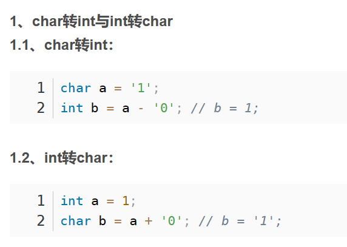

# I/0
## Input
### <<
### cin.get()
common use
```c++
int main(){
    char ch;// get一个put一个
    while((ch=cin.get())!=EOF){
        cout.put(ch);
    }
}
```
### cin.getline()&&getline()->string
### cin.read()

## Output
### >>
### cout.put()->char
### cout.write()->char* ,int size

## 将对象输入输出文件
利用字节输入输出序列化
```c++
#include<iostream>
#include<fstream>//文件输入输出

using namespace std;

class Info {//一个info类、结构
public:
	unsigned id;
	double salary;
};
int main() {
	Info e = { 60001,8000 };//这他妈能初始化
	ofstream os("fname",ios_base::out|ios_base::binary);//创建os对象，文件名，ios_mode binary表示二进制输入输出
	os.write(reinterpret_cast<char*>(&e), sizeof(e));//将e地址转化为char* 首地址，传入长度
	os.close();//开始必须关闭
	
	ifstream is("fname", ios_base::in | ios_base::binary);//创建is对象，并打开文件
	if (is) {//读入必须文件存在
		Info e2;
		is.read(reinterpret_cast<char*>(&e2), sizeof(e2));
		cout << e2.id << " " << e2.salary << endl;
	}
	else {
		cout << "not find file"<<endl;
	}
	is.close();
}
```

# 字符数组处理
不允许使用C++ STL，也就是说string类没法用
能不能用cstring？？
## cstring char*的处理
### strcpy()
char* strcpy(char* dis,const char* source);
### strncpy()
char* strncpy(char* dis,const char* source,size_t num);
### strcat()
字符串拼接
### strcmp()
返回 =0 相同 
### strtok()
好晦涩不想用,切分字符串 
first use: strtok(str," ,;");
else:strtok(NULL," ,;");
### int<->char



## string 
### string<->char* c_str()
```c++
char * new;
string s="sjdak";
strcpy(new,s.c_str())
```

# int<->string
## int->string
### string库
```c++
#include<string>
int x;
string temp=to_string(x);//->int long double
```
### sstream
```c++
#include<iostream>
#include<sstream>
#include<string>
//zheng 11-6
template<class T>
inline string toString(const T &v){
	ostringstream os;
	os<<v;
	return os.str();
}
```
## string->int
### 数值判断法
```c++
string s = "123";
int num = 0;
for (int i=0; i<s.size(); ++i) {
    num = 10 * num + (s[i] - '0');
}
```
### ato函数
包含 atoi(int),atof(float),atol(long)
```c++
string s = "123";
int num = atoi(s.c_str());
```
### sstream
```c++
#include<sstream>
#include<string>
istringstream is("123");     // 构造输入字符串流，流的内容初始化为 "123" 的字符串
int num;
is>>num;   // 从 is 流
```
## 【应用】回文认定
string类解决
```c++
// 将输入整数转化为字符串
#include<string>
int x;
string temp=to_string(x);//->int long double
// 字符串倒序
sting temp2=temp;
reverse(temp.begin(),temp.end());
//比较输出
for(i=0;i<=temp.end();i++)
	if(temp2[i]!=temp[i])
		return false;
return true;

```

