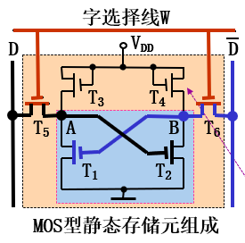
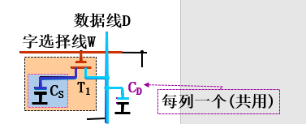
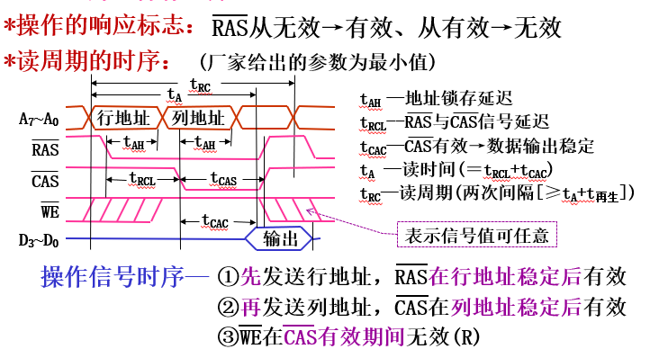
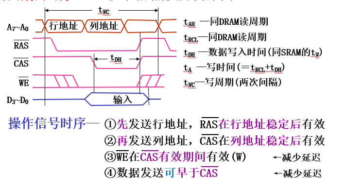
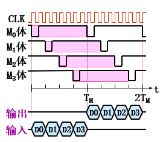
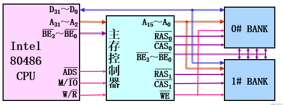

# 存储系统
层次结构及RAM需4学时，主存需4学时，Cache需3学时，虚存需1学时
## 概述
### 存储器分类
#### 存储介质
- 半导体
- 磁性
- 光
#### 信息可保存性
- 易失（半导体可能易失） 
- 非易失  
#### 存取方式（存储器中信息定位方法及操作方式）
- 随机存取 RAM
- 顺序存取 SAM（磁带）
- 直接存取 DAM(磁盘)
#### 操作类型
- 只读 ROM(非易失)
- 读写 RWM（易失）
#### 应用功能  
- 高速缓冲存储器SRAM
- 主存储器DRAM
- 辅助存储器DAM|FlashSSD
- 控制存储器ROM
### 存储器的主要技术指标
#### 存储容量（$S$）
#### 存取速度
存取周期>存取时间

##### 存取时间Access Time（$T_A$）
存储器`启动`一次**存储器操作**到`完成`的时间  
##### 存取周期Memory Cycle($T_M$)
存储器连续进行两次存储器操作的**最短**`时间间隔`  
#### 传输速度
##### 存储器带宽（$B_M$）Mbps|MB/s
W为数据引脚位数（一次传送数据xbit），  
$T_M$为`存取周期`（传送xbit所需时间）
$$
B_M=W/T_M
$$
### 层次式存储系统
用户需求：大容量、高速度、低价格  
$C$为存储器总价，$S$为存储容量，$c$为每位均价  $c=C/S$ 
#### 程序局部性原理
程序运行时，数据和指令访问所呈现出的相对簇聚的现象
##### 时间局部性
**最近**访问过的**信息**，不久将被再次访问
##### 空间局部性
最近访问信息的相邻信息，不久将被访问
#### 层次结构（多种MEM级联）
##### 参数要求
$$S_{M1}<<S_{M2}<<…<<S_{Mn}
\\T_{M1}<<T_{M2}<<…<<T_{Mn}\\
$$
使得
$$
\overline{c}＝\sum_{i=1}^{n}c_iS_i/\sum_{i=1}^{n}S_i ≈ c_n$$
##### 内容要求
上级MEM中信息为下级MEM中信息的副本  
有效容量：$S＝S_{Mn}$
##### 传递要求
各级MEM间的信息传递是透明的
##### 常见层次结构  
- Cache-主存   
    解决访问速度问题
- 主存-辅存  
    解决主存容量问题  

由于存储系统在外部看是一个整体，因此存储器之间的信息交换是透明的  
由于信息交换管理由硬件完成，因此Cache对所有程序员是透明的
#### 存储系统工作过程
1. 程序存储在辅存中
1. 程序执行时预先装入主存中
1. 按逻辑地址访问存储系统
## 半导体存储技术
 ※SRAM的学习要求：   
   1、熟记SRAM的`功能`(信息存储、按地址访问[时延相同])   ←应用需求  
              (2n×w)容量参数←┼───┘  │
                               └─────┴─→工作状态(读/写/闲)  
   2、了解SRAM的`内部组成`(存储矩阵+译码器+读写电路+控制电路)  
   3、掌握SRAM的`引脚组织`方法(地址+数据+控制)         ←容量-引脚关系  
   4、理解SRAM的`操作信号时序`(先发地址，读/写不同)    ←访问的实现 
### 静态存储器SRAM
#### 存储元——触发器
存储器中，只能存放**1位二进制信息**的电路称为存储元
  

读： $WT_5T_6 D=V_{中}$+差分放大器   
写： $WT_5T_6 D=i$   
保持 $\overline{W}$
#### 芯片组成
##### 存储矩阵
由于`信号延迟和线路长度成正比`，通常采用`二维正方形`（存储元）  
##### 地址译码器
对行X列Y译码
##### IO门 
D线+MOS做开关（MOS栅极由Y译码器输出控制）
##### 读写电路
读出放大器+写放大器  
input地址总线信号  
output D线  
一个读写电路只能读写一位数据
##### 控制电路
控制写、读、空闲状态 
#### 引脚组织：
##### 地址引脚——单向
n=$log_2(S/w)$
##### 数据引脚
存储单元长度w  
有单向、双向2种方式(双向为读写复用)，分别为2w根、w根   
一般为双向复用  
##### 控制引脚
RAM芯片规格有限需要允许用户进行存储模块设计  
$\overline{CS}$，用其进行芯片选择
$\overline{WE}$  
`逻辑转换`

#### **读写时序**
##### 读
  
读为什么不需要等待$t_{AW}$,即使译码不对，最终也会对的，而读不会用D线给存储元改变状态

1地址先有效
##### 写
  
①地址首先发送，CS在地址稳定后有效   ←操作指定单元  
②WE在地址稳定tAW后有效               ←防止误写入  
③数据发送可早于tAW+tW-tDW             ←便于实现  

### 动态存储器DRAM 
#### 存储元
  
破坏性读出  
每列数据线D有（1个）预充电电容$C_D$,保持中等电位以捕获存储信息电容$C_S$的信息
  
####  芯片组成

##### 地址锁存器
##### 时序控制电路
##### 再生电路  
#### 引脚：  
##### 地址引脚：采用`地址复用`技术 
原因：DRAM集成度高，地址引脚显得拥挤   
单向，为$[log_2(S/w)]/2$根  →地址分2次接收  
##### 数据引脚（同）
##### 控制引脚
$\overline{RAS}$ 
$\overline{CAS}$
$\overline{WE}$
#### 读写时序
##### 读

##### 写

#### 刷新 
失去电荷时间为2ms
刷新周期：同一存储单元相邻两次刷新的最大时间间隔64ms
刷新操作与读操作所需的时间相同
##### 刷新时序
`与读周期类似，CAS一直无效`~列不选通  
Y译码器输出也全部无效
##### 刷新方式
- 集中式刷新  
存在死时间（死区）
- 分散式刷新  
不存在死时间，存取周期翻倍
- 异步式刷新
死区为一个存取周期

刷新的实现：DRAMC——主存控制器/DRAM控制器 在芯片外  
1管理对主存的操作  
2实现DRAM芯片的刷新
### 半导体ROM
#### MROM
#### PROM
#### EPROM
#### EEPROM
#### Flash
## 主存
包含BIOS芯片ROM+DRAM芯片
$$
主存容量=主存单元长度\times 主存单元个数\\
主存单元个数<=2^{主存地址空间}
$$
### 逻辑设计
通过扩展的方式将存储芯片拓展为存储模块
存储模块：多个存储芯片构成的电路  
存储模块的存储字长、存储字数分别等于主存单元长度、主存单元个数
#### 位扩展（并联法）
除了D信号线对应引脚不同，其他引脚直接连接模块相应的信号线
#### 字扩展（串联法）
利用译码器将高位地址译码+使能端（$\overline{CS}\  \overline{RAS}$）
#### 字位扩展——自己悟
有例题好好做
### 主存与CPU的连接（未掌握）
#### 数据线
#### 地址线
#### 控制线
CS的逻辑连接
#### CPU的存储器接口

### 提高访存速度的技术
$$
存储器带宽B=W/T_M,W为数据宽度，T_M为存取周期
$$
访存需求：一次访问多个连续单元，多次访存的地址连续如访问int数据就需要连续访问4个主存单元。
方法：改进工艺、并行处理(多个MEM)、层次结构(多种MEM)  
#### DRAM改进（重看）
##### FPM DRAM
fast page mode  
支持一个行地址有效信号+多个列地址信号  

##### SDRAM
用时钟信号控制数据传输  
`突发（猝发）传送模式`：在第一个数据被访问后可连续传送多个数据  

  
突发长度BL——通过$\overline{RAS}$、 $\overline{CAS}$、$\overline{WE}$同时有效设置，故需增设$\overline{CE}$
##### DDR双倍数据速率 SDRAM
既然你采用时钟同步的方式，不如上升下降沿都传输数据
#### **多体交叉存储器**（字扩展）
存储体—指具有存储矩阵、译码电路、读写电路的存储模块
多体存储器：用多个容量相同的存储体构成  
本质就是做了个字拓展
##### ~~顺序编址~~（高位交叉编址）
高位作为体号,鸟用没有
##### 交叉编址（低位交叉编址）
低位体号，使得连续的数据存放在不同模块  
###### **交叉访问方式**（流水线）-多体交叉存储器
采用指令流水访问方式

###### 并行访问方式——多体并行存储器
和位扩展有鸡毛区别——有
不进行位扩展，使得存储单元长度仍按字节编址  
而CPU的地址引脚可以增加到机器字长
写入时需要数据掩码的帮助，由CPU提供

#### 双端口存储器（书用于寄存器——SRAM）
1.一读一写 读出错误  
2.两写 写入错误  
在一个存储器中提供两个独立的I/O接口  
## 高速缓冲存储器cache  
### cache的基本原理（硬件透明）
#### 命中率——H
Hit&Miss
#### 平均访问时间（任书不考虑优化）
$$
T_A=H\times T_c+(1-H)\times (T_c+T_m)=T_c+(1-H)T_m\\
T_c命中时间，T_m缺失开销
$$
影响因素：替换算法，写策略，**相联度，主存块大小，cache容量（命中率）**
#### cache（缓存）的存储空间管理
信息交换的单位——块  
cache的块——缓存块 8机器字长
>主存的页——页框（page frame）4KB？？？？chatgpt
块大小的决定方式——机器字长8机器字长  
编址单位——主存字大小编制  
>关于机器字长，存储字长的理解:  
机器字长由计算机运算器一次能处理的定点运算数据位数的最大长度  
存储字长指存储器/存储模块的存储单元（逻辑概念）所能存放的二进制长度称为存储字长/存储单元长度
存储单元——存储器按地址一次访问的空间，一位地址对应的空间
主存单元长度——主存的存储字长：ASCII码，按字节编址
通过多体交叉存储的并行访问方式来实现数据存储  
存放缓存块及其相应信息的存储空间称为行  
##### cache信息管理位
- 有效位1位（是否空闲 valid bit）
- 标记（Tag）
- x位$=log_2路数$（替换算法counter）
- 脏位1位(是否修改dirty bit)
算法位+脏位统称状态
#### 工作流程（作图）
### cache的地址映射 怎么存
可能存放主存块的行被称为候选行
候选行数称为相联度——一个主存块合法映射到cache的行数  
相联度越大，冲突概率越低，cache命中率越大，cache的Tag位越多，成本越大（比较器越多）
#### 直接映射
$$
主存块i，cache行j，cache行数G \\
j=i mod G\\
为了便于描述，将每G块主存块称为一个区\\
主存地址=区号（Tag）+区内块号（作为索引，不占空间）+块内地址
$$
#### 全相联映射
tag=主存块号  
候选行太多，需要G个比较器
主存块号（Tag）+块内地址
#### 组相联映射
将cache行分组，每组n行，则候选行为n，
映射函数为 $j mod G/n$
cache行号=cache组号+组内块号
主存地址=群号（Tag）+群内块号（cache组号）+块内地址
### cache的替换算法 存什么
#### ~~随机算法RAND~~
#### 先进先出FIFO
`增加候选行数不会提高H`，没有考虑程序局部性，需在候选行设置计数器
#### 最近最少使用LRU least resently used
LRU不会对cache命中率产生负面影响  
计数值保存在cache行中管理信息的状态位上，表示访问顺序
##### 计数值的修改算法
init 为全1（最大计算值）
modify 计数值比访问行小的+1 被访问行清0
### cache的写策略 怎么保持数据一致
写缺失处理：
按写分配法write allocate ：调入cache，写cache行
不按写分配法 no write allocate：直接写主存，不调入cache
#### 全写法
命中时，写入cache+主存  
缺失时，直接写入主存，不将块调入cache
#### 写回法
命中时，写入cache，不写入主存
缺失时，调入cache，写cache行
替换时，if modified ，写回主存
### ~~Pentium的cache组织~~
#### 多级cache
两级cache系统性能较好，L1cache 减小命中时间，L2cache减少缺失开销  
多核CPU每个CPU核为两级cache，共享L3cache
#### 哈佛结构
由于现代CPU采用流水线提高性能  
取指令，执行指令中取操作数可能同时发生——并行访存  
解决访存冲突：指令I-cache、数据D-cache（通常存在于L1cache）
## 虚拟存储器——主存存储管理
硬件MMU 存储器管理单元   
解决计算机不同进程如何分享主存，消除实际主存容量对程序的限制  
### 相关概念
#### 程序地址空间
从0开始编址，使用逻辑地址和逻辑**地址空间**  
对应的，主存地址称为物理地址，地址空间为物理地址空间  
各个程序的逻辑地址空间大小相同
#### 主存空间分配
##### 分区（连续分配）
固定分区、
可变分区 可用拼接计算合并空闲分区开销大
##### 分页
主存分为大小相等的页框page frame
进程分为大小相等的页page
用页表组织
管理开销大
#### 存储空间的扩充（早期：覆盖技术，下文，虚存技术）
### 虚拟存储器的基本原理
虚拟地址和虚拟地址空间  
特性：存储器可以独占，每个进程都有一个虚拟地址空间  
基本思想：借助辅存来扩充主存的地址空间，并能够按虚拟地址空间进行访问  
虚拟存储器是一个按虚拟地址访问的访问的主存-辅存层次
### 虚拟存储器的管理
#### 特性
存储器独占（每个进程独立编制）
存储器地址空间远大于主存(给出比主存更大的容量上限)
#### 实现原理
利用对换技术和程序局部性原理，综合使用主存和辅存
#### 段式
增加装入位
##### 优点
段的分界就是程序的分界，有利于实现程序的共享与保护
##### 缺点
会产生外部碎片，空间利用率不高
#### 页式
由于辅存缺失开销巨大，页比块大得多，通常为4KB  
虚拟页号（VP）物理页号（PP）
#### 段页式
虚拟地址=段号+虚拟页号（VP）+页内地址  
主存地址=页框号+业内地址  
段表项=装入位+页表首地址（特殊的物理页号）+其他  
页表项=装入位+物理页号+其他
#### 虚拟页式管理器的实现
##### 缓存管理
采取全相联映射
替换算法近似LRU，但是不能采用计数器更新实现，因为主存访存开销太大  
>另设硬件，循环位移器、栈
写策略采取写回法——减少命中时间  
虚存-辅存映射 逻辑-文件 文件头，文件-文件存储 操作系统的文件系统  
##### 页表的组织
由于页表项首地址是用加法得到的，故一个页表大小超过一个页面时，地址可能会出错（约定页表不超过一个页面）
##### 地址变换实现
虚拟地址VA，物理地址PA，页表项PTE，页表项地址PTEA
##### 快表TLB的组织
主存的页表称为慢表
为减少访存次数
有较高的相联度——8路组相联
LRU+写回法  
**快表大小，十几项？？**  
VPN虚拟页号  
>考点 快表下的有效访存时间 
