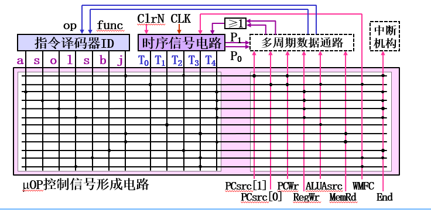
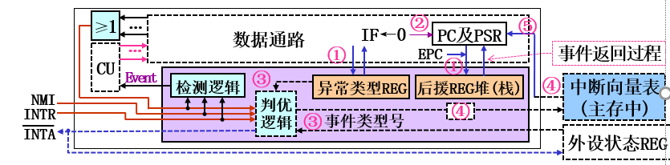

# 中央处理器CPU
## 功能
⑴指令控制：控制指令的执行顺序(按程序顺序循环执行) 
读程序  控制器   
⑵操作控制：产生指令执行所需的操作控制信号  
操作硬件  控制器  
⑶时间控制：控制操作控制信号的时序(时长及次序)  
硬件时间控制  控制器  
⑷数据加工：实现指令约定的数据运算(∈指令系统)  
运算器干的事情  
⑸外部访问：实现对存储器、外设的访问  
程序控制访问外部设备  
⑹异常及中断处理：实现异常及中断的检测及处理  
控制器  
## 组成

### 指令部件
REG（PC、IR）
### 控制单元CU 
是控制器的核心部件  
ID译码器、${\rm\mu OP}$控制信号电路，时序信号电路
### 运算器
ALU、FPU、FLAG、REGS
### 总线接口单元BIU
MAR、MDR、总线逻辑
### 存储管理单元MMU
页表寄存器PTR、段表寄存器STR 地址译码

    虚实地址翻译
    在用户访问内存时，将用户访问的虚拟地址翻译为实际的物理地址，以便CPU对实际的物理地址进行访问。
    访问权限控制
    可以对一些虚拟地址进行访问权限控制，以便于对用户程序的访问权限和范围进行管理，如代码段一般设置为只读，如果有用户程序对代码段进行写操作，系统会触发异常。
    引申的物理内存管理
    对系统的物理内存资源进行管理，为用户程序提供物理内存的申请、释放等操作接口。

### 中断机构
### 寄存器的组织（逻辑）
#### 用户可见
##### 数据
AC累加器在80x86用AX作
##### 地址
##### 通用GPR General Purpose Register
80x86有八个ax、bx、cx、dx、BP、SP、SI、DI
##### 状态PSR program Status Register
存放程序状态字PSW program status word
80x86为FLAGS寄存器

#### 系统专用
##### 程序计数器PC
80x86为IP
##### 指令寄存器IR
##### 存储器地址寄存器MAR
##### 存储器数据寄存器MDR
## 工作流程
循环执行指令+异常中断处理  
循环指令周期+中断周期
### 指令执行过程
取指令、分析指令、执行指令
  
取指令  
(PC)作为地址访问存储器找到指令字,写入IR  
变长指令字格式可能需要多次访存 如二字长指令 
指令译码  
对操作码以及寻址方式译码  
输出操作控制信号
取操作数  
数据操作  
保存结果  
指令地址计算  
PC=PC+1【PC增量操作】在取指令阶段完成，取出后即可增量

指令长度的获得有两种基本途径 ：  
一是在指令中固定某些位 ，专门用来描述该指令的长度  
二是可以构造一个指令与指令长度的对应**关系表** ，通过查找对应表来获得指令长度`80x86`
### **举例（Demo_IS）**

   
disp 存放到扩展单元ExtU中，比如直接寻址和立即寻址要用，
直接寻址作为地址ExtU立即寻址直接将ExtU进行处理  
**设(PC)=10H,(R0)=20H(R2)=30H**
#### 取数指令LD 0010 0100

`取指令：`  
功能   
IR←M[(PC)]；PC←(PC)+"1"  
操作  
$$
{\rm MAR\leftarrow(PC)}\\
{\rm MDR=M[(MAR)]}\\
{\rm IR=(MDR)}\\
{\rm PC=(PC)+1}
$$
**(IR)=0010 0200 (PC)=11H**

`译码:`  
0010→LD:RD←M[(RS)];01→RD=R1;00→RS=R0;  
指令功能：R1←M[(R0)]  
`执行:`  
M[]的翻译：
$$
{\rm MAR←(R0)}
$$  
要访问的地址交给MAR

    []的内容可以来自REG|ExtU，80x86不能再次来自主存，不然一个操作数的获得需要两次访存太慢了
$$
{\rm MDR←M[(MAR)]}
$$
表示存储器读操作 读出内容存入MDR  
RD←的翻译：  
$$
{\rm R1←(MDR)}   
$$
表示把MDR的数据存到目的寄存器中  
**(R1)=48H**
#### 存数指令ST 0011 1000
设(R0)=20H(R2)=30H  
取指过程：IR=M[(PC)]=0011 1000 PC=PC+1=12H   
译码:0011→ST：M[(RS)]←(RD);10:RD=R2;00:RS=R0  
执行:  
MAR=(R0)//地址交给MAR    
MDR=(R2)//数据交给MDR    
M[MAR]=(MDR)//表示写操作    
结果  
**M[20H]=30H**
#### **减法SUB** 0110 0110
取指过程：IR=M[(PC)]=0110 0110 PC=PC+1=13H  
译码：0110→SUB：RD←(RD)-(RS);01:RD=R1,10:RS=R2  
执行：  
`同时进行`(ALU为组合逻辑电路)  
$$
{\rm ALU_A}\leftarrow{\rm (R1)}\\
{\rm ALU_B}\leftarrow{\rm (R2)}\\  
{\rm ALU_A-ALU_B}\\
{\rm R1}\leftarrow{\rm ALU_F}
$$
结果  
**(R1)=18H,ZF=0**
#### **分支指令JNZ**1101 1110
取指过程：IR=M[(PC)]=1101 1110 PC=PC+1=14H  
分析指令：1101←JNZ:if ZF==0 PC←(PC)+disp disp:1110
执行指令：  
ZF=0√  
ExtU=符号拓展+disp=1111 1110=FEH
$$
{\rm ALU_A}\leftarrow{\rm (PC)}\\
{\rm ALU_B}\leftarrow{\rm (ExtU)}\\  
{\rm ALU_A-ALU_B}\\
{\rm PC}\leftarrow{\rm ALU_F}
$$
结果  
**(PC)=14H+FEH=12H**
### 分析特征
1. 执行过程由取指、分析、执行阶段的操作组成
2. 取指阶段的操作对所有指令通用
3. 执行阶段的操作由指令字内容决定
4. 执行过程的操作是一个基本操作序列
5. 基本操作类型  
   - ①REG间传送：
   - ②存储器读：
   - ③存储器写：
   - ④算逻运算：  
## 数据通路Datapath
指令执行过程中数据所经过的`路径`**互联结构**以及路径上的`部件` **功能部件**   
`它不属于CPU范围`还包括了存储器，只是通常放在CPU中讲

### 功能部件设置
#### 分类
操作部件(组合逻辑电路)、状态部件(时序逻辑电路)
#### 基于Demo_IS的部件设置  
PC、IR，MAR、MDR、MEM，GPRs、PSR，ALU、ExtU  
#### 各个部件的接口组织
`读寄存器是组合逻辑，写寄存器是时序逻辑`

### 互联结构设置
#### 总线结构
传输条件：同**一**时刻，**一**个部件**发送**数据  
单总线、双总线、三总线等  
信号冲突：不满足传输条件  
组合逻辑电路输出只依赖于输入`会立即受总线影响`
解决方案：  
1. 所有output全部加上三态门`开关`
2. ※组合逻辑部件input加寄存器`信息进入后下个CK才能被改变`|锁存器`信息进入后下个信息进入才能被改变`|增加总线数量`eg ALU需三总线或外加俩个寄存器`
#### 专用结构`点点结构`
接收冲突：增设MUX
### **微操作**$\rm{\mu OP}$
CPU内部的原子`不能再细化`操作称为$\rm{\mu OP}$  
微操作命令$\rm{\mu OP}$Cmd：实现$\rm{\mu OP}$的部件**控制信号**  
节拍：完成一个$\rm{\mu OP}$的时间|启动两个相邻$\rm{\mu OP}$的时间

$\rm{\mu OP}$Cmd书写约定：写出的信号都有效，未写出的信号都无效；  
多种取值的信号用“＝”表示

CPU基本操作与${\rm\mu OP}$的关系，由于CPU基本操作在数据通路上**操作功能**上不能再分，故CPU基本操作都是微操作
#### 寄存器传送$\rm{\mu OP}$`RD←(RS)`
总线  

**电位-脉冲制**  
读寄存器是使能的$Rx_{out}$  -电位信号  
写入$Ry_{in}$接CK-脉冲信号  
这些信号都由CU中信号形成电路给出  
$$
\rm{\mu OP}Cmd：Rx_{out}、Ry_{in}
$$
专用
$$
\rm{\mu OP}Cmd：Ry_{sel}=i、Ry_{in}
$$
(待续)
#### 存储器读写$\rm{\mu OP}$`MDR←M[(MAR)]|M[(MAR)]←(MDR)`
$\rm{\mu OP}$完成时间不固定，因为Cache不一定命中  
异步

等待mfc，0→1，故需要WMFC(Wait MFC)控制CPU是否等待  
WMFC=1，CPU等待；WMFC=0,CPU退出等待  
$$
\rm{\mu OP}Cmd：(Read|Write)+WMFC
$$
同步
$$
\rm{\mu OP}Cmd：Read+MDR_{inB}|Write

$$
#### 算逻$\rm{\mu OP}$`RD←(RS1)op(RS2)`
由于是组合逻辑部件，所以控制的uop为同一套  
总线下
$$
{\rm\mu OP}Cmd：Rx_{out}、op=op_n、Z_{in}\\
执行指令时,\\
①Ra_{out}、Y_{in} ②Rb_{out}、op＝op_n、Z_{in} ③Z_{out}、Rc_{in}\\
专用通路\\
ALUA_{sel}=i、ALUB_{sel}=j、op＝op_n、Rc_{sel}=k、Rc_{in}
$$
### **指令执行过程的控制信号**`控制需求设计`
#### **Demo 单总线+Demo_IS**
#### ~~Demo 专用+Demo_IS待看这才是实际应用的~~
### ~~数据通路设计方法~~
#### 指令周期与DP
指令执行时，操作有组合逻辑操作`只有电路传输延迟`，时序逻辑操作，`得等电平跳变`，
##### 单周期CPU
指令周期=1时钟周期，DP只能采用专用结构，部件不能复用  
$T_c=\max\{T_{指令i}\}$、CPI=1
##### 多周期CPU
指令周期=多CPU周期，无限制,  
$T_c=\max\{T_{\rm\mu OPi}\}$、CPI=n  
总线结构：性能简单，控制交叉  
专用结构：控制复杂，性能较好  
实际应用中，都是`专用结构的多周期`CPU
#### 设计参数与步骤
参数：指令系统、指令周期类型`单|多`、存储器结构`冯|哈佛`、数据通路结构`总线|专用`
##### 指令系统分析
##### 功能部件设计
##### 部件互联设计
##### eg单周期数据通路的设计
##### eg多周期数据通路的设计

## 控制器
控制信号发生器
### 基本结构
#### 功能
指令控制、操作控制、时间控制、异常中断和处理  
#### 基本组成
指令部件(PC+IR)：控制指令顺序执行  
CU：实现操作控制和时间控制`有序的`产生${\rm\mu OP}$控制信号  
中断机构：异常及中断处理，检测响应异常中断请求`处理由软件完成——软硬交界`    
#### 工作原理
循环`有序地`产生${\rm\mu OP}$序列的${\rm\mu OP}$Cmd   
时序控制电路产生节拍信号，${\rm\mu OP}$信号形成电路根据${\rm\mu OP}$要求产生${\rm\mu OP}$Cmd，来控制数据通路实现指令执行
#### 分类
根据CU产生${\rm\mu OP}$Cmd的方式不同，  
硬布线控制器：速度快、结构不规整-RISC  
微程序控制器-CISC
### 时序系统组织
##### 信号类型
机器周期：完成一个基本**功能**`有逻辑意义的微操作序列`  
节拍：一个节拍完成一个${\rm\mu OP}$是时序控制信号  
节拍脉冲：**对应节拍**的同步脉冲 是触发信号 个数仅于${\rm\mu OP}$个数有关
`到此我只知道CPU有时钟周期，不明白这些关系`
##### 早期计算机组织`三级时序`
##### 现代计算机组织`两级时序`
### 时序型号形成电路
环形信号发生器`位移寄存器|计数器+译码器`+定时逻辑 
#### 定时逻辑
用于每个节拍宽度的确定
##### 同步控制方式
限时执行uop的控制方式`实现自动的一种最简单的方式`  

${\rm\mu OP}$仅受基准时钟`主时钟`$T_c$的控制  
故$T_c=\max\{{\rm\mu OP}时延\}$  
由于一个节拍完成一个${\rm\mu OP}$,所以节拍宽度一致，有周期  
故节拍周期=$T_c$

同步控制只能用于控制那些时延差异不大的${\rm\mu OP}$如，CPU内部的${\rm\mu OP}$  `否则周期太长导致性能降低`

##### 异步控制方式`应答|握手`
不限时执行uop的控制方式`比如你要输入输出？`   
${\rm\mu OP}$时序`时长`只受专门信号控制如mfc,WMFC，部件之间有应答信号
##### 联合控制
以同步控制为基础，支持异步控制  
两种方式的切换采用延长节拍法实现
#### 信号产生
在`定时逻辑`约束下，形成时序系统组织所约定的`约定了时序信号的个数和意义`时序信号  
利用环形型号发生器+组合逻辑`实现意义的表示`
### ${\rm\mu OP}$Cmd的形成
input:指令类型+程序状态`PSW位`+机器状态`中断与异常`+时序信号  
output：${\rm\mu OP}$Cmd
### 硬布线控制器中CU的设计
多用于RISC
#### 分析指令集
得出指令集的${\rm\mu OP}$状态转换图 

#### 组织时序系统
时序信号分层`现代计算机基本两层`   
节拍：`要几个？`操作时段|**操作方式**`便于形成控制信号`|状态类型 
节拍脉冲：上升下降  
定时方式：同步|异步|联合

#### 时序形成电路设计
定时逻辑+环形信号发生器
节拍信号产生函数
$$
T_1＝T_0，T_2＝T_1，T_3＝(lw＋sw)\cdot T_2，T_4＝(add＋sub＋ori)\cdot T_2＋lw\cdot T_3，\\
T_0＝(add＋sub＋ori＋lw)\cdot T_4＋sw\cdot T_3＋(beq＋j)\cdot T_2+\overline{T_0}\cdot\overline{T_1}\cdot\overline{T_2}\cdot\overline{T_3}
$$
添加组合逻辑电路实现状态转换

#### ${\rm\mu OP}$Cmd形成电路设计
${\rm\mu OP}$Cmd使用时间表
   
${\rm\mu OP}$Cmd逻辑表达式
$$
PCsrc[1]＝T_2\cdot j，PCsrc[0]＝T_0，PCWr＝T_0+T_2\cdot j，\\
           RegWr＝T_4\cdot (add+sub+ori+lw)，…，\\
           End＝T_2\cdot (beq+j)+T_3\cdot sw+T_4\cdot (add+sub+ori+lw)

$$
用可编程逻辑阵列PLA实现  
  
每个状态焊死
组合逻辑形成${\rm\mu OP}$Cmd
### 微程序控制器
#### 思想和术语
指令→微程序`微指令序列`
状态之间跳转灵活  
存储逻辑形成${\rm\mu OP}$Cmd
微命令`注意区别微操作命令`：微程序控制器内特有的与${\rm\mu OP}$Cmd一一对应的
#### CPU工作流程与微程序机构 CS
#### ${\rm\mu OP}$Cmd形成机构`与硬布线的不同`
微地址形成电路+μAR+μIR+CS`ROM`+指令译码器`MUX组成`
  
微指令周期：取微指令、执行微指令    (～1个节拍)
μAR形成：加电时由硬件产生，还需产生PC(首条指令地址)
#### 微程序控制器的工作原理

#### ~~微指令格式~~
##### 指令编码
##### 微地址形成

## 异常及中断处理
事件：改变程序正常执行顺序的特殊情况
### 异常(事件)|内部异常|程序性异常|同步事件  
CPU内部执行指令引起的意外事件  
除0、溢出、断点、缺页、保护错、单步执行、非法操作码  
#### 故障Fault
可能被修复的异常  
发生时间：指令执行过程中  
处理：检测到立即进行异常处理  
处理结束：  
成功：返回当前指令重新执行|返回下一条指令继续执行  
失败：终止进程
#### 陷阱Trap
预先安排的异常
1. 安排程序状态`PSW中的TF位，程序任意步TF=1，异常`
2. 特殊指令INT 3`设置程序断点`；  
   INTO `执行INTO时OF=1 OFcheck`；  
   INTn`系统调用`

发生时间：指令执行结束  
处理：检测到立即进行异常处理  
处理结束：返回下一条指令继续执行
#### 终止Abort
不可修复的异常  
发生时间：未知  
处理：检测到立即进行异常处理  
处理方法：终止进程|重启系统 
### 中断(事件)|外部中断|异步事件
由CPU外部的设备产生的请求事件
键盘缓冲区满，打印机缺纸、定时器事件到、电源故障、线路故障、存储器校验错
IF位
#### 可屏蔽中断
#### 不可屏蔽中断
### 异常和中断的处理流程
响应`异常响应|中断响应`、处理`异常处理exception handler|中断服interrupt handler`、返回`可选`
#### 检测中断源
#### 响应
##### 响应条件
可屏蔽中断的响应：IF=1 INTR=1 END=1   
不可屏蔽中断的响应：NMI=1、END=1
##### 保存断点及程序状态
断点+PSR 存到其他寄存器，硬件保存 寄存器堆|寄存器栈  
还得保存异常类型号 
> 异常类型保存在CPU专用寄存器中，中断类型保存在外设硬件中

##### 关中断
IF=0
##### 识别事件类型转入响应处理程序
识别中断源  
获得处理程序入口地址  
将程序入口地址写入PC  
事件号→事件入口地址→处理程序
###### 向量方式 
中断向量IV：处理程序入口地址  
中断类型号：IV在IVT中的行号  
利用中断向量表IVT`主存`，相应时先找出最紧急事件再跳转获得程序入口地址，硬件识别
>向量表基地址存放在寄存器中，用基地址+偏移号获得表项，从表项读出程序入口地址
###### 非向量方式 
共用一个处理程序，入口地址固定，不同中断类型写成不同函数，`在向量处理时`主程序负责识别类型、选择最紧急事件，调用相应函数
#### 处理
现场`GPRS`由事件处理程序保存，软件保存``  

#### ~~返回~~
恢复断点和PSR  
IRET|RET指令`是|否恢复PSW`←程序中写明
### CPU中断机构
#### 功能：
实现中断和异常的**检测**和**响应**  
中断和异常请求的差别：  
检测：时机不同
响应：识别事件类型方式不同`CPU内部电路|中断响应操作`
#### 异常请求的检测和响应组织

可屏蔽中断请求信号线NMI  
不可屏蔽中断请求信号线INTR  
`检测逻辑后续讲`  
检测到产生Event信号`异常|NMI|INTR`→CU开始产生响应${\rm\mu OP}$Cmd  
Event识别有向量和非向量
### ~~基于异常处理的CPU设计~~ 

## 指令流水线
冯·诺伊曼只能串行执行
现代计算机注重指令并行性`同时性|并发性`
### 概念
基本思想：将指令执行过程划分为若干个阶段，每个阶段由专门的功能部件来实现，使得每条指令可以依次通过各个阶段，各个阶段可以同时处理不同的指令操作。  
段|级stage：流水线操作阶段   
拍：每一个段所需要的时长

$$
\begin{aligned}
&取址&\rightarrow&译码&\rightarrow&取操作数&\rightarrow&执行&\rightarrow&写结果\\
&{\rm IF}&\rightarrow& {\rm ID}&\rightarrow& {\rm OF}&\rightarrow& {\rm EX}&\rightarrow &{\rm WB}\\
&取址&\rightarrow&译码&\rightarrow&执行&\rightarrow&访存&\rightarrow&写结果\\
&{\rm IF}&\rightarrow& {\rm ID}&\rightarrow& {\rm EX}&\rightarrow& {\rm MEM}&\rightarrow &{\rm WB}\\
\end{aligned}
$$
#### 基本要求
##### 流水线各段操作相互独立
要求：各个段的源数据来自时序部件、结果存到时序部件  
实现：增设段间寄存器 

##### 各段操作必须同步
要求：段间寄存器同时写入(边沿触发)  
实现：设置公共的时钟信号

##### 各段操作无冲突
冲突：指流水线因某些原因无法正确执行后续指令的现象，又称为冒险(Hazard)  
实现：增设部件及控制器，处理各种冒险`后续介绍`  
#### 性能
##### 吞吐率
$$
T_p=\frac{n}{T_{流水}}=\frac{n}{m\Delta t+(n-1)\Delta t}=\frac{1}{[1+(m-1)/n]\Delta t}
$$
当n>>m时，$T_{Pmax}=\frac{1}{\Delta t}$
##### 加速比
$$
S=\frac{T_{串行}}{T_{流水}}=\frac{m\Delta t\times n}{m\Delta t+(n-1)\Delta t}= \frac{mn}{n+m-1}=\frac{m}{1+(m-1)/n}
$$
当n>>m时，$S_{max}=m$
##### 效率
$$
   E=\Big(\sum_{i=1}^{m}\frac{T_{段i}}{T_{流水}}\Big)\Big/m=\frac{(n\Delta t\times m)/m}{m\Delta t+(n-1)\Delta t}=\frac{n}{n+m-1}=\frac{1}{1+(m-1)/n}
$$
当n>>m时，$E_{max}=1$
#### 分类
按功能分类：单功能流水线|多功能流水线  
按工作方式分类：静态流水线、动态流水线

动态流水线的各个时段可以连接成不同的功能进行工作，功能切换可以在流水时进行  

按结构分类：线性流水线、非线性流水线(复用部件)  
按流入/流出次序分类：顺序流水线、乱序流水线  
按处理的数据类型分类：标量流水线、向量流水线  
### ~~冒险处理~~
#### 结构冒险
争用硬件资源
解决：重复设置争用部件|分时使用争用部件
#### 数据冒险
指令所需数据不可用  
写后读(RAW`read after write`)冒险、WAR、WAW冒险`存在于乱序执行法，不讨论`  
解决：阻塞法`插入气泡`|转发法|乱序执行法
#### 控制冒险
程序执行顺序发生改变，硬气流水线停顿  
解决：阻塞法|分支预测法`静态|动态分支预测`
动态分支预测需分支目标缓冲器(BTB)、预测逻辑等部件支持
### 指令流水并行技术
#### ~~超级流水线~~
加流水线`级数`的方法来缩短拍长，提高指令流出速度`但CPI=1`
#### 多发射流水线
增加内部元件使得多条指令在流水线中同时执行，使得同时流出多条指令
`CPI<1`  
新增任务：指令打包、冒险处理  
根据发射指令数是否可变
##### **超标量流水线`可变`**
超标量流水线内置多条流水线，每个时钟可以流入/流出多条标量指令，指令打包、冒险处理`动态分支预测`由硬件完成
##### ~~VLIW~~
## 多核处理器

多CPU和多核CPU：   
多CPU它有独立的MMU和L2cahe  
多核CPU只有独立的L1Cache 共用一个MMU，故多核只能实现内核级线程的并行，而不是进程的并行
TODO 详细学习MMU  
