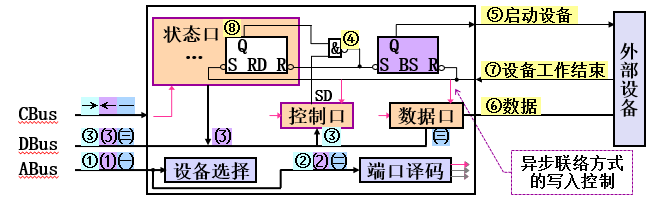
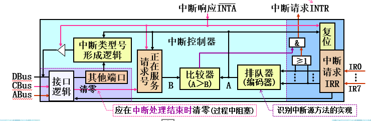
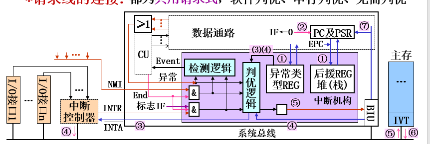
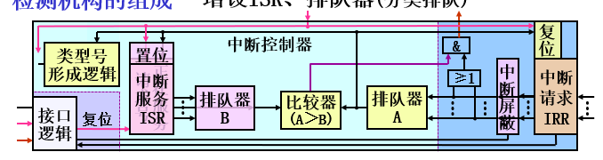
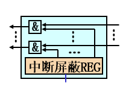

# I/O系统
## 概述
任务：实现主机与外设的信息交换`链接方式+控制方式 `  

硬件=外设、I/O接口、总线、传送控制部件  
软件=I/O指令|通道指令、I/O程序`设备驱动程序`

### 链接方式：总线  
### 编址方式：
#### 统一编址
#### 独立编址  
### 识别方法：唯一设备号`设备ID`
硬件记录，通过比较电路在控制信号到来时进行比较

### 接口与外设联络方式：
#### 外设与接口的数据传送
##### 无条件
同步传输  
对于外设来说主机输出外设一定准备就绪
##### 条件
异步传输，等设备就绪，如读取磁盘
#### 外设与接口的联络
##### 无条件
数据线n
##### 条件
并行
数据线n、请求应答线2   
串行  异步：1+2  ；同步：数据线1、时钟线CLK 1

### 传送控制方式：见下
## I/O设备 
### 分类
**按批量传输分：字符设备、块设备**

### 输入
#### 键盘
非编码、编码
#### 鼠标
机械鼠、光电鼠
### 输出
#### 显示器
种类：阴极射线管(CRT)、液晶(LCD)、等离子(PDP)等  
技术指标：分辨率、灰度级(彩色包含颜色、亮度、饱和度)
##### LCD(Liquid Crystal Display)
液晶材料：  
物理特性—棒状长分子结构，沿长轴方向平行排列(晶态时)  
光学特性—旋光性、透光性  
应用  
亮/灭用旋光性控制 (偏光片[X及Y]＋分子排列[扭曲/平行])  
灰度用透光性控制  (分子排列的倾向角[不同电压值])  
颜色用滤光片控制  (红色＋绿色＋蓝色)  

液晶单元  
偏光片+分子扭曲排列，用电压控制灰度  

LCD组成  
每个像素点由3个单元组成，显示控制采用行扫描方式(共用门电极、控制各列源电极)

接口  
VGA(Video Graphics Array)  
1、是**模拟信号**的传输，随着显示器的分辨率越高画面就会越模糊。一般模拟信号在超过1280×1024分辨率以上的情况下就会出现明显的误差。  
2、因为是模拟信息，信号极其容易受干扰。  
3、不能传达音频。  
4、一般不加放大器和转换器在30米左右，加放大器和放大转换器可以到150米。  
DVI(Digital Visual Interface)  
1、**数字信号**，避免了模/数转换过程，信号没有衰减，色彩更
纯净、逼真。  
2、只传送视频信号，不传送音频信号。  
3、支持多种格式，包括1920*1080全部高清格式。  
4、有效传输距离仅5米左右。  
HDMI(High Definition Multimedia Interface)  
1、可以传送无压缩的**音频信号**及高分辨率**视频信号**，数字信号，质量高。    
2、提高高达5Gbps的数据传输带宽。  
3、最高能支持1080P视频。  
4、理论20m，但需要质量好的线，实际市面上的一般15米内。  
5、同时传输音频、视频、版权保护，在消费电子领域非常受欢迎。  
6、HDMI是外部接口，对于视频的分辨率和色深的提升能力有限。  
7、HDMI兼容性不好。
#### 打印机 
击打式(机械式/针式)、非击打式(激光/喷墨)  
打印机接口：Centronics或USB  
### **外存储器**
#### 概念
磁盘
盘面——
磁道——
扇区——记录块(多个数据)
#### 辅存性能指标：
TODO 操作系统学习磁盘  
存储密度    
TODO  密度计算  
Ds＝道密度×位密度  
存储容量  
S＝磁道数×磁道长度×记录密度   
寻址时间  
从读写头开始移动到读写位置的时间  
Ta＝平均寻道时间＋平均等待时间    
数据传输率  
一直进行传输的速度  
Dr＝磁道容量×磁盘转速  
误码率
TODO 校验码相关  
出错位数/所读位数
#### 磁盘 
TODO 磁盘相关  
磁记录原理：信息用磁化方向表示，读/写～感应线圈电流方向  
工作原理
TODO 文字描述磁盘工作原理  
信息记录格式：

定长、变长  
组成`以硬盘为例`  
盘片+驱动器+控制器  
#### 磁盘阵列 
廉价磁盘冗余阵列RAID(Redundant Array of Inexpensive Disks)  
多个物理盘映射`硬|软都行`到一个逻辑盘  
RAID提高存储可靠性的方法：  
用部分条带存放校验信息(有RAID0～RAID7等标准)  
访问时同步进行数据校验  
##### RAID标准
TODO 标准了解  
#### 光介质存储器
光记录原理：  
信息用介质的不同形态/物态表示，  
读、写信息用反射光强弱、激光束强弱表示   
形变、相变、磁光  

信息记录格式  
扇区(大小固定、扇角可变) ←提高记录密度  
盘片格式：CD(紧致盘)、DVD(数字通用盘)、BD(蓝光盘)  

组成 类上 盘片+光驱+光控`一般我们直接塞盘片，光驱光控由计算机提供、不封装，但是磁盘硬件都封装好了，只需要提供软件就行`
盘片格式：CD(紧致盘)、DVD(数字通用盘)、BD(蓝光盘) 
#### 固态硬盘SSD-半导体介质辅助存储器
基于FLASH 
闪存芯片
叠栅MOS管作为存储元  
## I/O接口`外设到总线的接口电路`
### 功能
#### 数据缓冲
用寄存器暂存来自主机和外设的数据   
数据缓冲寄存器
#### 操作中转
用寄存器`控制寄存器`暂存主机的操作命令，并适时转发
#### 状态检测
监测外设状态`就绪`，并暂存到寄存器`状态寄存器`中  
>状态控制寄存器可复用
#### 通信控制
控制信号实现通信协议  
实现与主机通信、与外设通信
#### 信号转换
实现主机-外设间的信号转换(含格式/电平/时序等
### 组成(一般结构)
总线缓冲器、寄存器、设备选择端口、端口地址译码电路、逻辑控制电路、信号转换逻辑电路

### ~~分类~~
串行、并行|可编程、不可编程|传送控制分类3
###  对I/O接口的访问
主机-接口的访问：CPU执行相应的机器指令，访问一个I/O端口   
#### I/O端口
在I/O接口中的为可与数据总线交换信息的寄存器(数据口/控制口/状态口)  
#### 端口的编址
##### 统一编址方式
直接使用访存指令  
端口号位数=主存地址空间
如：精简指令系统MIPS的lw rt,disp(rs) 及 sw rt,disp(rs)
TODO  看MISPS指令  
##### 独立编址方式时
指令系统需增加I/O指令  
如：8086的IN AL,DX  及 OUT DX,AL`乐x86总共就四条`
>说明：C语言为  
BYTE  _inp(unsigned short usPort);  
BYTE _outp(unsigned short usPort，BYTE btData);
#### 访问接口的时机
取决于软件、I/O方式(如查询/中断)
## 传送控制方式`外设传输数据的方式`
### 程序查询|轮询
多用于字符设控制  
思想：设备启动→循环查询设备工作状态→就绪→传送  
特点：CPU在此期间不能做其他事情，外设CPU串行工作

#### 独占查询
启动后立即开始查询
#### 定时查询
启动后间隔一段时间开始查询    
#### I/O接口组织
数据线、控制线、应答线  

### 程序**中断**I/O方式
执行启动外设指令→外设就绪→I/O请求→中断响应→中断处理→中断返回  
将I/O请求作为可屏蔽中断请求，
#### 中断接口组织
向下兼容查询方式EI  
中断请求INT
中断响应INTA
TODO 图  
#### 中断系统
##### 中断请求的检测和响应组织
处理响应时中断源的识别
##### 中断控制器IC
TODO 看IC的组成  

#### 中断系统举例
TODO 好好理解它 8086 

#### 多级中断
##### 支持多级中断的IC

TODO   8259A
##### 中断屏蔽的组织
硬件：中断屏蔽寄存器按位与中断请求信号 
软件—中断处理程序可修改屏蔽字(写中断屏蔽REG)  
  
术语：  
优先级—指请求的响应优先级   
响应优先级—请求的排队次序(排队器A的编码次序)(IRR的复位次序)←硬件决定  
处理优先级—请求的完成次序(ISR的复位次序)←软件修改  
### **DMA**控制方式
磁盘需求；磁盘→DDR   
利用DMA接口传输，相当于总线让DMA作为主设备，MEM作为从设备   
direct memory access：由DMA接口来控外设-主存信息传输
TODO 主存与外存的页面置换非常相关  
>DMA方式的存在的意义，将以CPU为中心变为以存储器为中心

需要CPU的支持  
１传送准备和结束处理：设置传送字数、设置主存缓冲区、启动设备  
２让出HOST总线控制权
#### 传送方式
##### 停止CPU访问主存
在DMA接口访存时放弃访存
##### DMA与CPU交替访问
CPU工作周期比主存周期长  按一个主存周期和DMA轮换
透明DMA 
##### 周期挪用|窃取
I/O优先，若CPU访存，等其结束进行DMA
#### DMA接口|DMA控制器
MAC -Memory Address Counter  
WC-Word Counter  

#### 传送过程
##### 预处理
e.g. 将磁盘的x磁道y扇区(512B)的数据传送道主存缓冲区(首地址为b)中。设主存按字节编址，DMAC外设端有控制寄存器RegC，数据缓冲寄存器RegB(8bit)，磁道，扇区的主存端口为RegT、RegF，则
$$
{\rm MAC}\leftarrow b\\
{\rm WC}\leftarrow 512\\
{\rm RegC}\leftarrow 周期窃取、写主存\\
{\rm RegC}\leftarrow {\rm DMA}工作方式\\
{\rm RegT}\leftarrow x\\
{\rm RegF}\leftarrow y
$$
##### 数据传送
每次传输一个字，并修改主存地址与传送字数，直到数据传输完毕  
$$
{\rm RegB}\leftarrow {\rm Data}\\
{\rm HRQ}\rightarrow {\rm CPU}\\
{\rm CPU}\rightarrow {\rm HLDA}\\
{\rm ABus}\leftarrow {\rm (MAC)}、
{\rm CBus}\leftarrow {\rm MemW\#}\\
{\rm MAC}+1、{\rm WC}-1\\
{\rm WC}!=0 loop、else中断请求

$$
##### 后处理
用中断处理程序结束工作　　
>注意：CPU的速度中CPU频率和总线时钟频率要区别开来，CPU频率是cpu工作一次的时间，一条指令可能会需CPU工作多次（CPI的意义），而CPU存取一次数据需要一次总线周期，CPU的工作速度会被总线拖累（就取数据而言）  