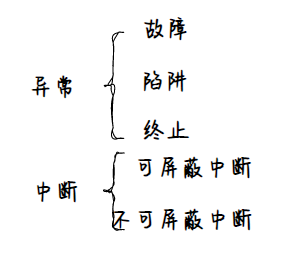
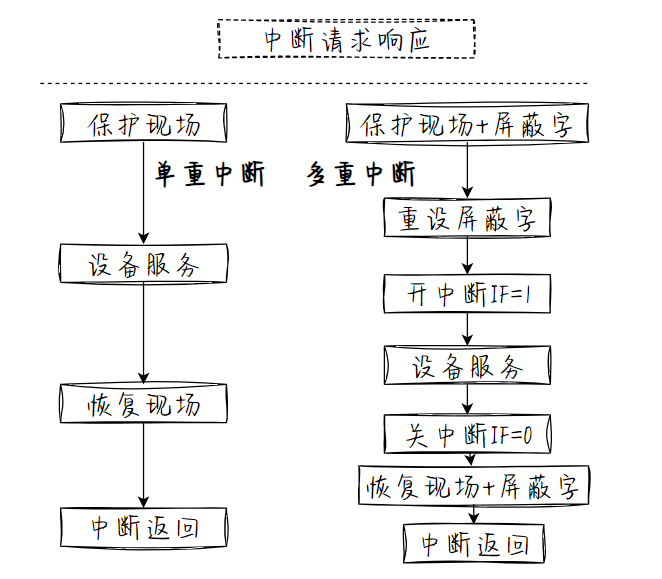
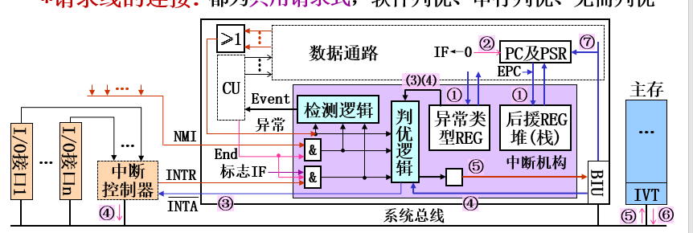
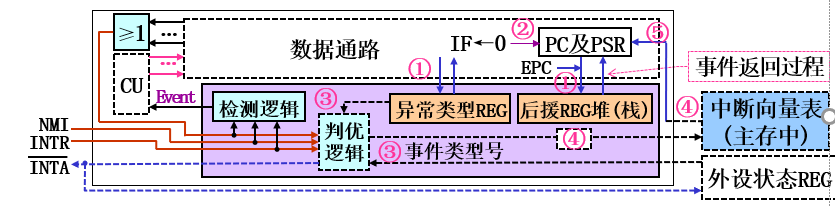
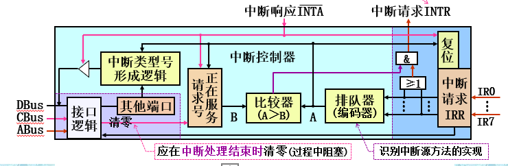
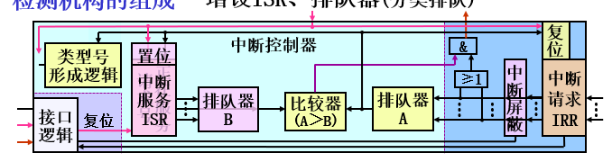
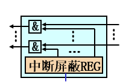
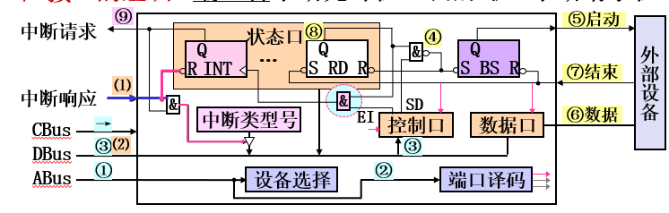

# 写在前面
此部分涉及到CO和OS交叉，硬软结合，具体说来，硬件的支持为操作系统得以运行(利用中断完成功能)提供了可能，而软件的实现为处理各种问题(除0，溢出，I/O)提共了程序性解决方案，两者的结合奠定了计算机系统处理复杂任务和调度协调各个硬件的能力基础
# 基本概念

# 处理流程
## 检测【硬件】
中断:中断源主动发出独立请求信号，~~任意时机检测~~，中断周期检测   
异常：在~~每条指令执行结束后检测~~随时检测   
## 响应【硬件】
### 向量
CU发出${\rm\mu OP}$Cmd→PC、PSR内容放入后援寄存器堆(栈)`此时IF=1`→关中断`IF=0`→判优选择→事件类型号→撤销其请求信号→查询IVT`主存，基址+类型号`→PC←(IV) 
#### 事件类型号的获取
异常：CPU异常类型寄存器   
NMI：固定唯一，用软件查询方式处理不同任务   
INTR：INTA→IO接口→中断类型号寄存器→DBus→CPU   
### 非向量
PC、PSR内容放入后援寄存器堆(栈)`此时IF=1`→关中断`IF=0`→判优→进入处理程序`共用`→程序查询`轮查状态口和PSR `→跳转到处理程序`if else 跳转`
## 处理&返回

中断服务程序+IRET
# 系统实现
## 硬件

### CPU内的中断机构

检测逻辑、判优逻辑、异常类型寄存器`异常event号的获取`、后援寄存器`保存PC和PSW`
### 中断控制器IC

#### 多级中断&中断屏蔽
支持多级中断的IC

硬件：中断屏蔽寄存器按位与中断请求信号   
软件—中断处理程序可修改屏蔽字(写中断屏蔽REG)  
  
术语：  
优先级—指请求的响应优先级   
响应优先级—请求的排队次序(排队器A的编码次序)(IRR的复位次序)←硬件决定  
处理优先级—请求的完成次序(ISR的复位次序)←软件修改  
### 支持中断的I/O接口

### 相关的各种控制信号线(可能复用了)
## 软件
### 中断向量表IVT
常驻主存，存放中断处理程序入口地址(IV)
### 中断处理程序