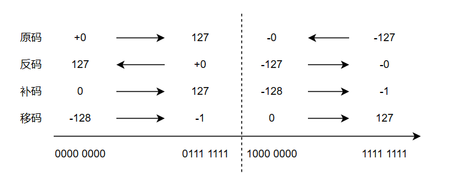
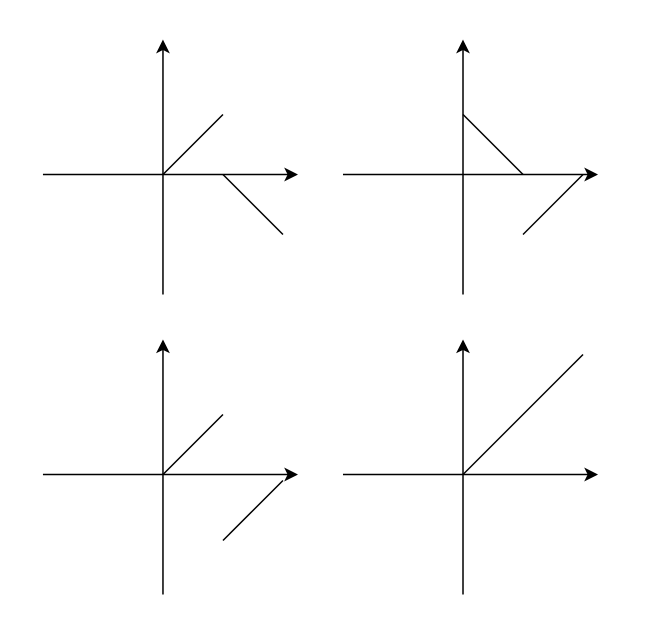
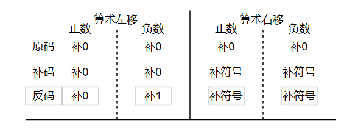

# 数据的表示和运算
## 数据的编码
### 进制与转换
10转x进制  
整数：除基取余，倒序输出  
小数：乘积取整，上左下右
### 机器数及（二进制数）编码
Def 机器数：在计算机内用编码表示的数`数字化的数？`  
Def 编码：解决数、文字、符号等在计算机中存储问题`数的符号，小数点如何表示`


#### 原码
符号位+|二进制真值|
整数  
符号+数字转二进制
小数
符号+小数点后数字转二进制
##### 特点
$[+0]_原\not ={[-0]_原}$  
符号数值分离运算，加减先比较  
**常用于浮点数的尾数表示**
#### 反码
过渡性编码 
#### 补码
##### 有模运算和补数：
###### 同余数：
$$\begin{aligned}
A&=B+kM\\ A&\equiv B \mod M\\ 
A、B&为模M的同余
\end{aligned}
$$
运算结果相同，同余数**运算等价**
###### 补数
$$\begin{aligned}
a+b&=M \\ &a、b互为模M的补数 
\end{aligned}
$$
补数的作用：  
1.**负数的正补数是其同余数**→用正补数存储负数  
Proof：负数的同余数之一为其绝对值的补数  
$$\begin{aligned}
a<0,|a|>0,|a|&=-a\\def b,|a|+b&=M\\
-a+b&=M\\a&=b-1M\\&证毕
\end{aligned}
$$
2.减去一个数等于加上这个数的补数→化减为加  
Proof：
$$\begin{aligned}
a+b&=M\\
c-a&=c-(M-b)\\
&=c+b-M (mod M)\\
&=c+b
\end{aligned}
$$
##### 定义：  
正数的补码=符号+二进制真值，负数的补码=符号+正补数值
##### 求补数运算和求补码运算
- 法1：二进制真值按位取反+1
- 法2：**从右往左第一个1左边按位取反**  
负数补码只需要符号置1，求其正补数二进制就行
#### 变形补码
用两位来表示符号 00为正 11为负  
有助于ALU做溢出判断（实际不使用？？）
#### 移码
真值偏移常数`+128`转2进制  
**用于浮点数比阶**
### BCD码——十进制数的编码
#### 有权码
8421码 1100 正 1101负
#### 无权码
余三码
### 字符编码 
- 输入码 按键到字符的映射
- 交换码 字符到序号的映射
- 内码  扩展码+交换码 序号的存储方式
- 字模码 点阵表示字形
字符编码指字符的交换码  
字符内码指交换码的存储和处理时的编码，称为字符数据
### ~~数据校验码~~ 
#### 数据的校验
数据的校验是指数据的检验（检错）和校正（纠错）  
数据校验通常通过“冗余校验”——附加信息来实现校验
#### 校验码
由数据信息和校验信息组成的编码
$$
校验码=数据位+校验位
$$
检错纠错原理：编码中包含合法码字和非法码字，能够识别非法码字就实现了检错，根据非法码字定位出差就实现了纠错
#### 码距 
任意两个码字中位值不相同的个数的最小值  
码距≥2校验码开始具有检错功能
#### 奇偶校验码
奇校验 奇数个1，P=0，  
偶校验 偶数个1，P=0，  
故障字 $S=p\prime_1 \oplus p\prime\prime_1$
#### 海明码（纠正1位出错）
##### 检验位数的确定
故障字为$k$位，可表示 $2^k$次种状态，校验码为$m+k$位
$$
2^k>m+k+1
$$
##### 分组规则
用$S=2^i$表示校验位出错，数据位安排在其余位上，数据位比校验位更重要  
分组规则为按数据位所在的二进制的值进行分组  
这种分组方式表示数据出错时，至少有两位校验位出错，加上数据本身，因此海明码码距为3
##### 校验位的形成
默认采用偶校验的方式
#### 循环冗余校验码
通过校验码能否被整除，来发现并纠正错误
##### 模2运算
模2加/减是按位加，即逻辑异或，没有进位和借位
模2乘 手工+模2加
模2除 上商时用余数的首位作为商
##### 工作原理 
$$
除数G(x)——生成多项式 校验位R(x)数据多项式M(x)\\
由于CRC通过校验码是否能够整除来检验出错，故\\
[M(x)x^k+R(x)]/G(x)的余数为0\\
\begin{aligned}
设M(x)x^k/G(x)&=Q(x)……R\prime(x)\\
故[M(x)x^k+R(x)]/G(x)&={[M(x)x^k+R\prime(x)]+R(x)}/G(x)\\
&={M(x)x^k+[R\prime(x)+R(x)]}/G(x)\\
&=Q(x)……R\prime(x)+R(x)
\end{aligned}\\
有R\prime(x)=R(x)时余数为0，R\prime(x)是G(x)的余数，故G(x)为k+1位，R(x)为M(x)左移k位后除G(x)得到的余数
$$
##### CRC的校验  
余数补0除G(x)循环   
G(x)举例：  
CRC-CCITT：1 0001 0000 0010 0001  
CRC-16:1 1000 0000 0000 0101  
CRC-12:1 1000 0000 1111  
CRC-32:~
## 数据的表示
- 无符号整数    无符号数编码
- 有符号整数    补码
- 实数、纯小数  浮点表示法 IEEE754
- 字符  ASCII
### 整数的表示
#### 无符号整数
无符号数编码 8/16/32位
#### 有符号整数
补码 8/16/32位
#### 整数类型转换
##### 位数相同
位值不变
##### 位数减小——截断运算
保留数据的低位部分
##### 位数增加——扩展运算
无符号整数——0扩展
有符号整数——**符号扩展**（保证了补码的真值不变）
### 实数的表示
采用浮点数表示，采用IEEE754标准 阶码用变形移码表示，尾数用变形的原码表示
#### 浮点数的规格化
#### IEEE754标准
### 字符和字符串的表示
交换码 内码 扩展码 字膜码
### 逻辑数的表示
## 定点数运算
### 加减运算
#### 补码加减运算
##### 运算规则
##### 逻辑实现

OF为溢出标志  
CF为进位/借位标志  
由于该运算器由组合逻辑电路组成，所以输入端需要信号稳定，并保存输出端结果，故三端默认位寄存器
##### 溢出判断OF
1. 符号位  输入数和和结果符号位 ab正z负 ab负z正  
$OF=(a_{n-1}\oplus z_{n-1})(b\prime _{n-1}\oplus z_{n-1})$ 
2. 进位位  最高位和次高位进位正溢01 负溢10  
$OF=C_{n-1}\oplus C_{n-2}$ 
3. 变形补码符号位 正溢01 负溢10  
$OF=z_{n}\oplus z_{n-1}$ 
#### 无符号加减运算
##### 溢出判断CF
加法最高位进位/减法最高位借位  
CF=1表示有进位/借位，CF=0表示结果正确  
$CF=C_{n-1}\oplus Sub(C_{-1})$
#### ~~原码加减运算~~
### 位移运算
#### 逻辑位移（无符号数）
$$
<<_A>>_A
$$
机器数整体移位，移出的位数丢弃，空位补0  
##### 溢出判断
左移丢1时溢出，右移丢1时损失精度  
用桶形移位器或移位寄存器实现
#### 算术位移（有符号数）
$$
<<_L>>_L
$$
机器数符号位不变、数值位整体移位，
移出的数位丢弃，出现的空位根据编码特征添补

```python
if arithmetic_move:
    if machine_num=='原码':
        +0
    else
        if right：
            +sign
        else
            if "反码负数":
                +1
            else：
                +0
```
##### 溢出判断
原码左移丢1/补码左移丢符号位
右移丢1损失精度
#### 其他
带进位的算术、逻辑移位，循环移位，带进位的循环移位
### 位扩展运算
### 乘法运算
每次使用一位乘数确定加数的乘法称为一位乘法
#### ~~无符号~~
无符号乘法是有符号乘法的基础  
判断、加法、位移操作
##### 思考
加法、移位本来需2个CLK(写2次)，如何在1个CLK内完成(写1次)？
##### 逻辑实现
循环n次的判断-加法-移位操作
##### 溢出判断
乘法结果＝n位时需判断，如int=int*int
$$
OF=z_{2n-1}＋…＋z_n
$$
#### 原码(1位)
实践中常用于浮点数尾数运算
##### 运算规则
符号位和数值位分开计算
$$
[A]_原\times [B]=[A\times B]_原\\
故[A\times B]_原应为2n位\\
而数值为2n-2位，故整数乘法高位补0,小数乘法低位补0\\
符号位S_p=a_{n-1}\oplus b_{n-1}
$$
##### 运算控制流程
循环n-1次的判断-加法-移位操作  
整数还需要再进行一次+0右移（实现高位补0），故整数计数依然为n次
取绝对值操作，即把数值为扩展为n位无符号整数
#### 补码（1位）
校正法（Booth算法）和比较法
##### 逻辑原理
#### ~~阵列乘法器~~
现代计算机采用，实现的是无符号乘法  
若用原码、补码，需增补部件
### ~~除法运算~~
## 浮点数运算（不要求逻辑实现-会做题）
### 表示（参见实数的表示）
$$
M \times r^E \\ 
M 可能是原码、补码的纯小数\\
E可能是移码、补码的整数
$$
### 加减
运算过程中浮点数通常采用双符号位的格式
#### 步骤
##### 对阶
小阶对大阶，小阶浮点数尾数（算术）右移  
分析：若大阶对小阶，大阶左移，移出1直接爆炸
##### 尾数加减
由于可以规格化，故溢出不算出错
##### 尾数规格化
使运算结果精度最大化
##### （尾数舍入）
1. 截断法
1. 置1法
1. 舍入法
原码 附加位最高位0舍1入，补码正数0舍1入  
补码负数：最高位0 其余不全为0,最高位1，其余全为0 舍；  
最高位1，其余不全为0，入。
1. 查表舍入法
##### 溢出判断
阶码是否上溢E 01
结果下溢用机器0表示
### ~~乘除~~
## ~~十进制数运算~~
## 运算器的组成
运算器是CPU中所有运算部件的统称
### ALU的组成
ALU主要完成定点加减法算术运算及基本逻辑运算  
因此ALU具有2输入1输出  
ALU需要输出运算结果状态，以支持关系运算
ALU需要控制端选择功能
### 74181


### 运算部件举例
#### 29C101
#### 部件的互联
##### 数据总线方式
分时传送，各部件入端设置锁存器，出端设置三态门