# 总线
## 概念
### def
总线：是连接多个设备(部件)进行信息传输的一组公共信号线，是各个设备共享的传输介质  
信号线：`个人：构成总线的基本单位`  
主设备：发出总线事务**请求**的设备  
从设备：响应总线事务**请求**的设备

  
TODO 图修正  

总线操作：总线上完成一次数据传输的所有**操作**  
总线事务|传输(Bus Transaction)：总线上一对设备之间进行信息交换的过程   
传输协议|通信协议：总线传输过程操作步骤的约定；总线传输规程所有信号线的有效信号都存在的时序关系
>总线所支持的总线事务类型指明了总线的传输功能和性能  

总线周期：完成一次总线操作的时间  
总线**工作**频率：$\frac{1}{总线周期}$  
总线传输周期：一个总线事务的时间  
总线时钟：
采用同步传输协议的总线的定时信号

>数值由总线上传输最慢的设备决定

总线时钟频率:$\frac{1}{总线时钟周期}$  
总线宽度(数据总线宽度)：数据总线的位数

总线数据传输率：总线宽度$\times$工作频率`此频率为总线周期的时间` 个人理解为工作状态下的传输率   
总线带宽：总线宽度$\times$传输频率`此频率只考虑传输周期的时间` 理论状态下的传输率  
**故总线带宽指总线的`最大`数据传输速率** 

总线仲裁器|总线控制器：实现总线管理的电路  
仲裁裁信号线：`用于总线仲裁中，连接主设备与仲裁器，输入主设备信息和输出仲裁器分配总线使用权信息的信号线`  
总线桥：一种特殊设备。所连接总线的主设备或从设备；所管辖总线的总线仲裁器  

Host总线|CPU-主存总线|主机总线|系统总线

### 方法|技术
信号线复用：地址、数据信号线复用   
`既然分地址期和数据期当然可以复用` 

总线管理：每次总线操作都先确定哪个主设备拥有总线使用权，再由该主设备使用总线完成总线传输操作，通过不断地分配总线使用权，来实现总线的分时共享  
总线仲裁：利用硬件确定哪个主设备拥有总线使用权的过程  
隐藏式仲裁：申请及分配阶段安排在总线传输周期的结束阶段进行`可以提高传输效率，要求仲裁时延固定`  

集中式仲裁：主设备通过一个仲裁器进行总线使用权分配  
分布式仲裁：不需要集中式的总线仲裁器，总裁逻辑分散在各个主设备中的总线使用权分配方式  
线或方式：集中式仲裁中BS、BR接收信号的方式`所有设备信号或在一起`  
公平策略：仲裁中各设备获得总线使用权的概率相等`多处理器CPU模块`
优先级策略：仲裁中各设备获得总线使用权概率不同`I/O设备`
## 分类
### 按数据信号线数量|数据传输方式
#### 串行总线`1根`
特点：长距离传输`成本低、抗干扰能量强`、串并行转换、数据拆卸和装配  
例 USB
#### 并行总线`多根`
特点：线路较近、物理干扰导致跳变→工作频率受限`不一定更快`
例：cpu-主存总线
### 按信号功能
#### 数据总线
双向  用来承载设备间传输的数据内容  
总线宽度`地址信号线数`
#### 地址总线
单向  用来承载设备间传输的数据地址  
统一编址时信号线数要与主存地址空间匹配    
#### 信号总线
单向多根  控制传输过程主/从设备如何使用地址和数据线   
组成：总线请求+总线仲裁+控制线+状态线   
e.g.BR、BG
### 按连接部件
#### 片内总线
芯片内的连接部件  
只有DBus，没有控制和地址总线  
#### **系统总线**
计算机内部**连接CPU**、主存、I/O接口等主要部件的总线  
ISA、PCI
#### 通信总线
主机与外设之间、计算机之间的总线  
>把外设归入系统就是I/O 总线，在系统外就可以叫通信总线
## 特性
### 物理特性
连接类型：电缆、**主板**、底板   
连接数量：串行、并行  
引脚、尺寸、形状
### 电器特性
传输方向  
有效电平范围`TTL≥2.0v为高。≤0.8v为低 `
### 功能特性
上述
### 时间特性
传输协议
## ~~总线`层次`结构和互联~~
### 总线结构`系统总线的`
#### 单总线
一条**系统总线**连接所有设备`ISA`   
CPU具有总线仲裁器的功能  
结构简单、扩展性强、传输性差
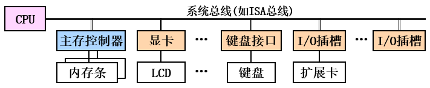
#### 多总线
##### 双总线  
CPU中心：CPU-主存 前端FSB|后端 CPU-L2Cache芯片内部  
cpu可以以不同速度访问cache和主存，需设置两组总线接口信号  
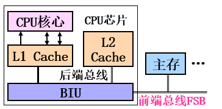   
存储器中心：HOST+I/O桥+I/O
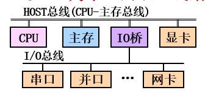
##### 三总线  
细分设备速度：HOST+AGP、PCI+ISA  
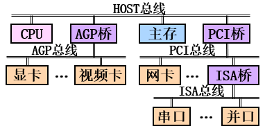  
连接多个CPU：CPU+HOST+I/O  
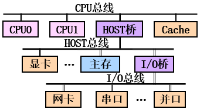
##### 南北桥 
北桥：AGP、主存、CPU   
南桥：USB、LAN、IDE`硬盘并口，SATA为硬盘串行传输`、……
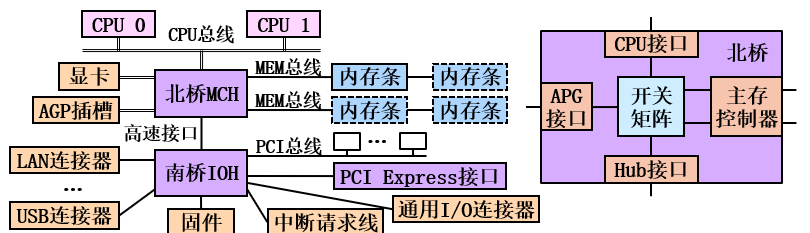
### 总线互联
通过**总线接口电路**`信号及时序转换器`互联   
例：BIU、主存控制器DRAMC、显示适配器(显卡)、总线桥 
功能：总线侧操作控制、信息缓冲、设备侧操作控制、记录设备状态、信息格式转换
## 性能指标
### 总线宽度
见上
### 总线带宽
`最大数据传输率`见上
### 总线负载能力
总线信号电平保持在有效范围内时，所能连接的部件或设备数量
## 总线操作的流程`总线管理过程-宏观`
宏观把握总线管理原理`见上`和实现该原理要解决的问题  
1总线是个有限的临界资源，故如何才能消除抢占冲突  
2总线是数据传输介质，如何实现数据传输`地址+信号怎么给`
传多少时间合适：正常逻辑，我传完了告诉你
强制逻辑：我规定一个最大时间让你传——这解决不了I/O设备要用户输入的问题
### 申请及分配
见下`总线仲裁`
### 寻址
TODO 由接口电路`互联机构`负责 见ep 7
### 传送数据
见下`定时和传输`  
### 结束`状态返回`
### 流程优化`隐藏仲裁`
TODO 绘图  
## 总线仲裁
### 集中式仲裁
仲裁权力集中在总线仲裁器`控制部件`上
总线请求线BR：有无请求bus request  
总线允许线BG：设备是否拥有总线使用权bus grant
#### 链式查询
总线忙线BS：总线是否忙bus state  
思想：自动轮询主设备，有总线请求，被询问的主设备获得总线使用权，轮询依据主设备与仲裁器的距离  
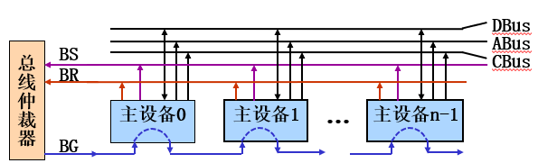
$$
{\rm BS}=\Sigma{\rm BSi}\\
{\rm BR}=\Sigma{\rm BRi}\\
{\rm BG}={\rm \overline{BS}\cdot BR}\\
{\rm BSi}={\rm BGi_{in}\cdot BRi}\\
{\rm BGi_{out}=BGi_{in}\cdot\overline {BRi}}
$$
流程：  
$\rm BR\cdot \overline{BS}=1$开始，直接置BG←1    
${\rm BRi\cdot BGi_{IN}}=1$时，BSi←1，$\rm BGi_{out}=0$,否则$\rm BGi_{out}=BGi_{in}$  
BS=1，结束，BG←0
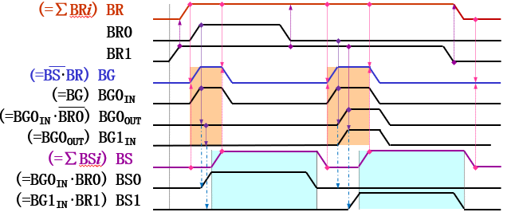
特点：仲裁信号线少；不能保证公平`远端可能永远无法获得资源`；电路敏感`前一设备坏会影响后续设备`
#### 定时器查询
主设备号：DevIDi  
仲裁器设备号：DevNo  
定时时间：$\Delta t$   
同上：依据主设备号，自动改逐次、定时，只不过BG变成了输送设备号  
流程：   
$\rm BR\cdot \overline{BS}=1$开始，  
开始时：固定优先级DevNo←0|循环优先级DevNo←i+1，  
每过$\Delta t$，DevNo+1；  
若BRi(DevNo=DevIDi)，则BSi←1  
BS=1，结束，DevNO=-1`非法值`  
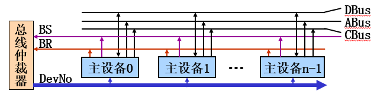 
特点：对电路不敏感，可以保证公平性，总裁信号线$2+\log_2n$，总线仲裁器需要**定时**,电路更复杂
#### 独立请求方式
不用BS，而用其他CBus替代  
线路数量$2n$  
根据算法需要在仲裁器内设置硬件队列或栈  
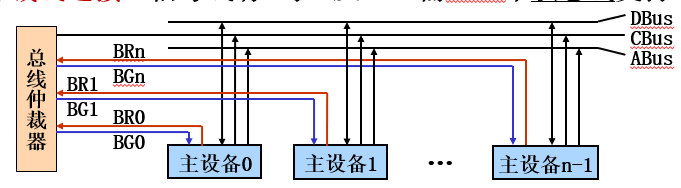  
 
特点：速度快，可以保证公平，可实现隐藏仲裁，仲裁信号线多  
>不需要主设备参与仲裁过程→仲裁时间固定→隐藏式仲裁

>系统总线的总线仲裁都采用独立请求方式
### 分布式仲裁
没有BG  
分布式仲裁不需要集中式的总线仲裁器，仲裁逻辑分散在各个主设备中。每个主设备用于自己的仲裁号和仲裁器`在I/O总线可以叫I/O控制器`
#### ~~自举式~~
数量n+1  
用BR来区分优先级，每个仲裁逻辑之接入更高优先级BRi来自动决定是否工作`影响逻辑表达式`  
利用信号线复用：SCSI总线接口`这接口还带了仲裁控制功能`
#### ~~竞争式~~
仲裁器需要通过**仲裁总线**连接，实现相互比较
##### 串行竞争-1根
APIC总线
##### 并行竞争-多根
Futurebus+
## 传输与定时
如何寻址如何传输，类别指令执行过程
### 总线事务类型
#### 参与设备个数
1-1 1-N 
#### 数据传送功能
R、W、读改写
#### 寻址范围
单地址、双地址
#### 传输数据个数
常规、突发
### 定时方式与传输协议
#### 同步`时钟信号`
读：传送地址及命令、等待从设备响应、传送数据、结束
写：传送地址和命令、传送数据、等待从设备响应、结束

TODO 绘图  
特点：协调简单、传输效率高  
适用：总线长度短、设备速度相近
#### 异步`握手信号`
请求、响应、撤销请求、撤销响应  
全互锁 三次延时
主从设备发出信号后都必须等待对方撤销信号   
半互锁 两次延时
主设备需等，从设备随时撤销  
不互锁 一次延时
约定时间自行撤销  
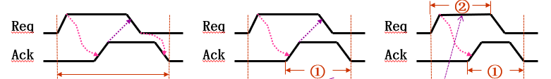
#### 半同步
通过时钟信号、联络信号的握手共同实现，  
各步骤时长以时钟周期为基准、可以改变  

TODO 对比CPU联合定时  
传输定时采用同步，传输控制支持异步方式  
### 总线标准
如何制定一个总线标准
1. 设几根数据线
2. 仲裁方式
3. 定时方式和传输协议`若同步还得约定总线时钟频率`
4. 电器特性

TODO ISA、PCI 深入填充  
#### ISA|AT
最早用于CPU-主存，并行 16位，8MHz，设备只能DMA传输，`教材已经把他划入低速，见多总线结构`
仲裁由CPU实现  
升级版EISA 
#### PCI总线
33.3MHz 并行 局部总线，半同步，速率由北桥芯片控制，
#### AGP总线
局部总线 并行 加速图形接口 2.1GB/s
基于PCI
#### PCI-E
`串行传输总线`以提升速度传输速度 10GB/s,  
布线空间节约、成本降低→点对点连接  
全双工：你发我也发  
热插拔 
#### QPI
点对点全双工同步串行总线 25.6G/s 
#### ~~VESA总线~~
没鸟用，用于GPU，并行`但教材用AGP`
#### ~~I/O 总线标准~~
RS-232C  串行  20kb/s  
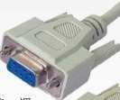  
SCSI  并行 640MB/s  
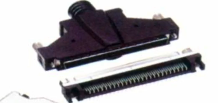  
PCMCIA 90MBps  
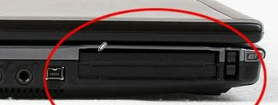  
USB universal serial Bus 串行 1280MBps  
TypeA TypeB TypeC miniA miniB
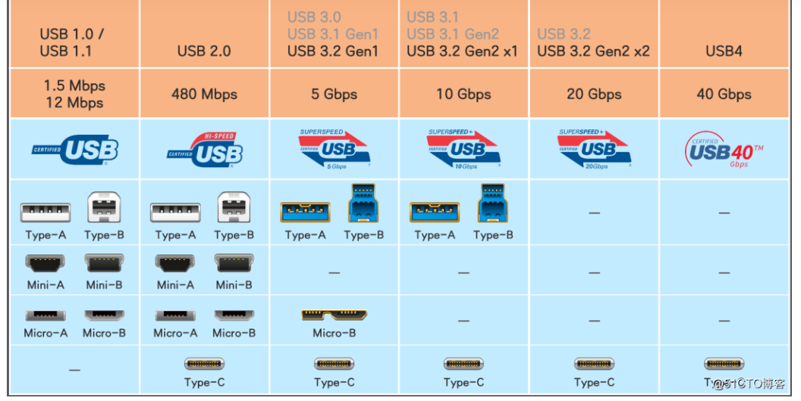  
USB 2.0 480Mb/s左边的弯折的箭头表示这个C口支持雷电3，可以达到40Gb/s的传输速度  
IDE|ATA 100MBps 并行 用于外存  
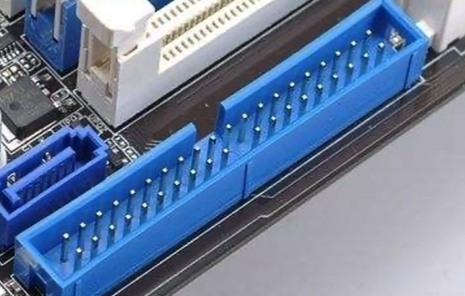  
SATA 串行 用于外存