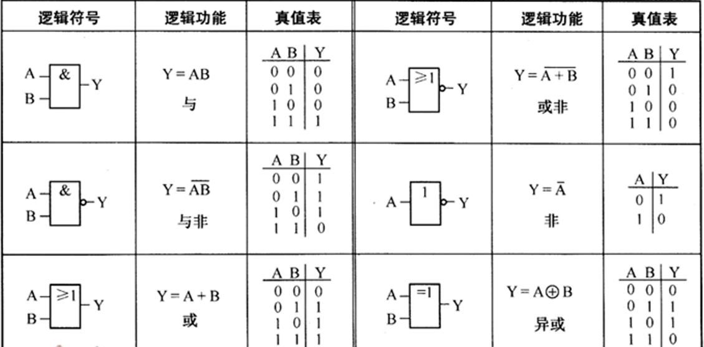
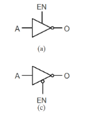
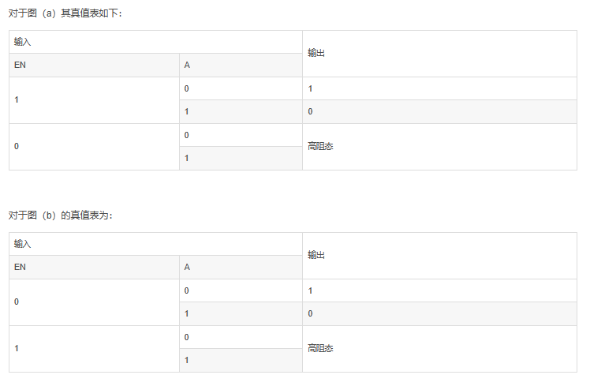
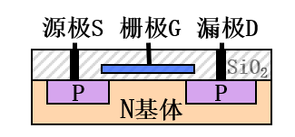
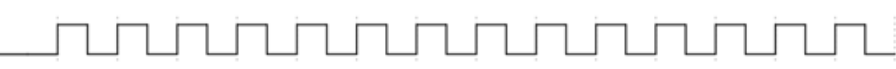
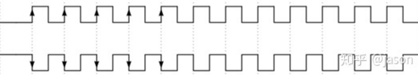
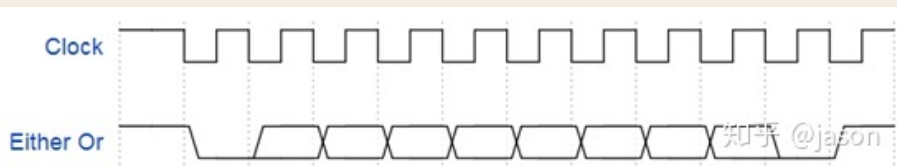
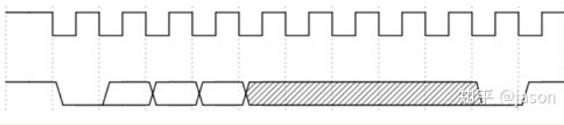
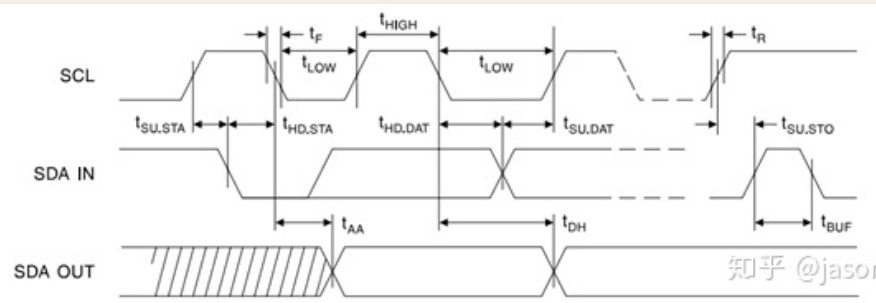

# 逻辑代数运算与门电路
## 基本逻辑运算
- 与 AND 
- 或 OR
- 非 NOT

### 运算规则
反演律：
$$
\overline{A\cap B}=A\cup B \\
\overline{A\cup B}=A\cap B
$$
## 复合逻辑运算
- 与非 NAND
- 或非 NOR
- 异或 XOR
- 同或 XNOR
# 时序逻辑电路 
## 触发器
### 边沿RS触发器  

RS触发器为电平触发方式，R、S不能同时为0，将$S=\overline{R}$时可获得输出Q与R相同可以进行一些迁移

R=1时为0称为复位端，S=1时为1称为置位端

常用来做`锁存器` 

| $\overline{R_D}$ | $\overline{S_D}$ | $Q^{n+1}$ |
|---|---|---|
| 0 | 1 | 0 |
| 1 | 0 | 1 |
| 1 | 1 | $Q^{n}$ |
| 0 | 0 | -- |

### D触发器

D触发器是在RS触发器基础上构成的，其功能是在触发边沿到来时，将输入端的值存入其中，并且这个值与当前存储的值无关

(1) 当 $\bar{S}{D}=0$, $\bar{R}{D}=1$ 时, 使得 $Y_{1}=1$ , $\bar{S}=\overline{Y_{1} \cdot C P \cdot \bar{R}{D}}=\overline{C P}$, $\quad \bar{R}=\overline{\bar{S} \cdot C P \cdot Y{4}}=1$ ,于是 $Q=1$, $\bar{Q}=0$ , 即将输出 Q 直接置 1。  
(2) 当 $\bar{S}{\mathrm{D}}=1$, $\bar{R}{\mathrm{D}}=0$ 时, 使得 $\bar{S}=1$ , 于是 $Q=0$, $\bar{Q}=1$ , 即将输出 Q 直接清零。
## 寄存器

## 计数器

## 加法器

串行进位方式：各个位的进位直接依赖于低一级的进位——行波进位  
延迟为各个全加器延迟和

并行进位方式，延迟为进位电路延迟加一个全加器延迟
# 组合逻辑电路
## 译码器（二进制译码器）
### 2-4译码器74LS139
### 3-8译码器74LS138
## 数据选择器 
## 加法器
## 三态门 
用做控制信号线开关  
  

# MOS 管（绝缘栅场效应管）
开启电压$V_t$`栅极G`决定截止和导通  
理解：电源+电容在两端形成恒压，然后超过多少电压就开始漏电  

# 电位和脉冲信号
电位信号：`靠电压发出的，稳定的电压信号`  
脉冲信号：`靠振荡电路产生的，带上升下降的波形信号`  
1.电平信号就是一种电压信号，它的特点就是在输入不变，供电不变，电路其他参数稳定的情况下，某一段时间中，保持一个相对固定的值。比如数字电路中的，高电平信号，低电平信号等等。

2.脉冲信号一般是由**振荡电路**产生的，振荡电路通过自我激励的形式（正反馈），形成一个特殊波形，然后通过非门这样的电路整形后就可以得到脉冲信号了。与电平信号相比，脉冲信号在输入不变的情况下，仍然会发生**周期性**的变化，比如电平在高低之间不断反复，而且高电平和低电平维持的时间都相对固定。产生这个现象的原因主要就是前面说的那个**振荡信号**，既然是振荡，肯定有电压的变化（而且往往是周期性变化，比如正弦波）。
# 时序图
## 方波
这样的图形常用来表示CLOCK (时钟信号),通常见与时序图的顶部   
   
方波还常见这种格式,在时钟上加上向上/向下的箭头,这是用于表示 是在上升沿触发还是在下降沿触发.  
  
## Either or 信号（非此即彼信号）
  
常用在DATA 线上. 表示数据信号可能为高|低.而`交叉处的含义是,此刻允许数据变化`.  
对应上面CLOCK 信号可以看出.只有当clock为低时,信号线上的数据才允许变化`下降沿有效`.当clock 为高时,数据线上要么是高,要么是低.   
## 灰色区域
  
灰色区域表示此处为三态,即：高电平|低电平|高阻态

高阻态——MOS管栅极电压不够，漏极就为高阻态

或者简单说,这段区域是啥都行,并不需要关心,这个上面的非此即彼信号不同的是,非此即彼要么是高,要么是低,不可以出现高阻态.
## 地址&数据表示
时序图上常用A 来表示Address, D来表示Data.这个应该很好理解.
## 时序需要控制时间说明
  
这通常是时序图最不容易理解的部分，需要好好理解时序制约关系
TODO 时序控制的说明  
## 上拉电阻
上拉电阻是一种电阻器件，用于在数字电路中维持信号的稳定状态。它被连接在数字输入引脚和电源之间，通常与开关等设备一起使用。  
当开关未被按下时，上拉电阻通过与电源连接，为输入引脚提供一个默认的高电平（通常是电源电压）。这样，在没有外部输入信号时，输入引脚保持高电平。   
当开关被按下时，开关与地连接，将输入引脚拉低至地电平。这样，在有外部输入信号时，输入引脚被拉低。  
上拉电阻的作用是防止未连接的输入引脚漂浮或受到干扰而产生不确定的电平。它确保输入引脚始终有一个确定的电平状态，以减少噪声和干扰对电路的影响。  
常见的上拉电阻值通常为几千欧姆至几十千欧姆，具体取决于电路的需求和设备的特性。
