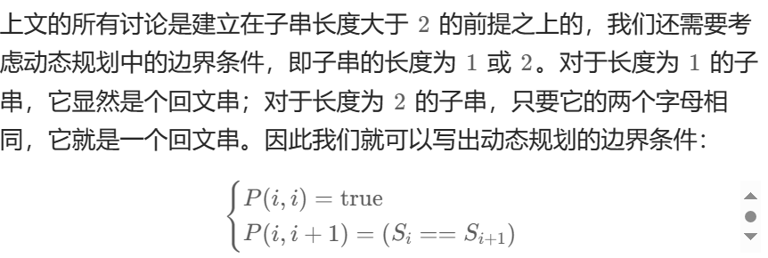

# 动态规划
## 最长回文字



2中心回文扩展法 枚举length=1、2的回文并扩展
Manacher算法，记录回文扩展臂长
3偶数回文插入字符

4倒序取交集法
# 滑动窗口
滑动窗口法，也叫尺取法，可以用来解决一些查找满足一定条件的连续区间的性质（长度等）的问题。由于区间连续，因此当区间发生变化时，可以通过旧有的计算结果对搜索空间进行剪枝，这样便减少了重复计算，降低了时间复杂度。往往类似于“请找到满足xx的最x的区间（子串、子数组）的xx”这类问题都可以使用该方法进行解决。
## 最小>s区间
```python
给定一个含有 n 个正整数的数组和一个正整数 s ，找出该数组中满足其和 ≥ s 的长度最小的连续子数组。如果不存在符合条件的连续子数组，返回 0。
输入: s = 7, nums = [2,3,1,2,4,3]
输出: 2
```

```c++
void solution(int *arg,int length,int s){
    int min=0,sum=0,left=0,right=0;
    while(right<length){
        sum+=arg[++right];
        while(sum<s)
            sum+=arg[++right];
        while(sum>s)
            sum-=arg[left--];
        if(right-left+1<min)
            min=right-left;
    }
    cout<<min<<endl;
}
```


## 935 2018 所有sum=k的区间
```python
找出整数序列A中所有和等于给定数k的连续子序列
输入：A={5,7,3,3,9,14,4,11,5,5,4,14,14,8} k=25
输出：1,5;7,10;8,11
```


```c++
//算法思想：利用一对指针维护一个滑动窗口，一次扩张和收缩作为一轮
void solution(int *A, int k,int length) {
	int sum = A[0], left = 0, right = 0;
	
	while (right < 14) { //窗口右边界未越界
		sum += A[++right];
		while (sum < k)
			sum += A[++right];// 向右扩张
		while (sum > k)
			sum -= A[left++];// 向右收缩
		if (sum == k)      // 满足条件则输出
			cout << left << "," << right <<endl;
	}
}
```

# 二叉树
## 二叉树的最大深度（leetcode 104）

递归思想：如果是叶子节点树深度为1，分支节点深度为作用子树最大深度+1
```C++
int maxdepth(Node *T){
    if(T==null) return 0;
    return max(maxdepth(T->lchild),maxdepth(T->rchild))+1;
}
```
## 二叉树不平衡节点个数(935 2017)
```c++
int count=0;
int depth(Node *T):

    if(T==null)
        return 0;
        if(abs(l-r)>1):
            count++;
        return max(depth(T->left),depth(T->right))+1;
}
```
## 最小深度
给定一个二叉树，找出其最小深度。 最小深度是从根节点到最近叶子节点的最短路径上的节点数量。


## 完全二叉树节点个数
```c++
    void countNodes(TreeNode* root){
        if(!root) return 0;
        return countNodes(root->left) + countNodes(root->right) + 1;
    }
```

## 二叉树中序遍历(leetcode 94)
```c++
void inorder(TreeNode* root, vector<int>& res) {
        if (!root) {
            return;
        }
        inorder(root->left, res);
        res.push_back(root->val);
        inorder(root->right, res);
    }
    vector<int> inorderTraversal(TreeNode* root) {
        vector<int> res;
        inorder(root, res);
        return res;
    }
```

## 后续遍历二叉树及节点层次
```c++
void postorder(TreeNode* root,int level=1) {
        if (!root)  return 0;
        postorder(root->left,level+1);
        postorder(root->right,level+1);
        cout<<root->data<<level<<endl;
    }
```

## 二叉搜索树的后序遍历合法性