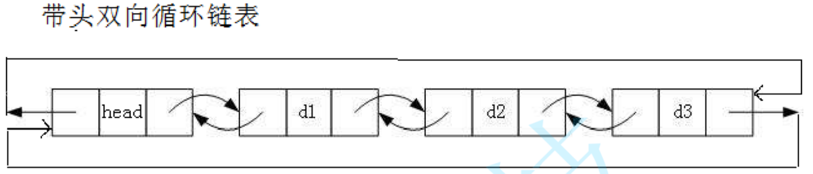

# 线性表linear_list
## 定义
具有相同数据元素的**有限序列**  
位序：$a_i$是非空表中第i个数据元素，i称为$a_i$在线性表中的位序  
表长：线性表中元素的个数  
（直接）前驱：
（直接）后继：
### 操作
InitList
DestoryList
IistInsert
ListDelete
LocateElem
GetElem
ListLength
ListEmpty
## 实现
### 顺序
| 平均 | 移动元素个数 | 时间复杂度 |
|---|---|---|
| 插入 | n/2 | $\Omicron(n)$ |
| 删除 | (n-1)/2 |  $\Omicron(n)$ |
|查找|---|---|
### 链式

头节点`一般有`：使操作统一

头指针与尾指针  
建立  
头插法
尾插法

插入

删除

查找
#### 双向链表、附加头节点、循环

lLink、Data、rLink

>考点：尾节点的rLink指向head而不是第一个元素

