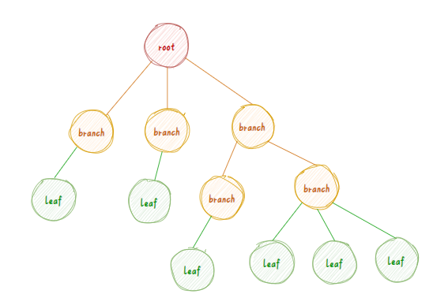

# 树
## 基本概念

本质1-N的模型


子树 空树

### 树的表示
嵌套集合、广义表、凹入表示`类目录缩进`

### 节点关系

`分支`节点|非终端节点:度不为0的节点  
**根节点$\subset$分支节点**  
 `叶子`节点|终端节点:度为0的节点  
孩子Child 双亲Parent 兄弟Sibling   
祖先 子孙 堂兄弟  
  
### 节点和树的属性
节点的层次(level)：根为第一层，定义其孩子在下一层`从1开始，自上而下`  
树的高度=深度depth：树中节点的最大层次

节点的度Degree：节点拥有的子树数`节点 上→下边数`
树的度Degree：max{节点的度}

vs。x叉树，规定节点的度≤x但不必须实现

有序树与无序树：子树是否能交换`二叉树是有序树`

森林

## 计算性质
#### 节点数
已知Depth 和树求node  

度为m的树第i层最多只有$m^{i-1}$个节点

高度为h的m叉树至多有$\sum_{i=1}^{h}m^{i-1}=\frac{m^{h}-1}{m-1}$个node,特殊的，二叉树$=2^{h}-1$

| Depth=h | Degree=m | m叉树 |
|---|---|---|
| M_Lv_Node | $m^{i-1}$ | $m^{i-1}$ |
| Max Node | $\frac{m^{h}-1}{m-1}$ | $\frac{m^{h}-1}{m-1}$ |
| Min Node | `h-1+m` | h |
#### 树高
已知Node 和树求 depth
| Node=n | Degree=m | m叉树 | 2叉树 |
|---|---|---|---|
| Max Depth | n-m+1 | n |n|
| `Min Depth` | --- | $\left\lceil \log_m [n(m-1)+1] \right\rceil$ |$\left\lceil \log_2 (n+1) \right\rceil$|
**证** 
$$
\frac{m^{h-1}-1}{m-1}\leq n\leq \frac{m^{h}-1}{m-1}\\
m^{h-1}\leq n(m-1)+1\leq m^{h}\\
h-1\leq\log_m [n(m-1)+1]\leq h\\
h=\left\lceil \log_m [n(m-1)+1] \right\rceil 

$$


## 二叉`有序`树Binary Tree


### 性质
TODO 自己总结  
1果然还不是太直观
$$
N_0=N_2+1
$$
### 完全二叉树
你按顺序依次放就完事  
完全二叉树的特点：叶子结点只能出现在最下层和次下层，且最下层的叶子结点集中在树的左部。需要注意的是，满二叉树肯定是完全二叉树，而完全二叉树不一定是满二叉树
#### 判定算法
思想：完全二叉树节点只有可能  
1.有两个孩子，  
2.有一个左孩子  
3.有左孩子的这个节点`只有一个`只能出现在**最后**  

算法：按层次遍历，将节点放入队列，找到关键节点后将后续节点，触发pop任务之间kill掉所有节点
TODO coding  

#### 性质
1.Child→Parent:$\left\lfloor\frac{i}{2} \right\rfloor$  
2.Parent→LChild:2i  if exist
3.Parent→RChild:2i+1 if exist  
`4.Branch Node= N/2`  
5.$N_0=N_2+1$
#### 满二叉树
叶子节点层leaf level Node=Max Node

### 二叉树的实现
#### 顺序存储 
```c++
BTree=ELe[100];
```
#### 链式存储
##### 二叉链表
```c++
struct Node{
    Ele data;
    Node* lchild,rchild;
}*BTree;
```
##### 三叉链表
```c++
struct Node{
    Ele data;
    Node* lchild,rchild;
    Node* parent;
}*BTree;
```
### 遍历
>考点【易】写出二叉树的遍历序列

>考点【中】由遍历序列构造二叉树  
必须有中序遍历序列：前+中；后+中：
#### 先
#### 中
#### 后
#### 层次
层次遍历主要利用queue:把根节点放到队列当中，节点出队孩子入队

 
### 线索化
>考点【中】线索化索引节点指向

## 应用
### 堆
### 二叉排序树
### 平衡二叉树
#### 平衡调剂算法
>考点：平衡二叉树的调整
### 哈夫曼树和哈夫曼编码
节点的权

节点的带权路径长度：路径长度×节点权值=(节点层次-1)×节点权值

树带权路径长度WPL：树中所有`叶子节点`的带权路径长度和


**定义** huffman tree  
n个带权叶子节点的WPL最小的树

哈夫曼树不唯一

构造算法
选择两个权值最小的节点形成一个二叉树 

哈夫曼编码
数据压缩

# 森林
## 实现
### parent法
使用树的双亲表示在于记录父节点的位置信息

### child法
### child-brother法
>考点【中】森林-二叉树的对应
## 遍历
### 先根
### 后根

