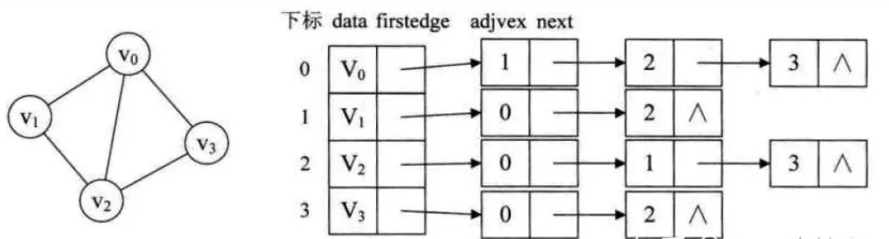

# 并查集union-find Set
## op 
### Find $\Omicron(\log_2n)$
找到树的根节点

#### 查询中的路径优化问题：
有些人可能有一个误解，以为路径压缩优化后，并查集始终都是一个菊花图（只有两层的树的俗称）。但其实，由于路径压缩只在查询时进行，也只压缩一条路径，所以并查集最终的结构仍然可能是比较复杂的。
### Union $\Omicron(1)$
将两棵树合并

## 实现
树的parent法实现
原因寻根快合并也快

## 应用
### 图的连通性问题

### 等价类问题  
**题目背景**  
若某个家族人员过于庞大，要判断两个是否是亲戚，确实还很不容易，现在给出某个亲戚关系图，求任意给出的两个人是否具有亲戚关系。  
**题目描述**  
规定：x和y是亲戚，y和z是亲戚，那么x和z也是亲戚。如果x,y是亲戚，那么x的亲戚都是y的亲戚，y的亲戚也都是x的亲戚。  
**输入格式**  
第一行：三个整数n,m,p，（n<=5000,m<=5000,p<=5000），分别表示有n个人，m个亲戚关系，询问p对亲戚关系。  
以下m行：每行两个数Mi，Mj，1<=Mi，Mj<=N，表示Mi和Mj具有亲戚关系    
接下来p行：每行两个数Pi，Pj，询问Pi和Pj是否具有亲戚关系。  
**输出格式**  
P行，每行一个’Yes’或’No’。表示第i个询问的答案为“具有”或“不具有”亲戚关系  。
# 图graph
## 图的基本概念
G=(V，E)  
顶点集$V\ne \phi$   
边集$E=\{ (x,y)|<x,y> \}$  
路径Path(x,y)：表示从x到y的一条单向通路`有方向`  
路径长度：边权值之和  
简单路径：路径上`各顶点均不重复`  
回路：首尾顶点重复

无向图|有向图  
简单图：不考虑`自环`和`多重边`


权(weight)&带权图(网络)：`边`具有与之相关的数值  


度degree：deg(v)=indeg(v)+outdeg(v)


连通：`无向图中`，两顶点间有路径    
连通图：任意一对顶点都连通的`无向图`   
`连通分量`：非连通图的极大连通子图  


强连通:`有向图中`，两顶点互有路径  
强连通图：~~  
强连通分量：~~

>考点：连通边数问题
 
生成树:  
无向图连通图——极小连通子图(n-1)  
有向图——有向树组成的森林
## 存储和基本操作
### 邻接矩阵
$$
A.Edge=
\begin{bmatrix}
    0 & 2 & \infty & 1 \\
    1 & 0 & 1 & \infty \\
    \infty & 4 & 0 & 1 \\
    1 & \infty & 1 & 0 \\
\end{bmatrix}
$$

#### 性能分析：
空间$\Omicron(n^{2})$   

当$e<<n^{2}$时，存储利用率低

遍历所有边$\Omicron(n^{2})$  

TODO 添加操作  
#### 稀疏矩阵压缩存储

TODO 压缩存储相关  
### 邻接表
节点表(Node Table)`顺序存储`+边链表(Edge Linked List)`链式存储`  

  

`无向图有边冗余:同一条边出现了两次`  

#### 性能分析
查找所有边$\Omicron(n+e)$  

### ~~十字链表、临界多重表~~
算了不想听了巴拉巴拉巴拉
## 图的遍历
### 广度优先BFS
|  | 矩阵 | 表 |
|---|---|---|
| 空间 | $\Omicron(n)$ | $\Omicron(n)$ |
| 时间 | $\Omicron(n^{2})$ |$\Omicron(n+e)$|
| MST | 不唯一 | 唯一 |
### 深度优先DFS
|  | 矩阵 | 表 |
|---|---|---|
| 空间 | $\Omicron(n)$ | $\Omicron(n)$ |
| 时间 | $\Omicron(n^{2})$ |$\Omicron(n+e)$|

### 非连通图遍历中的连通分量
## 应用
### 最小生成树Minimun-cost Tree
求使带权图连通的$\sum edge$  

最小生成树v.哈夫曼树   
哈夫曼树是节点有权，但是边没有权  
最小生成树节点没有权，但是边有权

>考点【难】：MST唯一性
充分条件：边权值均不同 

`最小、次小的边至少被一棵最小生成树采用`

>考点：画两种算法的流程图

>考点【中】求WDL
#### prime算法`贪心`
##### 思想
每次迭代，选择`最小桥(bridge)`加入
##### 实现
$V_{mst}=\{ u_0 \}$,$E=\phi$  
while (V包含顶点<n&&E!=$\phi$)  
{  
    $(u,v),u\in V_{mst} \cap v \in V-V_{mst}$,且具有最小代价     
    令$V_{mst}=V_{mst}+{v},E_{mst}\cup\{ (u,v) \}$  
    $E=E-E_{mst}$  
}
##### 分析
时间：$\Omicron(e\log_2e)$
#### Kruskal算法`贪心`
##### 思想
每次迭代时，**选出一条具有`最小权值`，且两端点不在同一连通分量的边**，加入到生产树中
##### 实现
最小堆+并查集
```c++
#include "heap.h"
#include "UFSets.h" 


int n=G.NumberOfVertices(); //节点数
int m=G.NumberOfEdges();//边数
MinHeap H(m);  //最小堆
UFSets F(n);  //并查集

int u,v,count;

for(u=0;u<n;u++)
   for(v=u+1;v<n;v++)
        if(G.getWeight(u,v)!=maxValue){ // 若边存在
            edge.tail=u;edge.head=v;
            edge.key=G.getWeight(u,v);
            H.Insert(edge);             // 插入堆
        }

count=1;
while(count<n){
    H.RemoveMin(edge);
    u=F.Find(edge.tail);
    v=F.Find(edge.head);
    if(u!=v){
        F.Union(u,v);
        MST.Insert(edge);
        count++;
    } 
}
```
##### 分析
|  | 矩阵 | 表 |
|---|---|---|
| 检测边 | $\Omicron(n^{2})$ | $\Omicron(n+e)$ |
| 建堆 | $\Omicron(e\log_2e)$ | $\Omicron(e\log_2e)$ |
| 出堆 e | $\Omicron(e\log_2e )$ | $\Omicron(e\log_2e)$ |
| Find 2e | $\Omicron(e\log_2n)$ | $\Omicron(e\log_2n)$ |
| Union n-1 | $\Omicron(n)$ | $\Omicron(n)$ |
| 总时间 | $\Omicron(n^{2}+e\log_2e)$ | $\Omicron(n+e\log_2e)$ |
### 单源最短路径问题
#### BFS`无权图`
不重要
#### Dijkstra`非负权值`
>考点：算法运行各数组的变化

Prime和Dijkstra的区别：
prime更新的是未标记集合到已标记集合之间的距离  、
Dijkstra更新的是源点到未标记集合之间的距离

final数组：用于维护该节点是否确定了最短路径  
dist数组：用于记录原`源`到当前节点的最短路径长度  
path数组：记录要实现最短，其上一个节点是谁

选择还没进入集合，所有distance最小的点进入
|  | v0 | v1 | v2 | v3 | v4 |
|---|---|---|---|---|---|
| final | 1 | 0 | 0 | 0 | 0 |
| dist | 0 | 10 | oo | oo | 5 |
| path | -1 | 0 | -1 | -1 | 0 |

#### Bellman-Ford`带负值`

#### Floyd对点最短路径问题

### ~~有向无环图描述表达式~~
DAG图，表达式OPD不可能重复
### 拓扑排序
>考点：有向图有拓扑排序的条件   
充要条件？？无环
#### 概念
AOV网络   
构造AOV网全部顶点的拓扑有序序列的运算


#### 实现
indeg[]数组，依次选出=0的顶点并删除边


用DFS实现拓扑排序
### 关键路径
>考点：最早，最迟，时间余量，关键路径
#### AOE网络
顶点表示事件，边表示活动