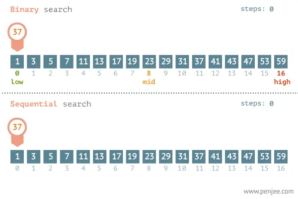
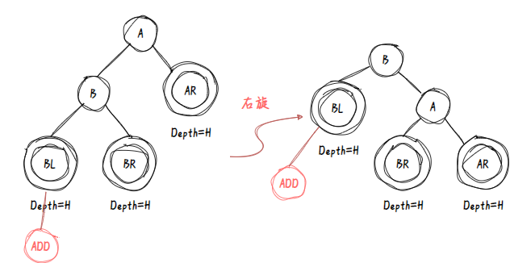
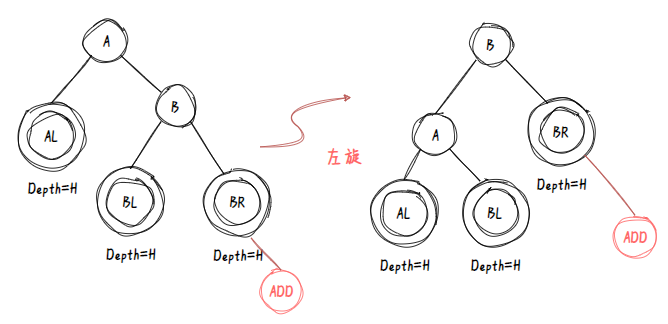
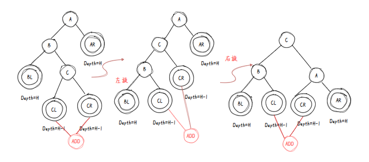
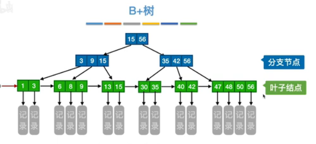

#  查找
## 基本概念
关键字(关键码)key 
查找成功：返回元素  
查找不成功：返回空

查找任务的关键在于对比，对复杂查找任务的优化在于如何剪枝
### 静态  
1 查询某个特定元素是否在表中  
2 检索元素的属性  

顺序查找，折半查找，分块查找
### 动态  
3 插入元素  
4 删除元素 

二叉搜索树，平衡二叉树，B树，B＋树，散列表
### 查找算法评价指标
查找长度：查找过程中`对比`关键字的次数  
平均查找长度(Average Search Length，ASL)：最好最坏平均
## 顺序查找
```c++
struct SSTable{
    ElemType *elem;
    int Tablelen；
}
// 王道垃圾代码
int Search_Seq(SStable ST,KeyType key)
{
    for(int i=0;i<ST.Tablelen&&ST.elem[i]!=key;i++);
    return i==ST.table?0:i;
}
// 教材用哨兵
int Search_Seq(SStable ST,KeyType key)
{
    ST.elem[0].key=key;
    for(i=ST.length;ST.elem[i].key!=key;i--);
    return i;
}
```
### ASL
设$P_i$相等  
查找成功
$$
ASL=\sum_{i=1}^{n}P_iC_i=\frac{1}{n}\sum_{i=1}^{n}(n-i+1)=\frac{n+1}{2} 
$$
查找失败
$$
ASL=\sum_{i=1}^{n}P_iC_i=\frac{1}{n}\sum_{i=1}^{n}(n+1)=n+1
$$
## `折半查找`
元素`有序`且为`顺序表`

```C++
//迭代
int Search_Bin(SSTable ST，KeyType key)
{
    int  high=Tablelen-1;
    int low=0;
    int mid=(low+high)/2;
    while(low<=high)
    {
        if(ST.elem[mid]==key)
            return mid;
        else if(ST.elem[mid]>key){
            high=mid-1;
        }
        else
            low=mid+1;
    }
    return 0;
}
//递归

```
### 查找判定树
根据$mid=\lfloor(low+high)/2\rfloor$，  
右子树node-左子树node=0|1  
故一定是平衡二叉树$h=\lceil log_2 (n+1)\rceil$  
空链域=失败结点个数=n+1
### ASL
#### 查找成功
$\sum level\cdot node_{num}$
#### 查找失败
总共查找失败的情况区间为n+1种，设概率均等`事实上不同失败区间包含的数据个数不同不可能均等`  
单个区间的key查找失败的查找长度=失败区间上级节点的level
## 分块查找
`对应的数据结构不再是顺序表而是索引顺序表`  
块间有序，块内无序

1.确定分块:顺序|折半  
2.分块内顺序查找  
### ASL
设索引表有b个节点`分b块`；
指向的顺序表有s个节点`每块s个data`；

查找成功_双顺序型  
`索引表中仅保存key值不能把顺序表中的全部顺序返回，故即使相等也需要到顺序表中再次查找`
$$
ASL=\frac{b+1}{2}+\frac{s+1}{2}
$$
已知bs=n求min{b+s}:b+s ≥$2\sqrt{bs}=2\sqrt{n}$

当b=s=$\sqrt{n}$时，平均查找长度为
$$
ASL_{min}=\sqrt{n}+1
$$
## 二叉搜索树
是一个`动态查找表`

>二叉搜索数的后序遍历序列合法性 935 2013 T3
https://zhuanlan.zhihu.com/p/614911010
### 查找
---
### 插入
查完插进去就完事了
```c++
status InsertBST(BiTree &T,ElemType e)
{
    if(!(Search(T,e.key,NULL,p)))
    {
        //新建节点
        s=(Bitree)malloc(sizeof(BiTNode));
        s.data=e;

    }
}
```
### 删除
---
### ASL
---
## 平衡二叉树AVL树
任何一个节点的平衡因子`l-r`<|1|  
最小不平衡子树

>考点：最大高度递推公式|最少节点数递推公式
$$
N_h=N_{h-1}+N_{h-2}+1
$$
### 插入如何保持平衡
#### LL
进行右旋操作 

#### RR

#### LR 
左旋→右旋  

#### RL 
右旋→左旋
### 删除如何保存平衡
---
## B树|多路平衡查找树
将二叉树变成了n叉树，结点关键字有序

规定，m叉树除了根之外，至少有$\lceil \frac{m}{2}\rceil$个子女  
则至少含有$\lceil \frac{m}{2}\rceil-1$个关键字  
规定 所有节点子树高度相同   

俗称：失败节点为叶子节点，最低一层为终端节点  
B树的depth,不算叶子节点层
### B树的搜索
一个在节点内搜索和循某一条路径向下层搜索交替的过程  

成功时取决于key的层次，不成功时取决于B
### 题型
每层最少有几个节点,
| 层次 | 节点数 |
|---|---|
| 1 | 1 |
| 2 | 2 |
| 3 | 2$\left\lceil m \right\rceil$|
| n | 2$\left\lceil m \right\rceil^{h-2}$ |


给定n个key 如何分配使得depth 最小|最大  
最小：塞满，
$$
key\leq(m-1)\cdot(\sum_{i=0}^{depth-1}m^{i})\\
>\log_m (key+1)
$$  
最大：塞最少
$$
key\geq1+2(\lceil \frac{m}{2}\rceil-1)\cdot\sum_{i=0}^{depth-2}\lceil \frac{m}{2}\rceil^i\\
<\log_{\lceil \frac{m}{2}\rceil}\frac{key+1}{2}+1
$$
第二种思路 n个关键字肯定有n+1个失败节点
$$
key+1\geq 2(\lceil \frac{m}{2}\rceil)^{h-2}
$$
### 插入
插入是在某个`叶节点开始`的，如果key插入后超过m-1,则需要分裂  

结点分裂大法；  取第$\lceil \frac{m}{2}\rceil$个key作为父节点

m为奇数，简单取中，n为偶数，后面节点多一个

> 插入后根节点关键字
### 删除
#### 非终端节点的删除  
用直接前驱或者直接后继顶替  
左子树的最右终端节点最右key  
右子树的最左终端节点的最左key  
#### 终端节点的删除  
低于下限  
1 借右兄弟节点的关键字  
前驱←前驱←前驱←  
2 借左兄弟节点的关键字  
后继→后继→后继→  
3 都不够借  
合并左右合并+父节点一个key，迭代  
## B+树的基本概念
所有关键码都存放在`叶节点`中，上层`非叶节点`关键码是是其子树中最小(最大)关键码的`复写`

两个头指针，一个指向root`叶节点随机搜索`，一个指向关键码最小的叶节点`链表顺序搜索`

### 插入 
叶节点上限为`m`,裂成两半，前一半≥后一半，然后构造非叶节点
## 散列查找
### 散列表Hash Table
**定义** 装填因子
设n为装入元素个数,m为散列表空间大小
$$
\alpha=\frac{n}{m}
$$
>考点:装填因子概念及其对查找效率的影响
### 哈希函数(除留余数法) 
表长Tablesize，取最接近或等于m的质数
$$
Hash(k)=k {\rm mod} m
$$
### 冲突处理
冲突：映射到了同一个空间

将m个地址改为m个桶(bucket)，桶内key互为同义词
#### 开放地址法
##### 线性探测
根据增量序列进行冲突探测，和空元素对比也算对比
$$
H(key)=key\% \left\lfloor m \right\rfloor\\
d_i=0,1,2,3,4,5\cdots\\
H_i=(H(key)+d_i)\% m
$$
> 删除不能清除，删除元素后查找失败的ASL

堆积(cluster)问题：不同探测序列的key占据了可用空桶导致为寻找某一关键码的搜索时间增加
##### 平方探测
采用平方探测法，`表长Tablesize=4k+3的质数`，才能探测到所有位置
$$
d_i=0^{2},1^{2},-1^{2},2^{2},-2^{2}\cdots k^{2},-k^{2}. k\leq \frac{m}{2}
$$

可以证明，当表为质数且$\alpha\leq 0.5$时，e一定能插入且任何一个位置不会被`探测两次`
#### 链地址法(成组链接)AVL
将链表顺序进行查找优化  教材P292  
$AVL_{succ}$  
已有元素探查次数的平均值  
~~空链查找长度为0`比的不是关键字而是null`~~ 这不是自欺欺人么? 

$AVL_{unsucc}$  
找不到探查元素，但找到插入位置的平均探查次数，是表中所有可能散列到的位置上要插入新元素时找到空桶的探查次数
### 散列表分析
理论上性能是$\Omicron(1)$，实际上与$\alpha$直接相关
