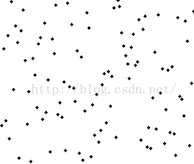

# sort 
## 基本概念
### 分类
内部排序
外部排序

基于比较思想的排序
基数排序
### 评价指标
时间复杂度  
空间复杂度  
**稳定性**：序列中关键字相同元素的**位序在排序前后是否改变**
## 插入排序
是一种原地排序
取出元素→查找在有序表中位置→插入有序表
`选择未排序中的元素进行插入`  
### 直接插入排序
利用m[0]进行插排，利用外部存储空间进行插排
查找位置方式为顺序查找

>考点：适合元素基本有序
### 折半插入排序
利用m[0]进行插排，利用外部存储空间进行插排
查找位置方式为二分查找
## 希尔排序
相距为d的元素作为子表进行直接插排→对整个表进行直接插排  
只能用于顺序表  
### 分析序列过程
## 冒泡排序

每一趟比较把最小|最大的移到最前|最后面

优化1:对趟数进行优化  
优化2:对排序过程进行优化

 

### 分析
以`交换次数`衡量其时间复杂度  
最好时间  平均时间  最差时间
稳定
## 快速排序
`不稳定`  
输入 low high A
一趟，用枢轴元素将表劈成两半： 

结束条件low=high 把基准元素放进去  
然后迭代执行算法 看来得设置出口


### 性能分析
stack frame 递归爆炸
用了递归调用栈帧换时间
$$
n\log_2 n
$$
### 优化
枢轴选取好

## 简单选择排序
`每轮总会选择出待排序序列的最值元素放到指定位置,前i-1个必然有序且符合要求`
扫描→交换
事件复杂度不会变，`执行过程与序列无关`
>对比插入排序
不稳定的
## 堆排序

1.建堆2.调整
### 堆
#### 堆的插入和删除
插入：表表尾上浮  
删除：表尾替代下坠
#### 堆的调整
堆本身是一种递归定义的的数据结构-二叉树本身也是递归定义的数据结构
属于选择排序的一种
利用堆这种数据结果进行排序
哈哈哈哈哈哈，那不是一直pop就完事啦？？
是一颗顺序存储的完二叉树
大根堆和小根堆
so easy
>并不是利用辅助堆进行外部排序，而是类堆算法进行原地排序

1轮：从下到上
2轮：从上到下
举反例证明不稳定
## 归并排序
空间复杂度o(n)
时间复杂度o(nlog n)
## 基数排序
利用key=int 进行位数排序
需要一个数组列表

之所以能实现，是因为？？ 关键字可拆？？

分配和收集思想

手动|几乎不考代码
```c++
struct node{
    int key;
    node* next;
}

class list{
    node* head=null;
    length=0;
    public:
    void head_insert(int key){
        node new=(key,head->next)
        head.next=&new;
    }
    void init(int[]x){
        for(int i=0;i<int_num;i++)
        {
            int m={1,2,3,3,4}
            head.init(m[i])
        }
    }
    void RadixSort()
    {
        
    }
}

```
## ~~外部排序~~考纲有，小道消息说不考
用的多数式归并排序吧