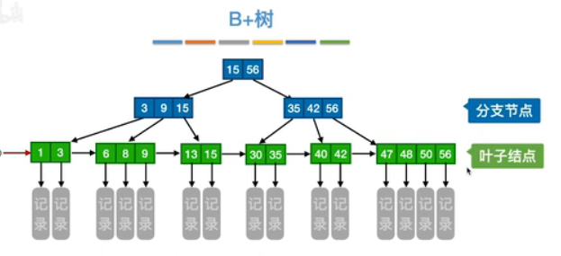

#  查找
## 基本概念
查找：
TODO   查找的概念
关键字key
查找成功：返回元素
查找不成功：返回空

查找表 
静态  
1 查询某个特定元素是否在表中  
2 检索元素的属性  
动态  
3 插入元素  
4 删除元素  

## 查找算法评价指标
查找长度：查找过程中对比关键字的次数  
平均查找长度(Average Search Length，ASL)：最好最坏平均
## 顺序查找
```c++
struct SSTable{
    ElemType *elem;
    int Tablelen；
}
// 王道垃圾代码
int Search_Seq(SStable ST,KeyType key)
{
    for(int i=0;i<ST.Tablelen&&ST.elem[i]!=key;i++);
    return i==ST.table?0:i;
}
// 教材用哨兵
int Search_Seq(SStable ST,KeyType key)
{
    ST.elem[0].key=key;
    for(i=ST.length;ST.elem[i].key!=key;i--);
    return i;
}
```
### ASL
设$P_i$相等  
查找成功
$$
ASL=\sum_{i=1}^{n}P_iC_i=\frac{1}{n}\sum_{i=1}^{n}(n-i+1)=\frac{n+1}{2} 
$$
查找失败
$$
ASL=\sum_{i=1}^{n}P_iC_i=\frac{1}{n}\sum_{i=1}^{n}(n+1)=n+1
$$
## 折半查找
元素有序
```C++
//迭代
int Search_Bin(SSTable ST，KeyType key)
{
    int  high=Tablelen-1;
    int low=0;
    int mid=(low+high)/2;
    while(low<=high)
    {
        if(ST.elem[mid]==key)
            return mid;
        else if(ST.elem[mid]>key){
            high=mid-1;
        }
        else
            low=mid+1;
    }
    return 0;
}
//递归

```
### 查找判定树
根据$mid=\lfloor(low+high)/2\rfloor$，  
右子树node-左子树node=0|1  
故一定是平衡二叉树$h=\lceil log_2 (n+1)\rceil$  
空链域=失败结点个数=n+1
### ASL
TODO  折半查找平均查找长度细节  
$$
ASL\leq\lceil log_2 (n+1)\rceil
$$
## 分块查找
块内无序，块间有序
```c++
index_list{
    Elemtype e=MaxValue;
    int low,high;
}
```
确定分块:顺序或者折半
分块内顺序查找
比较完分块，在**low块**中找元素
## ~~跳跃链表~~
```C++
\\跳跃链表的学习
struct node{
    int elem；
    node* next； 
}；
class Skip_List{
    node* list；
    int length；
    public:
    void init()
    {
        node sentinel=new node();
        list=&sentinel;
    }
    void insert(int x)
    {

    }
    int search(int key)
    {
        index=
     return index;
    }
};
```
查找和插入都只需要$\Omicron(log n)$
## 二叉排序树
是一个动态查找表
### 查找
TODO 查找  
### 插入
查完插进去就完事了
```c++
status InsertBST(BiTree &T,ElemType e)
{
    if(!(Search(T,e.key,NULL,p)))
    {
        //新建节点
        s=(Bitree)malloc(sizeof(BiTNode));
        s.data=e;

    }
}

```
### 删除
#### 叶子
直接删
#### 单子树
直接删
#### 双子树
TODO 删除如何保持正确  
##### 分开放
##### 直接前驱替代
##### 直接后继替代
### ASL
## 平衡二叉树AVL树
任何一个节点的平衡因子`左右子树高度差`<|1|  
最小不平衡子树
### 插入如何保持平衡
#### LL
进行右旋操作
ptr=&BR
Br→A
Al→ptr→BR
TODO code是实现  

#### RR

#### LR 
左旋→右旋  

#### RL 
右旋→左旋
TODO 明天再画  
### 删除如何保存平衡
## ~~红黑树~~
## B树|多路平衡查找树

将二叉树变成了n叉树  
结点关键字有序
按深度优先查找  

规定，m叉树除了根之外，至少有$\lceil \frac{m}{2}\rceil$  
则至少含有$\lceil \frac{m}{2}\rceil-1$个关键字  
规定 所有节点子树高度相同   

俗称：失败节点为叶子节点，最低一层为终端节点  
B树的depth,不算叶子节点层


### 题型
给定n个key 如何分配使得depth 最小|最大
TODO 公式化简  
最小：塞满，
$$
key\leq(m-1)\cdot(\sum_{i=0}^{depth-1}m^{i})\\
>\log_m (key+1)
$$  
最大：塞最少
$$
key\geq1+2(\lceil \frac{m}{2}\rceil-1)\cdot\sum_{i=0}^{depth-2}\lceil \frac{m}{2}\rceil^i\\
<\log_{\lceil \frac{m}{2}\rceil}\frac{key+1}{2}+1
$$
第二种思路 n个关键字肯定有n+1个失败节点
$$
key+1\geq 2(\lceil \frac{m}{2}\rceil)^{h-2}
$$
### 插入
TODO   插入动图
结点分裂大法；$\lceil \frac{m}{2}\rceil$中间提到根，左右劈开  右边变成brother
插入到最底层，用查找算法插入
### 删除
非终端节点的删除  
用直接前驱或者直接后继顶替  
左子树的最右终端节点最右key  
右子树的最左终端节点的最左key  
终端节点的删除低于下限  
1 借右兄弟节点的关键字  
前驱←前驱←前驱←  
2 借左兴地节点的关键字  
后继→后继→后继→  
都不够借 合并左右合并+父节点一个key  迭代  
```C++
delete ()
{
    if not terminal
    {
        delete(terminal)
    }
}
delete(terminal)
{
    if
    else if
    else
}
```
## B+树的基本概念
TODO 文件管理  
b+树非叶子节点不包含指针
叶子节点
非叶**根节点**至少有两棵子树
每个分支节点至少要有$\left\lfloor \frac{m}{2} \right\rfloor$个分支  
节点子树个数与关键字key个数相同  
所有叶子节点包含所有关键字顺序，链接

## 散列查找
### Hash Table 
利用哈希函数，
冲突：映射到了同一个空间
#### 除留余数法
表长为m，取最接近或等于m的质数
#### 直接定址法
#### 数字分析法
#### 平方取中法
### ASL
#### 开放地址法
##### 线性探测
根据增量序列进行冲突探测,冲突模的是表长，和空元素对比也算对比
$$
H(key)=key\% \left\lfloor m \right\rfloor\\
d_i=0,1,2,3,4,5\cdots\\
H_i=(H(key)+d_i)\% m
$$
删除不能清除
##### 平方探测
采用平方探测法m=4j+3的素数，才能探测到所有位置
$$
d_i=0^{2},1^{2},-1^{2},2^{2},-2^{2}\cdots k^{2},-k^{2}. k\leq \frac{m}{2}
$$
##### 伪随机序列法
#### 再散列法
两个
#### 链地址法
将链表顺序进行查找优化  
成功：
空链查找长度为0，没有对比关键字操作  
> 这不是自欺欺人么，

失败：
装填因子： 表中记录数/查找表长
# 排序
## 基本概念
将无序串排列成有序串的方式
## 插入排序
### 直接插入排序
```C++
void InsertSort(Sqlist &L)
{
    
}

```
### 折半插入排序