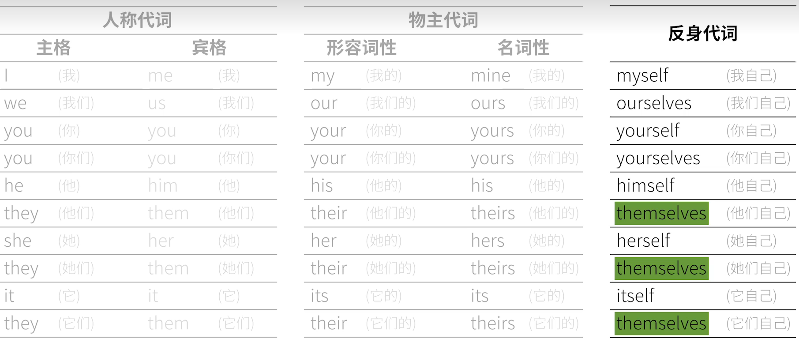

# 词法
## 动词verbs
### 谓语动词
#### 不及物动词
#### 及物动词
##### 单宾
##### 双宾
##### 宾+宾补
使役动词
make 强迫需要某人做某事
let 允许
have sb to do sth分派任务让人做sth
**have sth done** 我让人把某事做完啦
get 
get to do想办法劝说
#### 系动词
赋值
look smell remain grow keep stay seem appear
fell become turn prove
#### 助动词
辅助实义动词，构成语态或语气，自己不能成句  
许多助动词本身还有其他作用
have be do
#### 情态动词
can|could 有能力，请求、可能性   
may祝愿|might 请求、可能性、
must 必须 可能性 
will|would将来时，请求，可能性
shall将来时，征求意见、**警告**
you shall not drinking
should  应该，可能性，**竟然**,**虚拟语气**
its surprising that he should be late
ought to 应该`强`
need 需要
the rabbit need wait
do you need help
dare|dared敢
用于否定和疑问
used to
#### 半助动词
be able to  
be about to  
be going to   
had better
### *非谓语|非限定性动词*
#### 不定式to do
完全不定式
裸不定式

作主语
To Eat a carrot everyday is good for 
形式主语+不定式主语
It is good for sb to do sth

作宾语
The rabbit likes to eat carrots
作宾语补语
主语补语 
状语-表原因、目的、结果
#### 动名词ing
作主语
作主语补语
定语-表功能、用途
a sleeping pill=a pill for sleeping
宾语
#### 现在分词ing
作定语-表状态
a taking rabbit
作表语
作宾语补语
作状语
#### 过去分词-ed
`后置`定语-表被动的状态
表语-被动
宾语补语
状语
## 名词nouns
### 专有名词
首字母大写
通常不可数
### 普通名词
表人和物
#### 可数
##### 个体名词
单复数有形式区别+s
##### 集合名词
形式`无变化`可能表示单|复数
#### 物质名词
air wood 
#### 抽象名词
### 名词主格、宾格、所有格
主格、宾格形式相同
所有格+'s| of
1. 有生命名词的表所有权
2. 无生命名词的信息
   the paper's quality|the quality of the paper

连续使用 photoes of Mike|photoes of Mike

## 冠词articles
名词前必须+冠词
### 不定冠词a|an
1. 泛指  
2. 表示数字1
3. 主谓一致
4. 固定表达

a teacher and video creator

a teacher and a video creator

### 定冠词the
1. 再次提到的人|物
2. 序数词和最高级限定了范围
3. 唯一事物前
4. 泛指`西洋古典乐器`
5. the+形容词 =名词
6. 固定表达

### 0冠词
1. 泛指+名词复数
   we breath air 
2. 概念性名词(抽象的)
   季节月份星期节假日summer winter
3. 球类
4. 固定表达
out of question|out of the question
## 代词pronouns
替代名词的词  

1. 人称代词- 主格|bin
2. 物主代词-属格
3. 反身代词
   作宾语、作状语
4. 强调代词
5. 相互代词
   each other one another
6. 指示代词
   this that these those
7. 不定代词
   不确定代表名词多少的词
   many|much a few|few|a little|little some|any each|every either|neither
8. 疑问代词
   who whom`紧跟在介词后` what which 
9. 连接代词
   引导名词性从句
10. 关系代词
   引导定语从句

## 形容词adjectives
### 功能
1. 前置定语
   主观+尺寸+形状+新旧+颜色+来源+材料+用途
2. 后置定语`修饰不定代词`
3. 形容词短语作后置定语
4. 作表语
   ill well
5. 宾语补语 在需要宾补的动词中
6. `高级`状语
   the rabbit come back home，tired and hungry
### 构成
#### 形容词+形容词
#### 副词+形容词
### 比较级和最高级
## 副词adverbs
### 用法

## 介词 prepositions
介词属于虚词，
### 原理
一般在实词前增加附加信息
时间，空间，方式
八点前，桌子上，为了你

### 构成形式
1. 简单介词
   in to with
2. 短语介词
   by way of at the end of
3. 合成介词
   into onto
4. 分词介词
   including 
### 固定搭配
## 数词numerals
### 基数词
主语、宾语。定语、同位语
### 序数词
## 连词conjunctions
## 叹词interjections
# 简单句Simple Sentence
subject+predicate
下列动词均为谓语动词`充当谓语的动词`
## 句型
### 主+不及物动词
### 主语+单及物动词+宾语
### 主语+双及物动词+间接宾语+直接宾语
### 主语+复杂及物动词complex-transitive verbs+宾语+宾语补语
### 主语+系动词Linking verbs+表语
## 句子成分
同一个句子成分里可能有不同的词类
### 主语Subject
### `谓语Predicate Verb`
谓语=助动词+情态动词+实义动词|系动词
TAM  
表示动作时间tense；
表示动作状态aspect；
表示动词语气mood假设、情感`虚拟语气`；

#### 时态`通俗意义上`
tense=time+status
1.理解时间状态怎么合体
2.掌握不同时间状态下动词变位现象|时态变位+人称变位
3。时态配合上语气就糟糕了，语气会使用情态动词和助动词`前置`，表从否定→可能→肯定 疑问 、被动主动的过程
##### 时间
过去、现在、将来、
*过去将来-几乎只在从句中出现*

eg。张三上个月被一只兔子咬了，上个月他出院的时候说：
a.我要咬那个兔子一口  
b.我下个月7号7：15正在咬兔子
c.我下个月肯定已经咬完兔子了
d.我下个月这个时候已经在去咬兔子的路上了
##### 状态
进行态 强调动作在进行 我**在**点赞  
完成态 强调动作完成 我**已经**点赞了  
*完成进行* 部分完成，在进行中 我**已经在**给你点赞了
一般态 表规律、default 我给你点赞

##### 一般现在时
兔子吃胡萝卜  

1.表事实-并不限制时间其实
不恰当表达:I eat a carrot|I go to lunch不好加a
2.表习惯
3.表示预计发生的shi
##### 现在进行时
关键词 now
兔子`现在`**在**吃胡萝卜  

谓语构成:助动词be+现在分词
##### 现在完成时
兔子`现在`**已经**吃完胡萝卜了
表示动作完成状态,该动作的完成对现在的影响依然存在,比如离开
谓语构成:助动词have+过去分词
##### 现在完成进行时 

兔子`现在`**已经在**吃胡萝卜了

助动词have been(助动词be的过去分词) +现在分词 
关键词since for+时间段

##### 一般过去时
有个动作在过去发生的事实  
不能表示过去习惯动作需要used to  
谓语构成:动词过去式
##### 过去进行时
谓语构成:be的过去式was|were+进行分词doing 
##### 过去完成时
表示过去的过去做完的事情对过去的影响还存在
谓语构成:had been +过去分词
##### 过去完成进行时
谓语动词:had been doing
##### 一般将来时
表示一种将来**说话者确定**他会发生的事
不确定的时候不能用
eg  
you will do it you may do it
will|shall+动词原形
关于将来的表达:
1一般现在时
2be (going|about) to
##### 将来进行时
will be doing
##### 将来完成时
完成的事对将来的影响
will have done
##### 将来完成进行时
略
##### 一般过去将来
通常出现在主句是过去时态的从句中
would 
##### 过去将来进行
xxx
##### 过去将来完成时
用来表示虚拟语气后半部分的结果
would have done 
##### 过去将来完成进行时
他上个月说他7.7日可能已经在去北京的路上了
#### 语气
##### 陈述
##### 祈使
用(?<you)+一般现在时
##### 虚拟语气
主要用于条件从句
if引导 条件不成立用虚拟语气→前推一个时间
条件成立,
if i see the rabbit tommow,I will bite him

###### 一.做不可能的假设
1 和现在事实相反
if i saw the rabbits now,I would bite him
2.将来可能性很小的事情 `万一`
if i should see the rabbits tomorrow,I would bite him
3.和过去事实想法
if i had seen the rabbits a few days ago,I would have bitten him
###### 二.表达愿望请求命令建议
wish would rather宁愿 demand suggest insist order+shold do
1.对现在的愿望
I wish I were`这里不是was` a rabbit
I wish U were here
2.过去的愿望
I wish I had eaten the carrot
3.将来的愿望
I wish I could eat ...
### 宾语Object
### 宾语补语Object Complement
### 主语补语Subject Complement
### 定语Atributive
### 状语Adverbial
修饰谓语动词，表示时间，地点，原因，让步，条件
### 同位语Appositive
## 句法
### 主谓一致
### 独立主格
名词+现在分词
名词+过去分词
名词+不定式
the rabbit to come,the wolf is overenjoyed
名词+名词(主系表拆掉)
many animals went to party,some of them wolfs
名词+形容词(主系表拆掉)
many animals went to party,some of them happy
名词+副词
the rabbit sat on chair,head down
名词+介词短语
the rabbit came in,carrot in hand
状语从句的简化
原因
*the* worlf inviting him,*the* rabbit went to the party
条件
*the* weather permitting，*the* rabbit go 
时间
*The* work finished，*the* man back home
*The* rabbit is lying in bed,*a* carrot still held in his hands
# 并列句compound sentence
# 复杂句complex sentence
主句+从句
### 名词性从句
##### 引导词`从属连词|连接代词`
that 
whether
where
when
how
who
what
#### 主语从句
**主语从句的翻译** ：
兔子吃了胡萝卜是明显的×
##### 形式主语-表强调
用it 作为形式主语
it is suggested that u should do that
#### 宾语
简单且不影响阅读
**时态一致性**和主句相同时态，除非客观事实
#### 表语
特殊宾语从句
#### 同位语
重复解释，要用逗号
#### 宾语补语从句
宾+宾补的动词 引导词
### 定语从句|形容词从句
先行词+`关系代词`+从句
关系代词：that`限定，唯一`|which`非限定-选择` who whom whose as

连提问都不用就知道的只能用that
关系副词where=at which why=for which when=on which 地点 原因 时间
#### 限定性定语从句
the carrot which was on the table
#### 非限定性定语从句
the rabbit eat the carrot,which was on the table
它原本就在桌上，补充说明 **特征，**
经常作插入语
**可以补充说明整句话**
### 状语从句|副词从句
#### 时间
before when(时间点，突然)|while(时间段)|as(同时) after  **since【主句完成态】**  until  as soon as the next time
#### 地点
主句完整的时候+where wherever everywhere anywhere 
#### 条件
If unless as long as provided in case条件不确定=一般时态，
**条件句比主句落后一个时态**
容易导出虚拟语气，
虚拟语气的过去式只是表示条件不可能发生
#### 让步
发生条件，但**不做**
even if although no matter|regardless of what 
#### 方式
主句是事实 as if 假设  
do as i do
虚拟语气是不可能的假设 ， 
#### 比较
than 引导的+主+系
is bigger than me×口语
is bigger than i am

the ，the
#### 原因
because since as 
because u like me,you do it
原因已知推结果
you do it, for you like me
结果已知推原因
#### 目的
in order to  so that
#### 结果
so that   or so ... thar=t