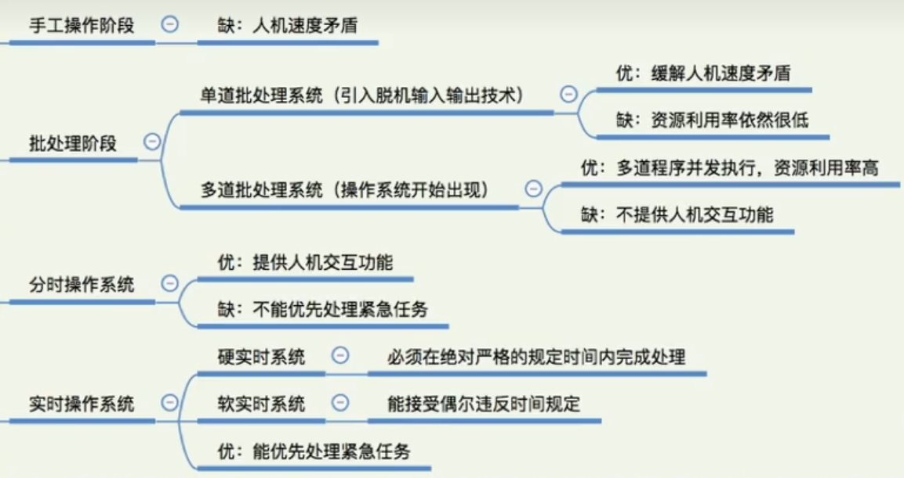

# 操作系统概述
## 概述
### 概念
操作系统是一直运行在计算机上的程序，其他程序则分为系统程序和应用程序
>windows 捆绑了一系列应用程序到操作系统
### 特征
并发 共享 虚拟 异步
### 功能和服务
1处理机管理   
2存储器管理   
3设备管理   
4文件管理  
5用户接口  
## 发展和分类
### 单道批处理系统IBM 7094
### 多道批处理系统IBM 1401
`OS出现`  
多任务切换和调度
### 分时系统 MULTICS
### 实时系统

## 运行环境与机制
由**中断**驱动，没有中断就不需要动作
指令分为`特权指令`和`非特权指令`
内存分为`用户区`和`内核区`
### 内核态与用户态
为了确保操作系统正常执行，需要psw有一个字表示模式位   
0-内核态  
1-用户态  
中断信号进入内核态
### 异常与中断
见计组
### 系统调用
※重点：区分命令行命令、库函数和系统调用

POSIX-IEEE定义的系统调用标准尊重了Unix  
fork()、read()、write()、open()、getmessage()  
#### ~~系统调用实现~~
使用`系统调用中断指令INT 0x80`进入内核态：  
interrupt 80H,80H是中断类型号`向量中断`，然后查IVT获得IV，即“系统调用”处理程序的入口地址，

传递参数：`非向量中断`传递具体“系统调用”的类型

故C语言实现时需要使用宏展开成一段汇编代码(INT)：  
利用#define进行内嵌汇编,传递调用号和内核态函数所需参数

e.g.fork()→展开成汇编int 0x80 +调用号

硬件通过中断机构→得知中断类型为系统调用→调用系统调用中断处理程序→分支语句(调用参数)→执行具体调用的系统程序
#### 类型
进程控制fork exec exit  
文件管理read write open
设备管理
信息维护
通信

### 用户接口
命令行、应用程序(含GUI)  
本质都是`依赖系统调用`来实现的
#### ~~命令行与shell~~
命令是一段程序,而shell则是循环检测、执行命令的程序
```c
//shell
int main(xxx)
{
    char cmd[20];
    while(1)
    {
        scanf("%s",cmd);
        if(!fork())
        {
            exec(cmd);
        }
        else
            wait();
    }
}
```
## 结构
|  | 设计难度 | 扩展性 | 效率 |调试验证|
|---|---|---|---|---|
| 分层 | 难 | 高 | 低 |易|
| 模块化 | 易 | 高 | 高 |难|

|  | 性能 | 可靠性 | 维护性 |
|---|---|---|---|
| 大内核 | 高 | 低 | 难 |
| 微内核 | 低 | 高 | 易 |
### 外核
给用户进程分配`未经抽象row`的资源
降低系统一致性
## ~~操作系统的启动~~
硬件提供了bios和指令集  
BIOS→bootset`1个扇区`→setup`4个扇区` |实模式汇编→system{head.h-设置gdt。idt(中断向量表)|保护模式汇编，main.c[mem_init();...各种初始化]} 
```c
void mem_init(long start_mem,long end_mem)
{
    int i;
    for(i=0;i<Paging_Pages;i++)
        men_map[i]=USED;
    i=MAP_NR(start_men);
    end_mem-=start_mem;
    emd_mem>>=12;
    while(end_mem --> 0)
        mem_map[i++]=0；
}

```
