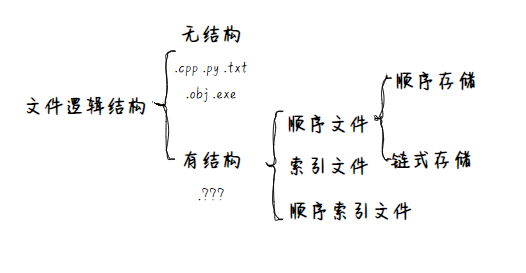
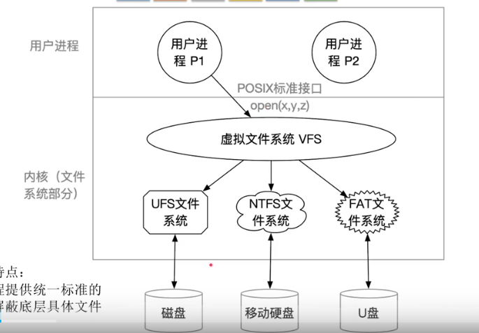
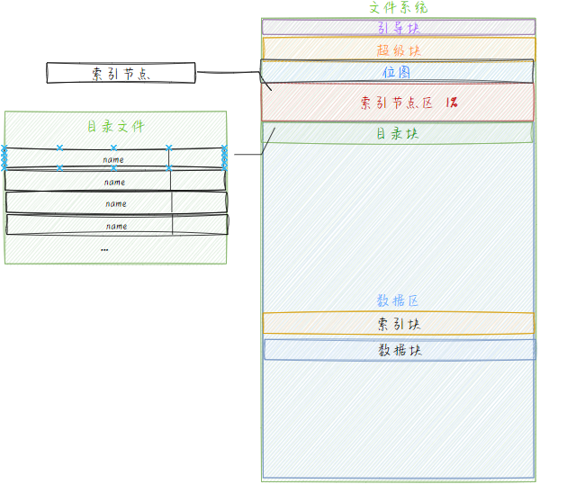

# 文件系统
## 思路
文件系统来源于对磁盘的使用：从磁盘到文件  
生磁盘  
第一层抽象；划分地址：磁盘块    
第二层抽象：多进程图像， 磁盘中断时从队列中取出  
请求队列+磁盘驱动   
访问的优化
考虑这个多进程的调度
抓住寻道时间这个主要矛盾，让寻道时间最短
**将缓冲略去了**  
第三层抽象：文件存放和地址映射 FCB|inode  

顺序结构：一旦动态增长就爆炸，比较适合于读写
链式结构：显然访问太慢
索引结构： 放在文件控制块 inode

第四层抽象：目录树 要能把磁盘变成一颗目录树

完成映射 你给我一个文件名我能从目录中给你查到文件的fcb

write→sys_write→inode

做文件名的字符串匹配

unix 多级索引
如何将磁盘煮熟  
使用文件来访问磁盘
## 生磁盘
### 第一层抽象：给磁盘编址-分块  
块号=磁道号+盘面号+扇区号

### 第二层抽象：磁盘调度
目标：优化寻道时间``

在调度算法中，将程序请求的盘块号多余信息舍去，利用柱面号`磁道号C`作为访问的key 假设不同key之间跨越移动磁头时间和两个磁道号差值有线性正相关
#### 先来先服务FCFS
多个磁盘到达的盘块请求队列应该时完全无规律的  
#### 最短寻道时间优先SSTF
将大量到来的访问请求近似成 正态分布  
那么中间出现的概率大多了  
导致部分请求迟迟得不到满足  
#### 扫描算法SCAN(电梯调度)
look 不到边缘就返回
#### C-SCAN()
雷达波扫描 
### 磁盘缓冲 
TODO 磁盘缓冲区的设计  
## 文件
### 文件属性
### 文件操作
创建、删除、读、写  
**打开、关闭**  
### 逻辑结构

#### 无结构文件|流式文件
流式文件  
源程序、可执行文件。以字节为单位读取
#### 有结构文件|记录式文件
文件{记录，记录，记录【数据项，。。】}
定长记录
可变长记录
##### 顺序文件：
记录顺序排列  
定长可以实现随机查找，变长不行  
顺序存储、链式存储`无法实现随机存取`
##### 索引文件
空间换时间  
文件{索引表【表项，表项】，记录，记录，记录，记录}
##### 索引顺序文件
TODO ？？？  
## 目录
文件目录系统由一个个目录文件按一定结构组织而成

### 目录项
#### 磁盘inode
文件主标识符、文件类型、存取权限、物理地址
#### 内存inode
+索引节点编号、状态、访问计数、逻辑设备号+链接指针

### 目录组织
#### 单级和两级目录
MFD   MFD+UFD
#### 树形
/root/xxxx/xxx  
利于分类。管理、保护 不便于实现文件共享
看linux，软连接，硬连接
#### 无环图型
删除挺麻烦的，
## 文件共享

### 基于索引节点的共享方式-硬链接
目录项指向同一个索引节点  
增加 count++  删除count-- 当count=0时删除
### 基于符号链的共享-软链接
快捷方式，新建一个只存储位置信息的文件
## 文件保护

### 口令保护
### 加密保护
### 访问控制
访问控制表=保护域+访问权  
linux:rwxrwxrwx文件所有者（user）、文件所属组（group）、其他人（other）   

`为什么都要1位我不理解，做个译码不行么？`   
`我懂啦：各类权限不是上下包含的关系，可独立写出`  ``
Windows  
1）完全控制：允许用户对文件夹、子文件夹、文件进行全权控制，例如修改资源、修改资源的所有者、删除资源、移动资源等操作，拥有完全控制就相当于拥有了其他全部权限。

2）修改：允许用户修改和删除资源，同时拥有写入和读取运行的权限。

3）读取和运行：允许用户读取文件夹和子文件夹内容并列出内容的权限。

4）列出文件夹内容：允许用户查看资源中的文件夹和子文件夹的内容。

5）读取：允许用户查看文件夹中的文件和子文件夹，并且能够查看属性、所有者等权限。

6）写入：允许用户在文件夹里创建子文件夹或新建文件，也可以改变文件夹属性等。

## 文件系统的层次结构
用户接口  
文件目录系统  
存取控制模块-文件保护  
逻辑文件系统与文件信息缓冲区  
物理文件系统  
### 虚拟文件系统与文件系统的挂载

## 文件实现
### 信息管理
#### FCB|inode
存放文件的信息，作用类比进程控制块  
文件名 保护信息 修改信息  
块地址：首地址|索引表
>TODO INode不包含文件名？？  
### 地址重定位
#### 连续分配  
支持随机访问，不适合动态增长  
利用空闲表  
#### 链接分配
便于文件拓展，外存利用率高
只支持顺序访问，查找效率低
##### 文件分配表 FAT(file allocated Table)  
一个磁盘一张FAT，开机读入内存并常驻内存  
相当于把索引信息移到主存里，减少了读磁盘操作，
但是你这不是要疯狂访存？？？？
#### `索引分配`
根据文件的FCB|inode读出索引块
##### 索引指针 
直接:指向数据块
1级：指向索引块
n级索引：外存调度次数 n
##### 索引块
存放物理块号的磁盘块  

#### 性能分析
### 空闲空间管理
bit map位图:查找简单高效，大容量磁盘占用内存较高 
空闲链表：效率低  
组：TODO 不想看  

## 目录实现
### 目录文件
#### 目录项
文件名+指针`→inode`  
#### 线性列表
#### 哈希表
## 文件系统的实现：逻辑格式化 
(每个卷)引导控制块boot control block：  
系统从该卷引导操作系统所需要的信息，若该卷无操作系统则为空    
卷控制块volume control block：  
UFS称其为superblock，分区块数，块大小，inode数量，数据数量

### 内存中的文件系统
系统打开文件列表  
单个进程打开文件列表  
### 位视图
用于磁盘块分配算法

引导块放在C盘中

在Linux中划分为引导区，super区`成组链接+位视图`。索引节点区+数据区  
超级块：当文件系统挂载mount时进入内存；    
索引节点区：当文件被访问时进入内存；   

引导块+超级块`提供位视图分区长度，inode长度等` +位视图[i节点位图，盘块位图]+ inode节点区+根目录+各种目录和文件的磁盘块

