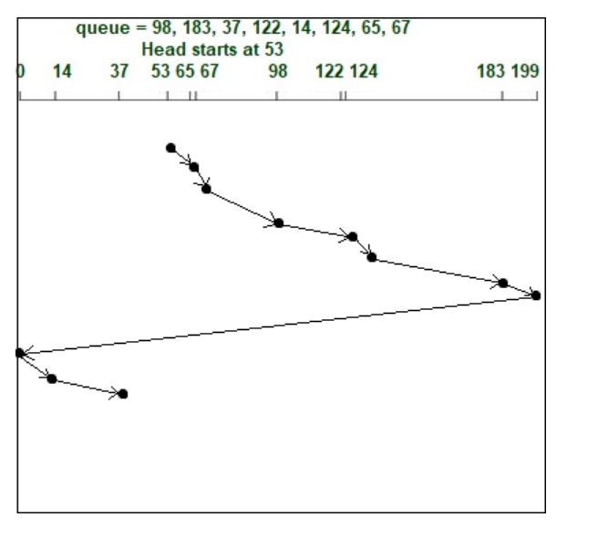

# 文件系统
## 思路
文件系统来源于对磁盘的使用：从磁盘到文件  
第一层抽象——划分地址：磁盘块    
第二层抽象——访问的优化：磁盘调度  
第三层抽象——文件：文件信息和文件地址映射FCB|inode  
第四层抽象——目录：文件名→FCB|inode映射
## 生磁盘
### 分块  
块号=磁道号+盘面号+扇区号
### 磁盘调度
目标：优化寻道时间  
在调度算法中，将程序请求的盘块号多余信息舍去，利用柱面号`磁道号C`作为访问的key     
假设不同key之间跨越移动磁头时间和两个磁道号差值有线性正相关

原因：磁道号为最值访问时间的最主要影响因素
#### 先来先服务FCFS
多个磁盘到达的盘块请求队列应该时完全无规律的  
#### 最短寻道时间优先SSTF
将大量到来的访问请求近似成`正态分布`  
那么中间出现的概率大多了,导致部分请求迟迟得不到满足  
#### SCAN(电梯调度)
磁头连续来回扫描磁盘

look算法，到达最大请求磁道号和最小请求磁道号即折返
#### C-SCAN(扫描算法)
雷达波扫描，`提供更均匀的等待时间`，头或指针在`单个方向`上工作，即，它一直扫描到一个方向的请求，一旦到达终点，它就会跳回到另一端，并在同一方向上为请求提供服务

### 分卷
一个磁盘可分为多个卷，每个卷是一个文件系统或者是无文件系统的生区
## 文件
### 概念
文件操作：创建、删除、读、写、**打开、关闭**  
### 逻辑结构

无结构文件又称`流式文件`，有结构文件又称`记录式文件`

索引文件时利用文件内部增设`索引表`，实现`记录号k`→记录`逻辑地址`的映射
## 文件实现
### 信息管理
#### FCB模式
目录文件的记录直接存放FCB
#### inode模式
存放文件的信息，作用类比进程控制块  
文件名 保护信息 修改信息  
块地址：首地址|索引表`此索引表是文件块→磁盘块的索引表`   
磁盘inode：文件主标识符、文件类型、存取权限、物理地址  
内存inode：+索引节点编号、状态、访问计数、逻辑设备号+链接指针
`Linux：iNode不包含文件名 `
### 地址重定位

#### 索引分配
根据文件的FCB|inode中的`索引指针`进行文件块和物理块的地址重定位  
**定义** 索引指针:inode|FCB中用于文件地址重定位的指针，即一个磁盘块`数据块|索引块`的地址   
直接：指向数据块  
1级间接：指向索引块  
n级索引：外存调度次数n  
**定义** 索引块:存放物理块号的磁盘块  

## 目录
### 基本概念
文件目录系统由一个个`目录文件`按一定结构组织而成
### 目录结构

## 目录实现
#### 目录文件与目录项
FCB实现：文件的FCB  
inode实现：文件名+指针`→inode`  
## 文件共享

### 硬链接
基于索引节点的共享方式   
目录项指向同一个inode|FCB  
inode|FCB维护一个被引用变量count  
增加 count++  删除count-- 当count=0时删除
### 软链接
基于符号链的共享`快捷方式`  
新建一个文件，存放原有文件在目录中的路径
## 文件保护
### 访问控制
访问控制表=保护域+访问权  

linux:rwxrwxrwx  
文件所有者（user）、文件所属组（group）、其他人（other）   

`为什么都要1位我不理解，做个译码不行么？`   
`各类权限不是集合划分的关系` 

## 文件系统的层次结构

## 文件系统的实现
### 磁盘上的文件系统
#### 引导控制块(boot control block)：  
系统从该卷引导操作系统所需要的信息，若该卷无操作系统则为空    
#### 超级块(superblock)|卷控制块(volume control block)：   
存放块大小，inode位图块数，数据位图块数等信息，当文件系统挂载mount时`进入内存`   

#### inode和盘块位图
记录inode区和盘块使用情况，当文件系统挂载mount时`进入内存`，并`常驻内存`   
#### inode区
专门存放文件的inode,当文件被访问时进入内存；   

### 内存中的文件系统`自举`
#### 位视图
用于磁盘块分配算法
#### 文件分配表 FAT(file allocated Table)  
一个磁盘一张FAT，开机读入内存并常驻内存  
相当于把inode区移到主存里，减少了读磁盘操作
#### 当前目录的缓存
当前目录的目录项读入  
#### 打开文件列表(open-file table) 
#### 单个进程打开文件列表 
PCB中维护

 

