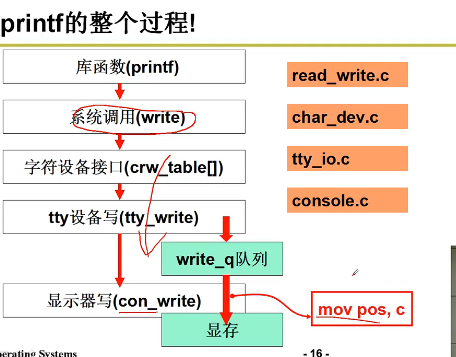
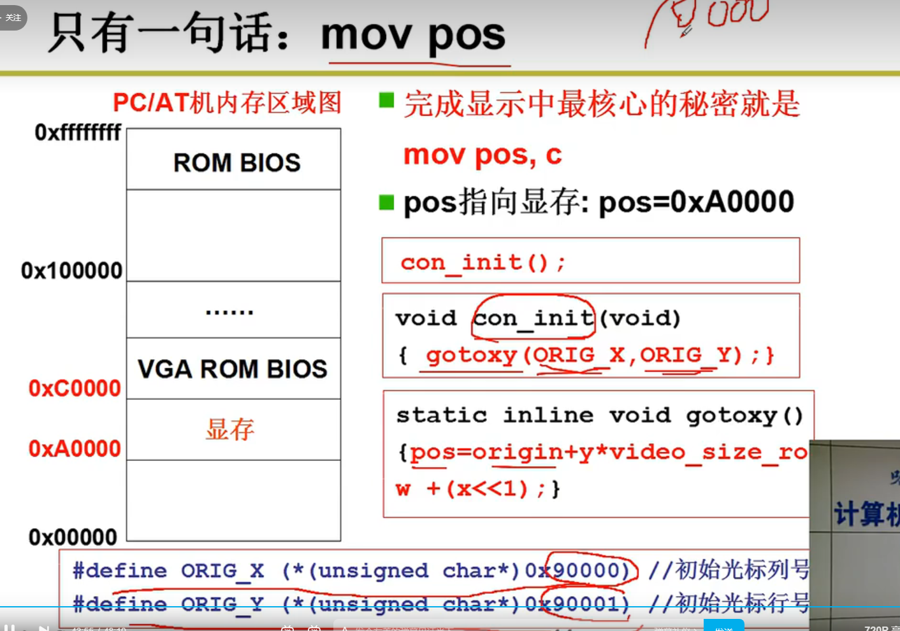
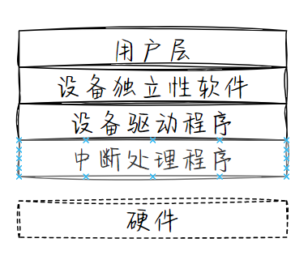
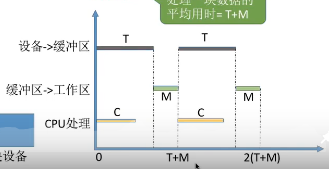
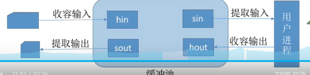
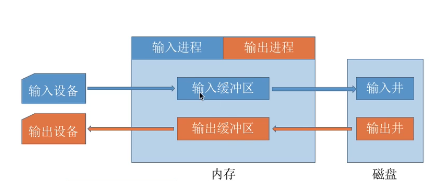

# I/O 系统
## 引论
**本质**  
对操作系统来说，对I/O设备的操作主要是对端口【寄存器】的OUT|IN|MOV指令

**目标**  
1封装成统一的读写内容格式   
2优化读写性能

**过程**  
1.系统调用write()→系统中断→写入I/O缓冲   
2.外设工作完→I/O中断→设备驱动程序→out指令  

### ~~linux~~
printf()库→文件系统→I/O系统   
open /dev/xxx read() write(1`由它决定是printf`,buffer,count) close()  --文件接口

文件→字符设备→4号tty设备→io缓冲区→写入端口  
out指令使用c内嵌汇编的形式写   
统一编址的时候就用 mov ax pos    
独立编址就使用out

linux/fs/write  
inode找到1表示tty设备`输入输出设备`   
判断是否为字符设备→ 设备号   
rw_char(设备号)  
{  
    选择设备号  
    //继续分支  
    设备驱动程序  
    rw_ttyx()  
       tty_write{  
//缓冲区写 --- 有限缓冲问题 ---  

设备中断处理程序从缓冲区读  
     }  
}  

设备驱动 这些代码形成的就是设备驱动 在驱动的时候根据设备对应的信息`注册`相应的函数 从tty表里面拿出来用
  
  
著名的90000 90001 windows 徽标  
### 功能
隐藏物理设备细节  
设备无关性  
提高利用率  
设备控制  
正确共享  
出错处理
### I/O 控制方式
见计算机组成原理
### 软件层次结构

## 核心子系统
### **I/O 调度**概念
对不同进程的I/O请求进行合理响应，见磁盘调度
### 高速缓存与缓冲区
高速缓存；保留数据副本的存储器  

利用内存作为磁盘的高速缓存`just a copy of low speed device`

缓冲区：用来保存两个设备之间或者设备和应用程序之间传输数据的内存区域  

CPU输出数据→内存缓冲区→I/O设备
磁盘块→内存缓冲区→进程工作区
#### 缓冲区作用
1. 处理设备数据传输速率差异`速度不匹配`  
2. 处理设备数据格式差异`粒度不匹配`  
3. 应用程序的`I/O复制语义`-将应用缓冲移入内核缓冲
#### 单缓冲
磁盘数据$\overset{T}{\rightarrow}$缓冲区$\overset{M}{\rightarrow}$用户进程$\overset{C}{\rightarrow}$处理完成

磁盘到缓冲区通过DMA盗用不占CPU，那么缓冲区到进程必须用中断读入需要CPU，处理也需要CPU？？？
$$
\max\{C,T\}+M
$$

#### 双缓冲
TODO bug:关于数据从缓冲区到工作区是否需要CPU  
一般来说 `要吧`   
C<T,连续传输,C>T,CPU连续处理 

linux 采用的就是I/O双缓冲 pip
#### 循环缓冲区
循环链表
#### 缓冲池
空队列
输入队列
输出队列

### ~~假脱机技术SPOOLing~~
利用软件实现数据缓冲  
输入井+输出井+输入程序+输出程序+输入缓冲区+输出缓冲区

#### 脱机技术
数据输入输出缓冲，就是利用硬件接口，  
脱离主机的控制实现输入输出操作  

