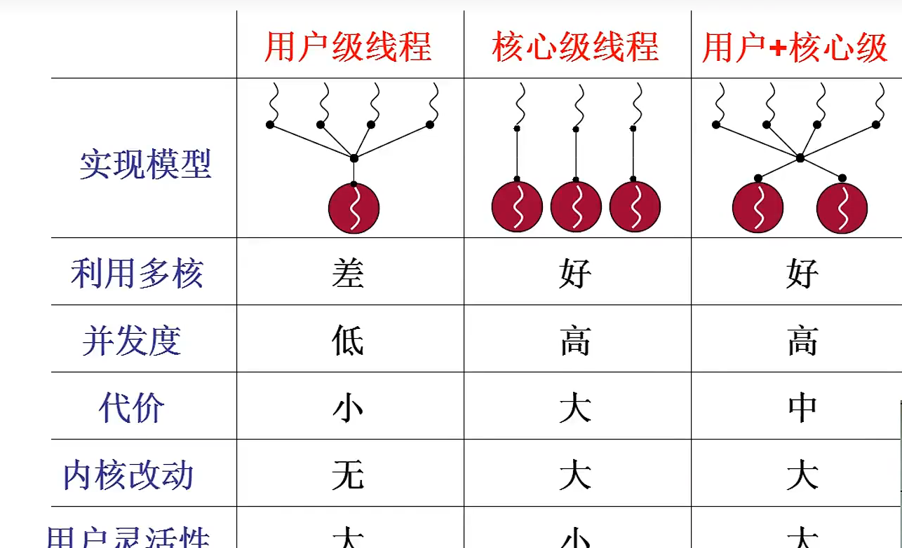
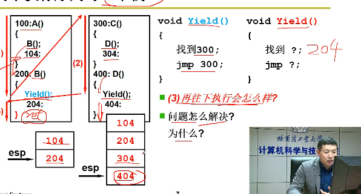
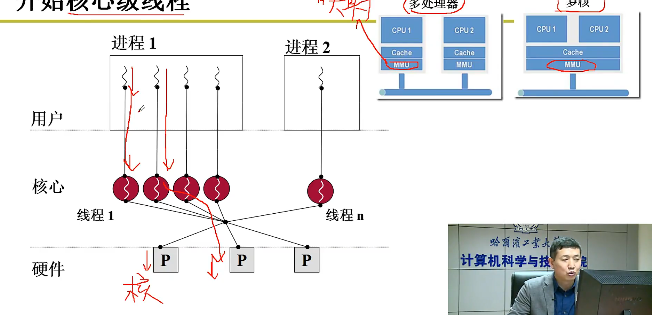

# 进程与线程
程序：外存中的可执行文件  
装载：双击|命令行  
## 预备——管理和使用CPU
操作系统在管理CPU的时候搞出来了多进程图像，有了多进程图示问题才得以推进
1最简单，设完PC初值自己动！  
问题所在：i/O 特别慢 利用率太低
2所以要切换，切换才能提高利用率，多道程序交替执行：并发，同时出发，交替执行  
只是修改PC也是不行的，需要有个东西来记录 
看书，+书签+头脑中的场景(现场)
需要有个概念来刻画运行中的程序——进程

模式：启动多个进程，CPU的运行的样子

Linux
从开机到结束： if(!fork()){init();} 
操作系统开机最后启动了一个shell 
shell不断等待命令，来了就创建进程

组织：PCB组成队列

调度：利用调度算法实现
进程切换需要精细控制，写汇编代码

问题：内核态和用户态通过硬件flag天然隔离啦
内核态进程1访问到了内核态进程2怎么办；
用户态进程1访问到了用户态进程2的地址怎么办，通过内存映射表解决

多进程的合作：等待打印队列，丢到一个队列中，队列需要处理，如果不处理，两个人`交替执行`，往里面放没等放完就会炸了

交替执行时，放在共享区域的count含义不能确保正确
核心在于进程同步，保证合理的推进顺序，系统负责给锁

进程的切换则是线程加内存映射表的切换
## 进程
为了实现程序并发执行  
对程序进行控制和划分的概念
### 概念
通俗：执行中的程序
是进程实体`程序`的运行过程，是系统进行资源分配和调度*若内核支持线程，则线程*的独立单位
一个程序需要活动需要操作系统支持，如分配内存
进程包括机器状态信息PC、IR、PSR，现场信息GPR+进堆栈段，数据段
### 进程状态
TODO 画图  
### 进程控制块PCB
进程状态标记  
pid   
中断相关：断点及程序状态`PC、PSG`*这部分其实通常用硬件维护*、现场`GPRs`(包括了函数调用栈指针等)   
存储管理相关：进程内存边界、**页表段表**  
调度相关：优先级
I/O管理相关：打开文件列表、给进程分配的I/O设备表  
记账信息：占用的资源等，网络传输带宽等  
TODO 补充
### 进程创建和终止
#### fork()
进程执行fork()时，会创建一个子进程，父进程fork()的返回值为子进程pid，子进程返回值为0；
两个进程都继续执行fork()后的指令
创建一个子进程，两个进程一起执行，如果不wait()的话
#### wait()
TODO ？？，放入阻塞队列  
#### exit()
可用父进程终止子进程
### 进程通信
独立进程：一个进程不能被其他进程所影响  
协作进程：一个进程能被其他进程所影响  

进程协作的目的：
信息共享、提高运算速度、模块化、方便

进程间通信机制(IPC)
#### 共享内存
建立一块协作进程共享的内存区域，彼此RW

用`共享内存+同步(冲突处理)` 解决生产者-消费者问题  
共享一个buffer无限缓冲|有限缓冲struct 循环队列  
但是没有解决访问冲突问题-见进程同步  
#### 消息传递
常用于分布式环境  
需要通信线路+协议
不需要解决冲突，交换少量数据  
利用**系统调用**send()，receive()实现
#### 管道-Linux
实质还是一种共享内存，只不过不用你写地址，封装了部分功能进入操作系统
一对特殊的文件单项文件，双方都能访问，单项
## 线程
### 概念
共享代码和数据、只改变运行的信息，运行不改变资源的需求
单线程进程只能在一个CPU上运行

实际应用，网页预加载  
### 多线程模型
考点：线程阻塞的问题
用户线程  
直接写了个线程库函数  
对操作系统来说，用户级线程具有不可见性，也称透明性
内核线程
之间的切换需要CPU切换运行状态

#### 多对1
任1时刻只能有一个线程访问内核，一个发生系统调用阻塞全部阻塞  
如scanf 全部阻塞，整个进程阻塞了
切换在用户态实现
#### 1对1
创建内核线程的开销会影响应用程序性能
#### 多对多
代码逻辑→运行机会的映射
### ~~用户级线程的切换~~
create()
yeild()
{
    切换TCB读取esp切换用户栈
}
两个线程一个栈就炸了  
  
浏览器一个卡全卡了  
### 内核级线程切换
一个内核级线程就要一套栈【用户栈+内核栈】
要实现线程切换那就要两套了  
两套栈：既要在用户态跑，也要在内核态跑
多CPU 和多核CPU 
多CPU他有独立的MMU和L2cahe 
而多核只有独立的L1Cache 共用一个MMU，故多核只能实现内核级线程的并行，而不是进程的并行

switch_to:
进入中断
中断处理
中断处理程序
执行调度程序
schedule()
{
  
    1.INT 0x80；
    硬件完成？
    2进入内核栈
    还要压入用户栈的现场
    相当与把用户栈的活动记入往内核栈压，能pop回去
    3.内核栈切换
    switch_to(找到下个线程TCB，找到内核栈esp)\\其实和yeild一样
    4IRET目标内核线程弹出了：
    5
    返回目标用户恢复现场
    //RET指令时不恢复现场是不可恢复中断用的
}
## CPU调度
选择可用的进程执行  
给PC及其工作的这一套系统CPU给他分配一个需要执行的指令序列
利用队列的链式实现将PCB串起来
利用调度程序控制它执行 


### 基本概念
#### CPU调度程序

### ~~调度层次~~
高级调度|作业调度  
创建PCB
中级调度 
和磁盘兑换
低级调度|进程调度
调出外存但PCB不销毁、调入内存
### 时机、切换与过程
#### 时机
1。运行→等待
2。运行→就绪
3。等待→就绪
4。终止
**不能调度**  
中断处理过程中 
操作系统内核临界区中  
原子操作过程中  
#### 切换
一个进程让出处理机，让另一个进程占用处理机的过程  
**分派程序**1切换上下文2.切换到用户态3.跳转
### 准则
CPU使用率
~~吞吐量~~
周转时间 进程提交到完成的时间 
带权周转时间=周转时间/execute时间≥1
等待时间 在就绪队列等待的时间`调度算法影响的核心`  
~~响应时间~~ 用户提交请求到产生响应
### 方式
见上时机，只允许1.4发生的是非抢占式，其余为抢占式
### 算法与甘特图
#### FCFS
#### SJF
短进程、短线程
#### PSA
#### RR
#### ~~多级队列~~
#### 多级反馈队列
设置多级队列，每个队列都有字节的调度算法，队列间固定优先级抢占
e.g. 三级队列【前两级用RR|8ms→16ms→32ms，最后一级用FCFS】  
new PCB→队列0→
执行一次看看你是不是符合要求，不符合丢下去，长作业下沉
## 互斥与同步
### 概念
汤书  
协作进程的制约关系   
1.程序先后执行顺序冲突*直接制约关系*  
2.使用系统资源的冲突*间接制约关系*  
临界资源：一个时间段内只能供一个进程使用的资源
进程同步：执行顺序  
互斥：对临界资源的互斥访问  
进入区 临界区 退出区 剩余区  

邓书  
共享逻辑地址空间导致的访问冲突`如果采用通道或消息传递就不会有这种问题`
本章就是讨论各种方式，以确保共享同一逻辑地址空间的协作进程可以有序的执行  

个人认为邓书更合理，因为设备CPU等资源在进程调度模块就已经解决了，你只有活动了资源才能就绪  

#### 同步
竞争条件(race condition)：程序并发访问同一数据，且执行结果与访问发生的特定顺序有关  

进程同步：一定程度限制协作进程间执行顺序，以避免竞争条件出现的措施  
 
#### 临界区问题
进入区：实现对临界区的进入请求  
临界区：每个进程有一段代码叫临界区，在这个区域中的语句可能会修改`共享的数据`变量，表，文件，  
退出区
剩余区

操作系统内临界区的处理：
抢占内核和非抢占内核
### ~~软硬件机制互斥~~
### 信号量机制|PV操作
实现协作的用户进程的同步
系统调用wait()→P()、signal()→V()
乐,1.若是共享数据的

王道
整型信号量  
```c++
int S
wait(S){
while(S<=0)
;
S--;
}
Signal(S){
    S++;
}  
```

记录型信号量  
```python
S=(value,list)
wait(S):
    S.value--
    if(S.value<0):
        block()
Signal(S):
    S.value++
    if(S<=0):
        wakeup(s.list)
}：
```


邓书
信号量是一个整数变量
计数信号量 会忙等

有若干个实例，若干份资源
二进制信号量|互斥锁
##### 实现进程互斥
##### 实现进程同步
初值设0，前操作之后v操作，后操作之前p操作
#### PV操作的实现
如何确保原子性
单处理器 关中断
多处理器 +自旋锁
将用户去临界区问题转化到内核区
取消了用户区的忙等将忙等限制在wait()、signal()临界区内
这些区比较短，几乎不会出现占用(争夺)
### 经典同步问题
TODO 没做完不想看了  
#### 生产者-消费者问题|有限缓冲问题
问题描述：
```python
producer:
wait()
```
多类型数据共用有限缓冲问题√
#### 读者写者问题
#### 哲学家进餐问题
## 死锁
各个进程等待对方手里的资源，导致阻塞都无法向前推进的现象 

某个进程申请的资源被其他等待进程占有，该等待进程可能再也无法改变状态
### 原因
竞争不可抢占资源  
进程推进非法  
信号量使用不当——信号量作为一种资源
### 必要条件
1. 互斥条件：存在互斥资源
2. 非抢占：你旧把资源握手里吧
3. 请求和保持|占有和等待：在保持资源的同时请求
4. 循环等待`有循环等待链，但说不定有外部解决方案`
### 解决方法
#### 预防死锁
##### 用SPOOLing技术破坏资源互斥性  
适用场景有限
##### 请求得不到满足直接释放所有资源，或者抢过来
释放会增加饥饿可能性，
抢夺会导致别人工作无效，同时增加系统开销
#### 静态分配
资源利用率降低了，增加饥饿可能性
#### 资源顺序链法
1不方便添加设备
2使用顺序和编号顺序不一致导致资源浪费
3编程复杂
#### 避免死锁
有趣的例子  
手握100e,企业B，A，T找你借钱，你的余额公开，当你被发现借不出钱，他们就不会还钱→gg
|  | 最大需求 | 已借 | 还会借 |
|---|---|---|---|
| B | 70 | 20 | 50 |
| A | 40 | 10 | 30 |
| T | 50 | 30 | 20 |

##### `银行家算法`
采取预先声明资源策略，预先声明所有资源，系统利用全局信息有选择的分配资源，而不是满足条件就分配
1.检测规范性和可分配性
2.试探分配安全性
#### 检测+解除
化简资源分配图
剥夺资源，撤销进程，历史回退
#### 资源分配图
P节点-进程节点；R节点-资源节点【单个资源+单个资源】
请求边、分配边


可能三：进程实际需要的最大资源小于声明的最大需求资源。
TODO 安全性算法和死锁定理的区别  
TODO 可以试试code  
