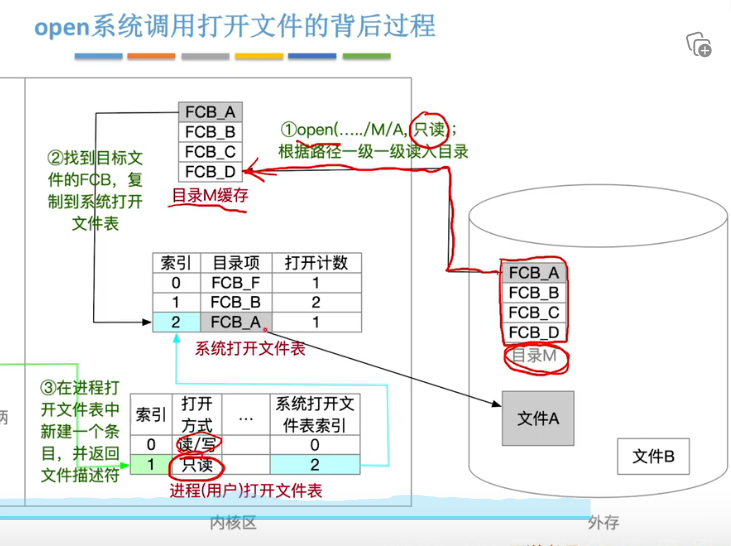
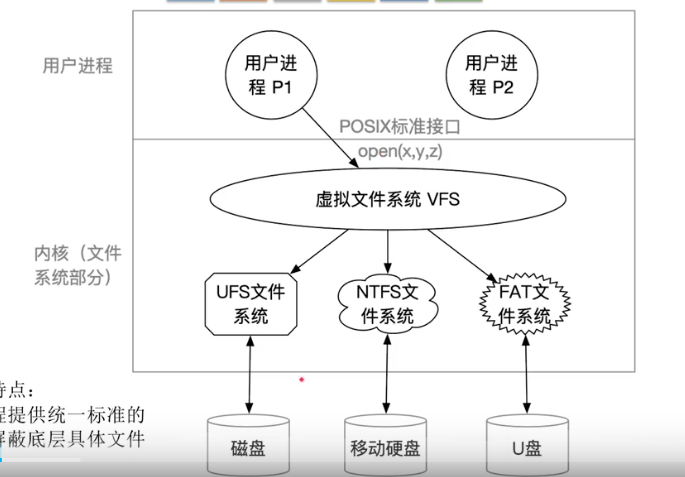
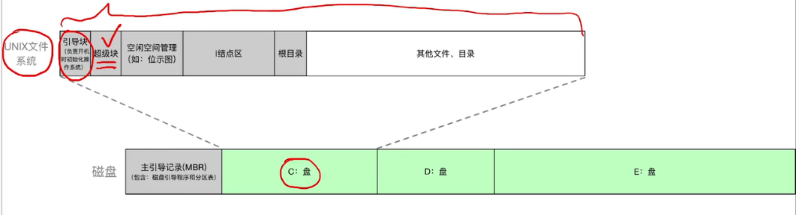

# 文件系统
1. 文件的属性
2. 文件数据组织
3. 文件件的组织
4. 文件权限|共享与保护
抽象数据类型(文件，op，)
## 文件概念
### 文件属性
#### 文件名
#### 扩展名
#### 标识符
无意义
#### 权限
#### 路径
### 分类
#### 无结构文件|流式文件
流式文件  
源程序、可执行文件。以字节为单位读取
```C++
File* fp=fopen("filename","r|w");
if fp==NULL{
    printf("open success");
    exit(0);
    for (int i=0;i<10000,i++)
        fputs("Hello world!",fp);
fseek(fp,16,SEEK_SET);
char c= fgetc(fp);
fclose(fp);
}
```
#### 有结构文件|记录式文件
文件{记录，记录，记录【数据项，。。】}
定长记录
可变长记录
```C++
typedef struct{
    int number;
    char name[30];
    char major[30];
}info

File* fp=fopen("student.info","r|w");
if fp==NULL{
    printf("open success");
    exit(0);
}
for(int i=0;i<N;i++)
{
student[i].number=i;
student[i].name[0]='?';
student[i].major[0]='?';
}
fwrite(student,sizeof(info),N,fp);
fseek(fp,5*sizeof(info),SEEK_KEY);
info stu;
fread(&stu,sizeof(info),1,fp)
fclose(fp);
}
```
### 逻辑结构
##### 顺序`记录`文件：
记录顺序排列  
定长可以实现随机查找，变长不行
顺序存储、链式存储`无法实现随机存取`
##### 索引文件
空间换时间  
文件{索引表【表项，表项】，记录，记录，记录，记录}
##### 索引顺序文件
TODO  画图  
### ~~物理结构~~
文件的物理结构应该属于计算机组成原理的存储器的部分？
#### 连续分配  
支持随机访问
#### 链接分配
##### 隐式
便于文件拓展，外存利用率高
只支持顺序访问，查找效率低
##### 显式 
FAT(file allocated Table)  
一个磁盘一张FAT，开机读入内存并常驻内存  
相当于把索引信息移到主存里，减少了读磁盘操作，
但是你这不是要疯狂访存？？？？
#### 索引分配
每个文件一张表，软件查表
索引表和页表一样都不能超过一个页面4k的大小
如何拓展索引表
1。链接方案
用特定表项指向下一个表
外存调度次数，1，2，3，4，5，6，7，8，。。。
2。n级索引
外存调度次数 n
磁盘{索引表【索引块，、、、】，数据块，索引表，数据块}
3.混合索引
## 文件目录系统
文件目录系统由一个个目录文件按一定结构组织而成
### 目录文件的记录
#### 文件控制块FCB`目录文件的记录`
##### 基本信息
文件名  
物理地址  
##### 存取控制信息
##### 使用信息
#### 文件名+指针`→索引节点`
将文件描述信息存放在索引节点中  
超级块：当文件系统挂载时进入内存；  
索引节点区：当文件被访问时进入内存；  
#### 磁盘索引节点
文件主标识符、文件类型、存取权限、物理地址
#### 内存索引节点
+索引节点编号、状态、访问计数、逻辑设备号+链接指针

### 系统结构
#### 单级
MFD
#### 两级
MFD+UFD
#### 树形
/root/xxxx/xxx  
利于分类。管理、保护 不便于实现文件共享
看linux，软连接，硬连接
#### 无环图型
删除挺麻烦的，

## 文件共享
### 基于索引节点的共享方式-硬链接
目录项指向同一个索引节点
### 基于符号链的共享-软链接
快捷方式，新建一个只存储位置信息的文件
## 文件保护
保护域
访问权
### 口令保护
### 加密保护
### 访问控制
访问控制表
linux:rwxrwxrwx文件所有者（user）、文件所属组（group）、其他人（other）
Windows
1）完全控制：允许用户对文件夹、子文件夹、文件进行全权控制，例如修改资源、修改资源的所有者、删除资源、移动资源等操作，拥有完全控制就相当于拥有了其他全部权限。

2）修改：允许用户修改和删除资源，同时拥有写入和读取运行的权限。

3）读取和运行：允许用户读取文件夹和子文件夹内容并列出内容的权限。

4）列出文件夹内容：允许用户查看资源中的文件夹和子文件夹的内容。

5）读取：允许用户查看文件夹中的文件和子文件夹，并且能够查看属性、所有者等权限。

6）写入：允许用户在文件夹里创建子文件夹或新建文件，也可以改变文件夹属性等。
## 文件系统实现

TODO 文件系统的内存结构  
### 文件系统的层次结构
用户接口
文件目录系统
存取控制模块-文件保护
逻辑文件系统与文件信息缓冲区
物理文件系统
### 虚拟文件系统与文件系统的挂载

### 目录实现
#### 目录文件的特殊操作
搜索
创建FCB 及本体文件
删除FCB 及本体文件
修改FCB 及本体文件
### 文件实现
####  文件操作接口
创建、删除、读、写  
**打开、关闭**  
## 磁盘
### 结构
见计组
### 调度算法
#### 先来先服务FIFO
#### 最短寻道时间优先SSTF
#### 扫描算法SCAN
#### C-SCAN
#### C-LOOK
### 管理
#### 划分与初始化
物理格式化，划分扇区  
分区
逻辑格式化
初始化内存管理数据结构、创建文件系统
引导块放在C盘中

在Linux中划分为super区`成组链接+位视图`。索引节点区、文件区，
#### 空闲表法
连续分配
#### 空闲链表法
盘块链
盘区链
#### 位视图法
字号，位号→盘块号
#### 成组链接法
super block