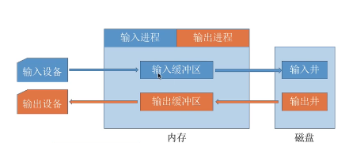
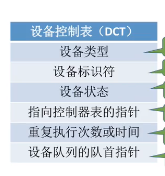
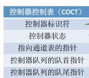
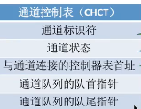
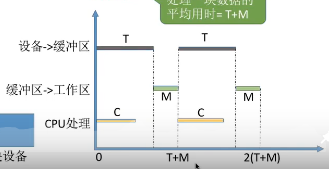
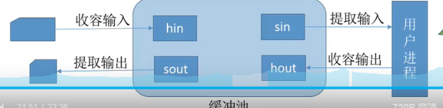

# I/O 系统
## 概述
管理对象：I/O设备、I/O控制器
### 功能
隐藏物理设备细节  
设备无关性  
提高利用率  
设备控制  
正确共享  
出错处理
### I/O 控制方式
见计算机组成原理
### I/O软件层次结构
#### 用户层
printf()
#### 设备独立性软件
系统调用write ？？？  
设备保护？？  
差错处理  
设备分配与回收  
数据缓冲区管理  
逻辑-物理设备名 
#### 设备驱动程序
厂家提供
#### 中断处理程序
构
## 核心子系统
I/O调度、设备保护、假脱机技术、设备分配与回收、缓冲区管理
### ~~假脱机技术SPOOLing~~
利用软件实现数据缓冲  
输入井+输出井+输入程序+输出程序+输入缓冲区+输出缓冲区
TODO  绘图  

#### 脱机技术
数据输入输出缓冲，就是利用硬件接口，  
脱离主机的控制实现输入输出操作  
#### 共享打印机
### ~~设备分配和回收~~
#### 设备固有属性
独占设备、共享设备、虚拟设备
#### 设备分配算法
。。。。
#### 设备分配安全性
安全分配：I/O请求→进程阻塞→完成→唤醒
优点：不会死锁 
TODO 死锁   
不安全分配：可能会产生死锁
#### 设备分配的数据结构
DCT  

COCT

CHCT

SDT
#### 分配过程
SDT→DCT→COCT→CHCT

### 高速缓存与缓冲区
利用内存作为缓冲区  
CPU输出数据→缓冲区→I/O设备
磁盘块→内存缓冲块→进程工作区
>DMA传送方式下,一次从磁盘调入一块`4kB`,才会
#### 作用
1.解决速度不匹配的问题
2.降低CPU中断频率
3.解决数据粒度不匹配的问题
4.提高CPU与I/O的并行性
#### 单缓冲
磁盘数据→缓冲区T,缓冲区→用户进程M,数据处理C
$$
\max\{C,T\}+M
$$

#### 双缓冲
TODO bug:关于数据从缓冲区到工作区是否需要CPU  
一般来说
C<T,连续传输,C>T,CPU连续处理 
#### 循环缓冲区
循环链表
#### 缓冲池
空队列
输入队列
输出队列

### **I/O 调度**概念
如磁盘调度
### ~~设备保护~~
利用文件

