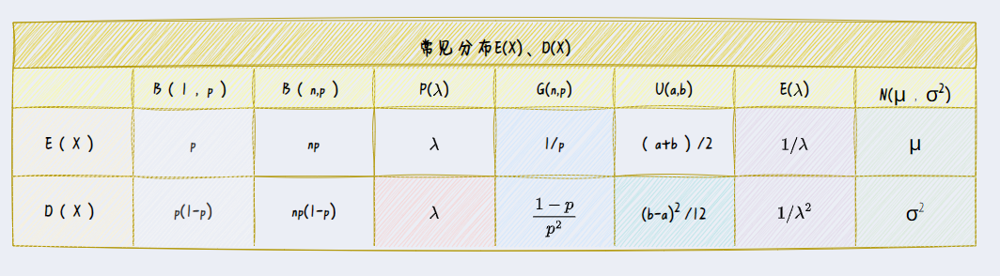

# 随机变量的数字特征
在分布不一定可知的情况下
## 数学期望|期望|均值E(X)
它是随机变量X的固有特征，而不是统计结果的平均  
在试验次数很大时，观测结果的算术平均接近期望
离散型
$$
E(X)=\sum_{i=1}^{\infty}x_ip_i\\
$$
连续型
$$
E(X)=\int_{-\infty}^{\infty}xf(x){\rm d}x
$$
### 随机变量函数的期望
**定理** 设随机变量Y是随机变量X的函数：Y=g(X),g为连续函数
$$
E(Y)=E(g(X))=\sum_{i=1}^{\infty}g(x_i)p_i\\
E(Y)=E(g(X))=\int_{-\infty}^{\infty}g(x)f(x){\rm d}x
$$

这个定理证明复杂的一批，只要记住公式会算就行
### 运算性质
1E(C)=C
2E(CX)=CE(X)  
前两个容易证明，后两个要定理支持  
3E(X+Y)=E(X)+E(Y)
4若相互独立：E(XY)=E(X)E(Y)
## 方差
是表示随机变量X和期望偏离程度`稳定性`的特征量  

实质-偏差值的期望：随机变量函数$g(X)=[X-E(X)]^{2}$的**数学期望** 

方差已经开始脱离X本身进行运算了，只需要有E(X)就行  

**定义** 设一个随机变量，若...
$$
D(X)=Var(X)=E\{[X-E(X)]^{2}\}\\
\sigma(X)=\sqrt{D(X)}
$$
### 性质
0.D(X)≥0 故有
$$
E(X^{2})\geq [E(x)]^{2}\\
E(X^{2})=D(X)+[E(x)]^{2}
$$
1 
$$D(X)=0\Leftrightarrow P\{X=E(X)\}=1$$  
2
$$
D(CX)=C^{2}D(X) D(X+C)=D(X)\\
D(aX+b)=a^{2}D(X)
$$

3
$$
D(X\pm Y)=D(X)+D(Y)\pm 2E\{(X-E(X))(Y-E(Y))\}
$$
若X和Y独立，则
$$
D(aX\pm bY)=a^{2}D(X)+b^{2}D(Y)
$$

### 计算
$$
E\{[X-E(X)]^{2}\}=E\{ X^2-2XE(X)+[E(X)]^{2} \}\\
=E(X^{2})-2E(XE(X))+[E(X)]^{2}\\
=E(X^{2})-[E(X)]^{2}
$$  

## 切比雪夫不等式

## 协方差
$$
Cov(X,Y)=E\{(X-E(X))(Y-E(Y))\}
$$
相关系数
$$
\rho_{XY}=\frac{Cov(X,Y)}{\sqrt{D(X)D(Y)}}
$$
### 计算
$$
Cov(X,Y)=E(XY)-E(X)E(Y)\\\
=\int_{-\infty}^{\infty}\int_{-\infty}^{\infty}xyf(x,y){\rm d}x{\rm d}y-\int_{-\infty}^{\infty}xf_X(x){\rm d}x\cdot\int_{-\infty}^{\infty}yf_Y(y){\rm d}y
$$
### 性质
1
$$
Cov(aX,bY)=abCov(X,Y)
$$
2
$$
Cov(X+Y,Z)=Cov(X,Z)+Cov(Y,Z)
$$
